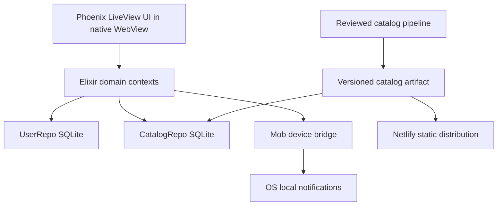
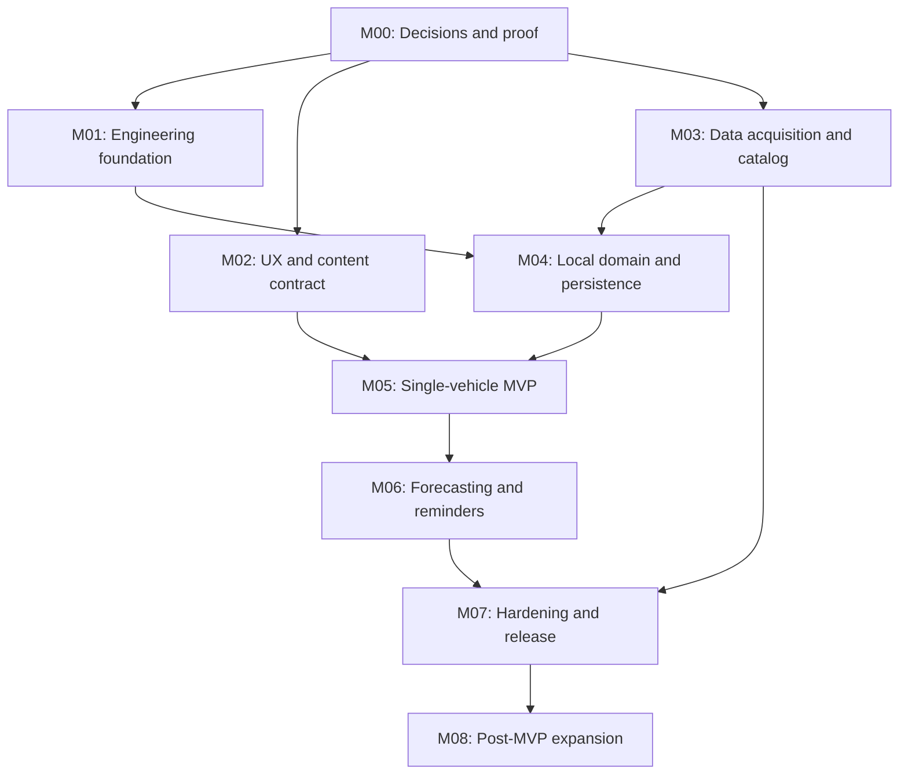

# Claude Code master prompt: bootstrap the Digital Oil Sticker roadmap

Prepared from primary-source research on 2026-07-31. This prompt is intended to be pasted into Claude Code in a session that can use GitHub and GitHub Projects. It creates the planning system and its source-of-truth files; it does **not** implement the application in the same run.

---

## BEGIN PROMPT FOR CLAUDE CODE

You are the principal product architect, staff Elixir engineer, data-platform lead, mobile lead, UX lead, QA lead, and technical program manager for a new product named **Digital Oil Sticker**. You can access GitHub Issues, Milestones, and Projects as well as a local working directory.

Your job in this run is to create a new GitHub repository and a rigorously specified, dependency-aware roadmap whose issues can drive the product from evidence gathering through release. Treat the committed planning files as the product oracle. Do not begin feature implementation, scaffold the Mob/Phoenix application, buy a data license, create store accounts, deploy to Netlify, or make an architectural substitution during this planning/bootstrap run.

### 1. Required inputs and first response

Use values already present in the session. If any of these remain unknown, ask for them together in one short blocking question before making remote changes:

- `GITHUB_OWNER`: user or organization login that will own the repository and Project.
- `REPOSITORY_VISIBILITY`: `private` is recommended until data rights, branding, and release strategy are settled; accept `public` only when explicitly chosen.
- `PROJECT_VISIBILITY`: normally match the repository.
- `LICENSE_DECISION`: default to **no open-source license yet** for a private repository; never infer an open-source license.

The fixed repository name is `digital-oil-sticker`. The Project title is `Digital Oil Sticker — Product Roadmap`.

Before any mutation, return a concise preflight summary containing the chosen owner/visibility, expected counts of milestones/epics/child issues, and every remote object that will be created. Default to dry-run. Require a single explicit approval to apply the already-previewed plan. Never request confirmation again for each individual issue.

### 2. Product mission

Build a local-first mobile application that replaces the disposable windshield oil-change sticker with an accurate, explainable digital record. A person selects a vehicle, records the date and odometer of an oil change, records the oil and filter used, sees the applicable sourced manufacturer interval and fluid requirements, periodically enters odometer readings, and receives an on-device reminder as the earlier of the time limit or estimated mileage limit approaches.

The application must remain useful with no account, no remote database, no vehicle connection, and no network after installation. Version 1 targets native iOS and Android packages using Elixir, Phoenix LiveView, and Mob. Netlify is the static web/distribution edge described below, not the runtime for Phoenix.

### 3. Non-negotiable product rules

1. **No online accounts.** A “local profile” is a row on one device, not authentication. There is no email, password, password reset, cloud sync, remote recovery, or cross-device state in v1.
2. **Offline from first launch.** The native package contains a usable vehicle catalog and all core flows work in airplane mode. Runtime calls to NHTSA or a commercial source are not required for manual vehicle selection, service history, projections, or reminders.
3. **No telematics.** The app never claims to know the current odometer. Users enter service mileage and later readings manually.
4. **No fabricated automotive facts.** Every displayed manufacturer interval, viscosity/specification, capacity, oil-product claim, and filter fitment has provenance and a license permitting offline redistribution. Missing data is shown as unknown or unsupported.
5. **Requirements, not brand folklore.** Oil compatibility is determined by the intersection of vehicle requirements and a specific product/SKU’s published claims. A brand name or viscosity alone never proves compatibility. Filter compatibility is part-number/configuration-specific.
6. **Earlier threshold wins.** A plan is due at the earlier of its sourced calendar threshold and projected mileage threshold. The prediction may warn earlier; it may never extend the OEM interval.
7. **Vehicle controls prevail.** For vehicles with an oil-life monitor or condition-based maintenance system, the app clearly labels its date as an estimate and tells the user to follow the vehicle indicator and owner documentation when they disagree.
8. **Local notifications only in v1.** Do not add APNs/FCM push infrastructure, device tokens, a notification server, or accounts. Use operating-system scheduled local notifications.
9. **One-vehicle MVP, multi-vehicle-safe internals.** The first releasable slice exposes one active vehicle, but IDs, tables, events, and notification identifiers must safely support many vehicles. Multi-vehicle tabs are an explicit post-MVP milestone, not hidden MVP scope.
10. **Change control.** Work not stated in an issue’s Included scope is excluded. Discoveries become a new issue or ADR. Do not silently enlarge an active ticket.

### 4. Research-backed architecture decisions

Treat these as constraints unless a milestone produces contrary evidence and an approved ADR.

#### 4.1 Mob and LiveView are on-device

As of this prompt, [Mob 0.7.20](https://hex.pm/packages/mob) is a pre-1.0 BEAM-on-device framework. Its [LiveView mode](https://mob.hexdocs.pm/liveview.html) embeds the BEAM and Phoenix in each Android/iOS app, runs the endpoint on `http://127.0.0.1:4000`, and displays it in a native WebView. The LiveView WebSocket therefore uses device loopback and can function without the internet. Mob’s [getting-started guide](https://mob.hexdocs.pm/getting_started.html) documents `mix mob.new ... --liveview`, Elixir 1.19+, and the native build flow.

This is **not** LiveView Native and is not a remote Phoenix server. Prefer one Mob root WebView and Phoenix route stack for product navigation. Mixed native and Phoenix navigation stacks do not synchronize automatically, so add native screens only for device functions that the LiveView bridge cannot safely expose.

Mob’s LiveView documentation describes **two mutually exclusive JavaScript bridges**: the native WebView bridge and the `MobHook` LiveView bridge, which replaces `window.mob` after the LiveView socket connects. Do not confuse a `Phoenix.LiveView.Socket` with `Mob.Socket`. First-party plugins such as `MobNotify` are invoked from callbacks on the root `Mob.Screen`, whose state is a `Mob.Socket`. The planned boundary is therefore a typed `DeviceCommandBroker`: ordinary Phoenix/OTP code computes a command, dispatches it to the registered root screen process (for example through the documented `Mob.Screen.dispatch/3` path), the root screen calls the pinned plugin with its `Mob.Socket`, and a correlated acknowledgement/result is returned to the domain/UI. M00 must prove this end-to-end path on both platforms; no implementation ticket may simply pass a Phoenix socket to `MobNotify` or assume that a LiveView JS event invokes native functionality.

Because Mob is young and pre-1.0, M00 contains a physical-device go/no-go spike. Feature implementation must not begin until that gate passes or an explicit fallback ADR is approved.

#### 4.2 SQLite is the runtime database

Mob documents on-device [Ecto plus `ecto_sqlite3`](https://mob.hexdocs.pm/data.html), including explicit startup migrations. Replace the Phoenix generator’s PostgreSQL default before the first application build. Use two local SQLite databases:

- `CatalogRepo`: replaceable, read-mostly reference data bundled with the application.
- `UserRepo`: durable local profile, garage, plan, history, mileage, forecasts, and reminder metadata. It is never replaced by a catalog update.

Use `pool_size: 1` for each SQLite Repo. Do not create cross-database foreign keys. User rows store a stable catalog key plus a readable snapshot so old history remains understandable when a catalog changes.

#### 4.3 Netlify is a static boundary

[Netlify Functions](https://docs.netlify.com/build/functions/get-started/) support TypeScript, JavaScript, and Go request handlers, while [Edge Functions](https://docs.netlify.com/build/edge-functions/api/) run in Deno. Netlify is not an always-on Elixir/Phoenix host and must not be represented as one.

Use Netlify for:

- a static product, support, privacy, and attribution site;
- deploy previews for that static site;
- later, immutable versioned catalog packages and their signed manifest.

Build and test native applications and catalogs in GitHub Actions. Distribute iOS through TestFlight/App Store and Android through internal testing/Play Store. A browser product would require a separately approved architecture and deployment; it is not promised by this roadmap.

#### 4.4 vPIC identifies vehicles; it does not recommend maintenance

The official [NHTSA vPIC API](https://vpic.nhtsa.dot.gov/api/) supplies manufacturer-reported vehicle identity, year/make/model endpoints, VIN decoding, and vehicle variables. The year/make/model endpoint supports years greater than 1995, but it does not enumerate every retail trim/engine/build. A VIN decode may return trim, engine, body, drive, or fuel values only when the manufacturer encoded and submitted them. Missing values mean unknown. The official [EPA/DOE FuelEconomy.gov bulk dataset](https://www.fueleconomy.gov/feg/download.shtml) is a second free candidate for U.S. market configuration enrichment—its downloadable 1984–current vehicle rows include engine, fuel, drivetrain, and transmission distinctions. [EPA annual certification data](https://www.epa.gov/compliance-and-fuel-economy-data/annual-certification-data-vehicles-engines-and-equipment), including light-duty certified-vehicle model and test-result files, is a third official free candidate for engine/configuration cross-checks. M03 must measure and reconcile these sources rather than forcing any one to supply facts it does not contain.

The [vPIC standalone downloads](https://vpic.nhtsa.dot.gov/Downloads) are explicitly limited to VIN-decoding functionality. They do not replace catalog API calls and should not be embedded merely to create a year/make/model selector.

vPIC has no engine-oil interval, viscosity, oil capacity, oil-product, or filter-fitment fields. It is the vehicle-identity spine only. M03 must obtain licensed OEM-derived maintenance/fluids and supplier fitment data before the product makes recommendation claims.

Candidate sources to evaluate include [MOTOR Maintenance Schedules](https://www.motor.com/products-services/data-products/maintenance-schedules/), [MOTOR Fluids](https://www.motor.com/products-services/data-products/fluids/), and a source that delivers configuration-specific filter applications. [ACES](https://www.autocare.org/aces) is the exchange standard for fitment; it and VCdb do not themselves grant a parts catalog. The [API EOLCS directory](https://www.api.org/products-and-services/engine-oil/eolcs-licensee-directory) can verify licensed oil product claims but does not map a product to a vehicle.

Use a **free-first, field-by-field acquisition strategy**. Inventory government/open datasets, clearly reusable public specifications, public certification directories, and manufacturer-provided sources; prove both coverage and reuse rights for each required fact. Use vPIC and other clearly permitted sources wherever they are fit for purpose. Do not reject a source merely because it is free, and do not purchase fields already covered by an acceptable source.

Apply a pragmatic three-lane approval model so rights diligence does not become an excuse to buy data unnecessarily:

1. **Green lane — official U.S. government structured data.** Start with vPIC, FuelEconomy.gov, and EPA certification downloads/APIs. Under [17 U.S.C. §105](https://www.copyright.gov/title17/92chap1.html), copyright protection generally is not available for U.S. Government works. Capture the official source, access instructions, agency disclaimer/attribution, data revision, and any third-party notices, then presumptively approve factual fields when no contrary restriction appears. Escalate only a marked third-party work, trademark/endorsement concern, privacy issue, or contradictory terms—not the mere fact that the data is free.
2. **Documented-facts lane — public OEM and product documents.** Evaluate owner manuals, maintenance booklets, warranty/maintenance guides, oil-product technical data sheets, certification listings, and supplier application files. Normalize discrete facts and write original UI wording; do not vendor source PDFs, protected images, prose, or table layouts. Record document/version/page or field provenance plus the publisher’s access/automation terms. Manual acquisition is permitted when automated retrieval is not.
3. **Permission-needed lane — bulk extraction from interactive commercial sites.** A freely viewable locator or catalog may still prohibit automated extraction or redistribution. Prefer an offered download/API, written permission, or a supplier-provided file. If none exists, keep that domain manual/unsupported or procure only the measured gap.

M03 must investigate this free candidate matrix before opening a commercial procurement ticket:

| Fact domain | Free/public candidates to test first | Intended use and hard limit |
| --- | --- | --- |
| Year/make/model/vehicle type and VIN-coded attributes | NHTSA vPIC API | Identity spine and aliases; not complete retail configurations and no maintenance facts. |
| U.S. engine/fuel/drive/transmission configuration clues | FuelEconomy.gov bulk data and web services; EPA annual light-duty certification/test files | Configuration enrichment, reconciliation, and QA; never oil/filter recommendations. |
| OEM time/distance/condition intervals and oil requirements | Public OEM owner manuals, maintenance guides, warranty/maintenance booklets, and manufacturer service portals that permit the acquisition method | Extract discrete, cited facts into an original schema; do not copy protected prose/layout/assets. Coverage and version matching must be measured configuration by configuration. |
| Oil product identity and published claims | API EOLCS directory; brand technical/product data sheets; certification/license lists offered for download or documented lookup | Verify a specific SKU’s published claims and effective status. Certification/viscosity alone does not establish vehicle compatibility or an interval. |
| Oil-filter application | Filter-maker/supplier downloadable application guides, public structured feeds, or written-permission exports | Exact part-to-configuration fitment plus qualifiers only. A brand, dimensions alone, or unlicensed aggregator cross-reference is insufficient. |
| Names, aliases, and QA cross-checks | vPIC manufacturer/make/model/variable endpoints; EPA/DOE files; NHTSA datasets where relevant | Normalization and anomaly detection; never infer a missing maintenance or fitment fact. |

For public manuals and data sheets, prefer a reproducible human-reviewed extraction queue over indiscriminate crawling: capture document URL, revision, market, model/configuration applicability, page/section locator, extracted factual value, reviewer, and checksum; store only what the rights matrix permits. This gives the project a credible no-license path even if automated bulk access is unavailable.

At the same time, do not equate “visible without a login” with permission for automated extraction and redistribution. Do not scrape OEM, oil-brand, or filter-brand product finders whose terms prohibit it. Record the exact terms/license, access method, attribution, factual fields used, and legal/product review disposition in the source register. Ambiguous sources stay out of a shipped catalog until reviewed.

For gaps that free sources cannot cover, the preferred procurement is a **one-time bulk snapshot with perpetual rights to normalize, vendor, and redistribute that acquired version inside the offline application**. Paying for API access or receiving a data file is not enough by itself. Written terms must permit consumer-app use, caching, normalized derivatives, offline end-user storage, inclusion in signed build/catalog artifacts, internal backups and historical snapshots, required attribution/trademark treatment, and continued distribution of the already-acquired version after the commercial relationship ends. Price and separately plan optional refresh purchases or a subscription, but do not make the installed app dependent on an ongoing provider API.

### 5. Frozen scope boundaries

#### MVP release candidate

- Native iOS and Android app built with Mob LiveView.
- No-login local profile and unit/time-zone preferences.
- Bundled offline catalog for the approved U.S. light-duty coverage matrix.
- One active vehicle selected by year, make, model, and the best available licensed configuration; manual fallback when exact configuration is unavailable.
- Sourced normal/severe oil-service interval, oil requirement, capacity when licensed, source attribution, and explicit unknown/unsupported states.
- Record, correct, and review oil-change events with date, odometer, oil product/manual description, filter product/manual description, and notes.
- Manual odometer check-ins and transparent projected due date.
- One or more locally scheduled reminder thresholds for the active vehicle.
- In-app due/overdue states, notification deep link, permission-denied fallback.
- Fully offline startup, CRUD, search, projection, and reminder scheduling after install.
- Static Netlify help/privacy/attribution site.

#### Launch hardening, still in v1

- Data-quality sign-off against a deliberately difficult golden vehicle set.
- Import/export or another approved local recovery mechanism.
- Accessibility, performance, privacy, migration, corruption-recovery, killed-app, reboot, time-zone, and DST validation.
- Store signing, beta, store listings, release/rollback runbooks.

#### Explicit post-MVP

- Multiple vehicles enabled in the UI, vehicle tabs/list switching, and per-vehicle reminders.
- Signed catalog updates from Netlify with atomic activation and rollback.
- Optional VIN scan/decode with explicit network/privacy disclosure.
- Broader oil/filter product coverage and provider operations.
- A browser/PWA or hosted Phoenix product, only after a separate decision.
- Cloud sync, shared garages, remote push, telematics, shop booking, commerce, ads, social features, and predictive maintenance beyond oil changes.

#### Coverage contract to freeze in M00

Use this planning default until M00 approves a different matrix:

- Market: United States.
- Rolling window: 30 model years; for the 2026 baseline, 1997–2026 inclusive.
- Vehicle classes: passenger cars, multipurpose passenger vehicles, and light pickups/vans that use engine oil.
- Include gasoline, diesel, and hybrid configurations when a licensed source supports them.
- Pure battery-electric vehicles may appear for honest identification but show “engine oil service not applicable”; never invent an oil plan.
- Heavy commercial vehicles, motorcycles, powersports, off-highway equipment, and non-U.S. schedules are excluded from v1.
- Catalog presence and recommendation support are separate statuses: `identity_only`, `schedule_supported`, `full_product_supported`, `not_applicable`, and `unsupported`.

### 6. User and content contract

#### Primary user journey

1. First launch explains that data stays on the device, lets the user choose miles/kilometers and time zone, and does not ask for notification permission yet.
2. The user selects year → make → model → available configuration from the bundled catalog. Every selector works offline and preserves a clear no-result/manual path.
3. The app shows the source-backed schedule and oil requirements before saving the vehicle. If an exact configuration cannot be proven, it asks the user to confirm/manual-enter instead of guessing.
4. The user records the last oil change date, odometer, oil, filter, and optional notes.
5. The app computes the manufacturer calendar due date, mileage threshold, estimated mileage date, and effective earlier due date. It explains inputs and confidence.
6. Only after the value is clear does the app request notification permission. Denial never blocks the product.
7. The dashboard acts as the digital sticker. A later odometer check-in refines the estimate and reconciles local reminders.
8. Recording a new oil change closes the previous cycle, starts a new one, recomputes the forecast, and replaces obsolete notification requests atomically.

#### Required terminology

- Say **“Meets the recorded requirements”**, not “manufacturer approved,” unless the source explicitly documents an OEM approval.
- Say **“Estimated due date”** for mileage projection and show a confidence label.
- Say **“Source unavailable”** or **“Exact configuration not verified”** rather than supplying a generic value.
- Keep **oil-life monitor**, **calendar interval**, **mileage interval**, **normal service**, and **severe service** distinct.
- Every recommendation detail view identifies provider/document, source version/revision, retrieved/verified date, applicable market and condition, plus a route for reporting a data error.

### 7. Target implementation architecture



#### Runtime boundaries and modules

Keep the first implementation as one Mob/Phoenix application, not an umbrella unless the M00 spike proves a concrete need. Establish these contexts and adapters:

- `DigitalOilSticker.Catalog`: read-only vehicle, requirement, product, fitment, provenance, and support-status queries through `CatalogRepo`.
- `DigitalOilSticker.Garage`: local profile and vehicle lifecycle through `UserRepo`.
- `DigitalOilSticker.Maintenance`: plans, service cycles/events, selected oil/filter snapshots, and recommendation resolution.
- `DigitalOilSticker.Forecasting`: deterministic pure functions for mileage rate, confidence, due thresholds, and reason codes.
- `DigitalOilSticker.Reminders`: desired reminder plan, stable identifiers, reconciliation, and a `NotificationAdapter` behaviour.
- `DigitalOilSticker.DeviceCommandBroker` and the root `DigitalOilSticker.MobScreen`: the only bridge from Phoenix/domain commands to APIs that require `Mob.Socket`; own command validation, correlation IDs, timeout/restart behavior, and redacted acknowledgements. Plugin-specific values never leak into domain modules.
- `DigitalOilSticker.DataPacks`: bundled catalog verification/bootstrap; online updates remain post-MVP.
- `DigitalOilSticker.Boot`: ordered catalog verification, user migration, Repo startup, recovery state, and endpoint readiness.
- `DigitalOilSticker.Clock`: injected UTC/local date and time-zone behaviour so tests do not depend on wall-clock time.

Expected LiveViews/components include `OnboardingLive`, `VehiclePickerLive`, `StickerLive`, `OilChangeLive`, `RecommendationLive`, `MileageLive`, `SettingsLive`, `AppShell`, `VehicleSummary`, `DueStatus`, `SourceBadge`, `ConfidenceBadge`, `CascadeSelect`, `ProductPicker`, `PermissionPrimer`, `OfflineState`, and consistent empty/error/recovery components.

Use a local event contract (direct context return plus Phoenix PubSub where more than one active process needs it) for at least `vehicle_saved`, `service_event_recorded`, `odometer_recorded`, `forecast_changed`, `reminders_reconciled`, and `catalog_activated`. Events carry local stable IDs and reason codes, not display strings.

Do not add Oban or a perpetual background GenServer for deadlines. Mobile operating systems suspend normal processes. Recompute synchronously/on a supervised foreground task after a relevant mutation and at app foreground, then let the OS hold local notification requests.

#### Production shell security

- Bind Cowboy/Phoenix strictly to `127.0.0.1`, never `0.0.0.0`.
- Build native releases with `MIX_ENV=prod`; disable code reload, LiveDashboard, development routes, remote inspector, and Erlang distribution in release builds.
- Retain CSRF protections. Restrict WebView navigation to loopback application routes and hand approved external links to the system browser.
- On Android, any cleartext exception is limited to device loopback.
- Verify that another LAN device cannot reach the endpoint.
- Treat packaged session keys as local integrity material, not as remotely secret credentials.
- SQLite is protected by the OS app sandbox but is not automatically encrypted. Avoid full VIN storage by default and redact VIN, mileage, notes, and vehicle identifiers from logs and fixtures.
- No telemetry or third-party analytics by default. An opt-in diagnostic export is local, reviewable, and redacted.

### 8. Database and data-contract baseline

M03 and M04 may refine names, but they must preserve these boundaries and semantics.

#### `CatalogRepo` tables

| Table | Required fields and constraints |
| --- | --- |
| `catalog_metadata` | `key` primary key, `value`; includes `schema_version`, `data_version`, `generated_at`, `min_app_version`, and content hash. |
| `data_sources` | Stable `id`; provider/type/name; canonical URL or document locator; license reference; provider version; retrieved/effective/verified timestamps; SHA-256; attribution; authority and review status. |
| `makes` | Stable `id`, nullable unique `vpic_make_id`, display/normalized names, support status. Index normalized name. |
| `models` | Stable `id`, `make_id`, nullable `vpic_model_id`, display/normalized names. Unique provider identity and index `(make_id, normalized_name)`. |
| `vehicle_configurations` | Stable `configuration_key`; year, make/model IDs, trim/series/body/drive/fuel/electrification/engine fields when known; vehicle type; provider namespace/key; completeness code; search text. Index `(model_year, make_id, model_id)` and provider key. Unknown is nullable, not false. |
| `maintenance_schedules` | Configuration/rule key, `service_type = engine_oil`, normal/severe/flexible condition, nullable miles/months, oil-life-monitor flag, recommendation text, source ID/locator, effective dates and verification state. At least one threshold or a documented indicator rule is required. |
| `oil_requirements` | Schedule/configuration link; SAE viscosity, API/ILSAC/ACEA/OEM codes as separately normalized facts, capacity value/unit and with/without-filter qualifier, notes and source. Do not copy restricted standard text. |
| `oil_brands`, `oil_products`, `oil_product_claims` | Stable brand/product/SKU, market/status/effective dates, viscosity and certification/approval claims, claim source and last verification. A brand row alone is never compatible. |
| `filter_brands`, `filter_products`, `filter_fitments` | Stable brand/part number, configuration/provider application key, position/service type, qualifiers, source and effective status. |
| `aliases` | Entity type/key, normalized alias, source; unique alias within entity type and indexed for lookup. |
| optional FTS tables | Add only after the Mob/exqlite build proves FTS5 support. Cascading indexed selectors must work without FTS. |

The catalog builder emits rejected-row reports, coverage counts, collisions, source diffs, a manifest, and a deterministic SQLite artifact. Catalog records are immutable within one `data_version`.

#### `UserRepo` tables

| Table | Required fields and constraints |
| --- | --- |
| `local_profiles` | UUID, optional display name, unit system, IANA time zone, onboarding version, timestamps. One active profile in MVP; no credentials. |
| `vehicles` | UUID, profile ID, nullable stable `configuration_key`, catalog version, nickname, year/make/model/configuration snapshots, support status, optional local-only VIN with explicit consent, timestamps/archival state. |
| `maintenance_plans` | Vehicle ID, operating condition, sourced miles/months/OLM rule snapshots, requirement/source/version snapshots, optional explicit user override with reason, active cycle and timestamps. |
| `service_events` | UUID, vehicle ID, performed local date, normalized odometer plus unit, oil brand/product/viscosity snapshots, filter brand/product snapshots, notes, provenance mode (`catalog` or `manual`), timestamps and correction lineage. |
| `odometer_readings` | UUID, vehicle ID, observed instant/local date, normalized odometer, input unit, source (`service_event` or `manual`), validity/supersession fields. Index `(vehicle_id, observed_at)`. |
| `usage_profiles` | Vehicle ID, user baseline distance/week, unit, severe-use answers and selected condition, effective timestamps. Preserve answers that selected the condition. |
| `forecast_snapshots` | Vehicle/cycle ID, algorithm version, input hash, computation time, effective rate, due odometer, projected/calendar/effective dates, confidence code, reason code. Snapshots are explainability/audit records, not the only source of truth. |
| `reminder_rules` | UUID, vehicle ID, reminder kind, lead value/unit, preferred local time, enabled flag. Multi-vehicle-safe from the first migration. |
| `scheduled_notifications` | Stable notification ID primary key, vehicle/cycle/rule IDs, desired and scheduled instants, due-date snapshot, payload version, platform state, last error/reconciliation time. |
| `schema_events` | Migration/catalog compatibility/recovery events with version and non-sensitive result; no automotive/user content. |

Use integer base units for persisted mileage (for example metres or a documented fixed unit) and convert at the boundary so switching miles/kilometres never loses precision. Store UTC instants for events plus the IANA time zone used to derive a local notification time; store service dates as dates when time-of-day is not meaningful.

#### Migration and catalog rules

- `UserRepo` uses forward Ecto migrations run explicitly before the UI becomes writable. Test fresh install and every supported upgrade path. Before a risky migration, create a local atomic backup and document recovery; never silently reset user history.
- `CatalogRepo` is not patched by user migrations. On first launch, verify and copy the bundled artifact into application support. When a newer compatible bundled catalog exists after an app upgrade, stage, integrity-check, atomically rename, and retain the previous catalog for rollback.
- An optional network update follows the same protocol in M08: signed manifest, hash, size, schema/min-app compatibility, staged integrity check, atomic activation, rollback. It never overwrites `UserRepo`.

### 9. Recommendation and forecast rules

#### Recommendation resolver

Given a vehicle configuration and operating condition, return a typed result:

- `verified`: exact licensed match with thresholds, requirements, and provenance;
- `partial`: identity is known but a required engine/configuration qualifier is missing;
- `conflict`: sources disagree; show no automatic product recommendation and retain both facts for review;
- `unsupported`: no licensed schedule for the selection;
- `not_applicable`: verified non-engine-oil vehicle such as a battery EV.

Filter oil products by all mandatory normalized requirement claims and market/effective date. Record `match_basis` values; never collapse unknown to compatible. Filter filters only through licensed configuration-specific application records and qualifiers. Users may manually record any oil/filter they used, but manual history must not be relabeled as verified compatibility.

#### Forecast reference behavior

For one active service cycle:

- `calendar_due_date = service_date + sourced interval_months`, when a calendar threshold exists.
- `due_odometer = service_odometer + sourced interval_distance`, when a distance threshold exists.
- Each valid reading segment yields distance/day from two monotonically increasing odometers separated by sufficient time.
- Establish a user-entered baseline distance/week as a prior. Blend it with recent observed segments using a documented, versioned, deterministic weighted method. The algorithm issue must choose and freeze weights/half-life; no screen may implement its own arithmetic.
- Reject or quarantine negative distance, duplicate-time contradictions, implausible values outside an approved threshold, and readings explicitly superseded by a correction. Never silently delete them.
- `projected_mileage_due_date = latest_valid_reading_time + remaining_distance / effective_distance_per_day` only when rate is positive and remaining distance is positive. If already past due odometer, the mileage state is overdue now. If rate is zero/unknown, the mileage date is unknown rather than infinity.
- `effective_due_date` is the earliest known date among calendar and projected mileage dates. A sourced oil-life-monitor rule adds a prominent monitor instruction and may prevent the app from presenting a false exact date.
- Confidence is a categorical, explainable result based on observation count, observation span, recency, and disagreement with the baseline. It is not a probability. Suggested levels are `baseline_only`, `low`, `medium`, and `high`; M06 freezes exact thresholds with tests.
- Recompute after vehicle/plan/service/reading/unit/time-zone/catalog changes and at foreground. Persist the algorithm version and input hash.

### 10. GitHub planning system to create

#### Repository bootstrap files

Create and commit these planning/governance files before creating the remote issue set:

- `README.md` with the product mission, current phase, architecture summary, and links below.
- `CONTRIBUTING.md`, `SECURITY.md`, and `docs/governance/CHANGE_CONTROL.md`.
- `docs/product/PRODUCT_CHARTER.md`, `SCOPE.md`, `GLOSSARY.md`, `ROADMAP.md`, and `CONTENT_AND_CLAIMS.md`.
- `docs/architecture/ADR-0001-mob-liveview-on-device.md` and `ADR-0002-netlify-static-boundary.md` as **proposed/pending-spike**, not falsely accepted.
- `docs/data/SOURCE_REGISTER.md`, `DATA_DICTIONARY.md`, `COVERAGE_MATRIX.md`, and `LICENSING_CHECKLIST.md`.
- `docs/quality/TEST_STRATEGY.md`, `GOLDEN_VEHICLES.md`, and `RELEASE_GATES.md`.
- `.github/pull_request_template.md`.
- `.github/ISSUE_TEMPLATE/01-feature.yml`, `02-bug.yml`, `03-spike.yml`, `04-data-change.yml`, `05-qa.yml`, and `config.yml` with blank issues disabled.
- `planning/roadmap.yml` as the machine-readable catalog of labels, milestones, Project fields, issue metadata, parent IDs, blockers, body file paths, and field values.
- `planning/issues/<roadmap-id>.md` containing the complete canonical issue body for every epic and child below.
- `planning/state.json` containing server-returned numbers/URLs/IDs and specification hashes after apply. Never hand-invent remote IDs.
- An idempotent roadmap validation/synchronization command under `scripts/github/`; dry-run is default and `--apply` is explicit.

Do not create an application skeleton in this run. The M01 scaffold ticket owns that work.

#### Project fields

Use the existing `Status` field and configure these values if the current owner/permissions allow it: `Backlog`, `Ready`, `In Progress`, `In Review`, `In QA`, `Blocked`, `Done`. Do not create a second Status field.

Create:

| Field | Type | Values/rule |
| --- | --- | --- |
| `Priority` | single select | `P0 Critical`, `P1 High`, `P2 Normal`, `P3 Low` |
| `Workstream` | single select | `Product`, `UX`, `Architecture`, `vPIC/Data`, `Domain Rules`, `LiveView UI`, `Mob/iOS/Android`, `Notifications`, `QA`, `DevOps/Release`, `Documentation` |
| `Estimate` | number | Fibonacci `1,2,3,5,8`; leave blank until refinement and split work larger than 8 |
| `Risk` | single select | `Low`, `Medium`, `High` |
| `Target` | single select | `Gate`, `MVP`, `Launch`, `Post-MVP` |
| `Sequence` | number | Dependency-aware stable sort number from `roadmap.yml` |
| `Start date` | date | blank until the team approves a schedule |
| `Target date` | date | blank until the team approves a schedule |

Use built-in Milestone, Parent issue, and Sub-issue progress fields in views. Do not duplicate Project fields as labels.

Recommended views are `Delivery board`, `Ready queue`, `Roadmap`, `QA queue`, `Blocked`, and `Post-MVP`. Configure what current GitHub APIs expose; write an exact manual checklist for unsupported view grouping/sorting/workflows instead of pretending they were created.

#### Repository labels

Create only missing labels after exact-name inspection. Never overwrite a divergent existing label without approval.

- `kind:epic`, `kind:feature`, `kind:task`, `kind:spike`, `kind:bug`, `kind:docs`
- `platform:ios`, `platform:android`, `platform:netlify`
- `quality:accessibility`, `quality:privacy`, `quality:security`, `quality:performance`
- `needs:decision`, `needs:design`, `needs:data-validation`, `needs:qa`, `needs:license`

If the owner is an organization and organization issue types are already configured, map Task/Bug/Feature where appropriate; otherwise labels remain the portable source. Do not modify organization-wide issue types in this run.

#### Milestones

Create repository milestones without due dates:

1. `M00 — Decisions and proof`
2. `M01 — Engineering foundation`
3. `M02 — UX and content contract`
4. `M03 — Data acquisition and offline catalog`
5. `M04 — Local domain and persistence`
6. `M05 — Single-vehicle offline MVP`
7. `M06 — Forecasting and local reminders`
8. `M07 — Hardening, beta, and release`
9. `M08 — Post-MVP multi-vehicle and catalog operations`

Each milestone has one epic parent issue and implementable children. Use native sub-issue relationships. Use native blocked-by relationships rather than relying only on prose. The dependency DAG, not issue number, determines execution order.

The fixed inventory is **nine milestones, nine epic parent issues, and 68 child issues: 77 repository issues total**. The child distribution is M00=6, M01=6, M02=8, M03=10, M04=10, and M05–M08=7 each. Preflight, dry-run, apply, read-back verification, and the final report must all reproduce these counts exactly; a mismatch is a blocking validation failure.

#### Definition of Ready

An issue may enter `Ready` only when:

- its outcome, Included, and Excluded sections are explicit;
- acceptance criteria are independently testable;
- required designs/data fixtures/source rights/ADRs exist;
- no blocking product, licensing, architecture, or QA question remains;
- native parent and blocked-by relationships are accurate;
- data/privacy/accessibility/offline sections are answered or marked `N/A — reason`;
- implementation can finish without silently broadening scope.

#### Definition of Done

An implementation issue is Done only when acceptance evidence is attached, automated and required physical-device tests pass, migrations/recovery are verified where applicable, documentation and source attribution are updated, logs/fixtures contain no private vehicle data, the linked PR uses `Closes #…`, and follow-up discoveries have their own issues. An epic closes only after every required child and its aggregate integration gate pass.

#### Canonical child-issue body

Every `planning/issues/*.md` body must include this structure, specialized with concrete details from the catalog below:

```markdown
<!-- roadmap-id: DOS-Mxx-nnn -->
<!-- roadmap-schema: 1 -->

## Outcome
## Why this matters and what it unblocks
## Context and source of truth
## Included
## Excluded
## Preconditions
## Functional requirements
## Technical implementation contract
### Components and ownership boundaries
### Data and persistence
### Interfaces and events
### Failure and recovery behavior
### Security and privacy
### Accessibility and performance
## UX and content states
## Acceptance criteria
## Test plan
### Automated
### Manual/device matrix
## Rollout and rollback
## Documentation and evidence
## Dependency rationale
## Risks, decisions, and open questions
## Definition of done
```

Use numbered `FR-*` and `AC-*` requirements. Use `N/A — reason` rather than omitting a section. A spike replaces the implementation contract with hypothesis, timebox, alternatives, success/failure criteria, and mandatory ADR/follow-ups. A data issue must additionally state source/version/license, mapping, stable keys, constraints/indexes, idempotency, rejected-row policy, checksums, coverage report, fixture strategy, update cadence, and rollback/recovery.

### 11. Detailed milestone and issue catalog

Create the following epics and children exactly once. The stable roadmap marker is the identity; titles may be clarified only without changing scope. The issue bodies must expand every bullet into the canonical sections above and must preserve the concrete acceptance criteria and exclusions stated here.

## 11.1 — Roadmap issue specifications: M00–M02

> Treat every item below as a backlog specification, not permission to begin product implementation during the planning bootstrap. The bootstrap run creates the plan only. Product code, cloud resources, store registrations, deployment, and data ingestion begin only when the corresponding issue is deliberately scheduled. A child issue is complete only when its acceptance criteria and evidence are attached; prose such as “investigated” or “works locally” is not sufficient.

## Milestone M00 — Decisions & Proof

### Epic DOS-M00-000 — Freeze the feasible product architecture before feature development

**Milestone outcome:** Convert the product idea into tested constraints and written decisions, then prove the binding runtime architecture: a Mob `0.7.20` application generated with `mix mob.new digital_oil_sticker --liveview`, with BEAM/Phoenix running entirely on the device, a native WebView loading LiveView over IPv4 loopback, two on-device Ecto/SQLite repositories, and `mob_notify` local notifications. Netlify is a separate static publishing surface and is never the application runtime.

**Exit gate:** DOS-M00-001 through DOS-M00-006 are accepted; a physical iPhone and physical Android device have been used for the Mob, persistence, and notification proofs; the selected architecture has no unresolved “to be determined” dependency that would invalidate the storage, hosting, or offline model. No feature milestone may start before this gate. A consciously accepted limitation may remain, but it must have an owner, user-facing fallback, and review date.

**Children:** DOS-M00-001, DOS-M00-002, DOS-M00-003, DOS-M00-004, DOS-M00-005, DOS-M00-006.

---

### DOS-M00-001 — Ratify product invariants, terminology, and measurable non-functional targets

**Outcome**

A short product constitution defines which constraints are promises, which are preferences, and how success is measured. It becomes the precedence document when later tickets conflict.

**Why / Unblocks**

Architecture, UX, QA, and data work cannot be estimated consistently while “offline,” “local account,” “exact vehicle,” and “lightweight” mean different things to different people. This issue unblocks every other M00 issue and supplies scope-control tests for all later milestones.

**Included**

- Define production v1 as native-packaged iOS and Android only. Browser execution is permitted solely as a local development convenience and is not a production promise; PWA/web distribution requires a separate future architecture decision.
- Define “no online accounts” as: no registration, login, remote profile, identity provider, password reset, cloud synchronization, server-side personal record, or analytics identifier tied to a person. A “local profile” is a set of records on one installation, not an authenticated identity.
- Define “offline-first” precisely: the app bundle includes a usable baseline vehicle catalog, so first launch, vehicle selection, status, oil-change logging, driving-usage editing, history, and due calculation work in airplane mode without a provisioning download. A later optional catalog update may require connectivity but cannot be required to begin using the installed app.
- Define the rolling catalog target (“last 30 model years”), the meaning and update cadence of “major manufacturers,” and the supported markets. Record that trim/build completeness depends on authoritative source coverage and cannot be inferred.
- Establish measurable targets for cold start, on-device Phoenix readiness, WebView connection, common LiveView interaction latency, packaged app size, bundled catalog size, offline readiness, accessibility, and minimum supported iOS/Android versions. Numerical values may be provisional until the physical-device proof, but each must have an owner and ratification date.
- Define the core user promise: the app estimates when an oil change may be due from recorded mileage, elapsed time, manufacturer guidance when available, product guidance when licensed/verified, and user-entered driving samples. It does not read the odometer or diagnose the vehicle.

**Excluded**

- Choosing storage libraries, implementing screens, writing production code, buying datasets, or claiming comprehensive manufacturer/oil/filter coverage.
- Online sync, social features, fleet administration, telematics/OBD integration, repair scheduling, or guaranteed notification delivery.

**Technical / UX contract**

Constraints use RFC 2119 language: **MUST** for release blockers, **SHOULD** for defaults that require an explicit exception, and **MAY** for optional behavior. Later issues must cite the relevant invariant. The app endpoint MUST bind only to `127.0.0.1`; it MUST NOT listen on `0.0.0.0`, a LAN address, or a public interface. Safety-adjacent copy must call the result an “estimate” or “reminder,” preserve the source and effective model-year context, and direct the user to the owner’s manual/qualified service provider when data is missing or conflicting. No interface may imply that a local profile is backed up or recoverable unless an explicit export/import feature has shipped.

**Acceptance criteria**

- [ ] The constitution defines the terms above and separates release promises from aspirations.
- [ ] Every promise has a measurable pass/fail condition or a dated issue that establishes one.
- [ ] Supported platforms and the rolling model-year rule are explicit.
- [ ] The bundled-catalog-at-first-launch and strict-loopback runtime promises are explicit.
- [ ] Prohibited scope is listed, including remote accounts and hidden server storage.
- [ ] Product, engineering, design, data, and QA representatives sign off on one unchanged revision.

**Tests / evidence**

- Attach the ratified constitution and a one-page traceability table mapping each invariant to its verification milestone.
- Run a tabletop review using three scenarios: first launch without connectivity, loss/replacement of a phone, and missing maintenance data for an otherwise selectable vehicle. Record the expected user experience for each.

**Dependencies**

None.

---

### DOS-M00-002 — Ratify and prove the on-device Mob/LiveView architecture and Netlify boundary

**Outcome**

An architecture decision record (ADR) and reproducible proof confirm the binding design: `mix mob.new digital_oil_sticker --liveview`; BEAM/Phoenix runs inside the installed iOS/Android application; its endpoint listens strictly on `127.0.0.1`; the native WebView connects to that loopback LiveView; all core state is on-device. Netlify hosts only a separate static marketing/help/privacy site and, in a later milestone, downloadable catalog artifacts.

**Why / Unblocks**

This runtime is unusual enough that it must be proven on physical devices before feature work. It also prevents a recurring architecture mistake: Netlify cannot run the BEAM or the LiveView socket and must never be treated as the app host. This issue unblocks repository foundation, endpoint hardening, native lifecycle work, persistence, packaging, and the separate support-site deployment.

**Included**

- Generate a disposable proof with the exact command `mix mob.new digital_oil_sticker --liveview` and Mob `0.7.20`. Record the generated native projects, embedded BEAM startup sequence, Phoenix endpoint configuration, WebView URL/origin, LiveView socket lifecycle, and release packaging path.
- Configure production endpoint binding explicitly to IPv4 `127.0.0.1`; verify it never falls back to `0.0.0.0`, `::`, a LAN address, or a remotely reachable interface. Define deterministic/random port selection and the native-to-WebView readiness handshake so the WebView does not race BEAM startup.
- Prove cold launch, LiveView connect, background/resume, force-quit/relaunch, offline launch, and clean shutdown on one physical iPhone and one physical Android phone. Demonstrate that no internet connection or remote Phoenix service is needed.
- Define WebView hardening: allow only the loopback app origin and explicitly approved external support links; block arbitrary navigation, mixed content, remote script injection, and debug WebView access in production; set an appropriate Content Security Policy and validate origin/host handling for LiveView/WebSocket requests.
- Define the Netlify boundary as a separate static site/build containing marketing, help, privacy, and attribution content only. It has no application session, LiveView socket, Functions, Edge Functions, Blobs, database, user record, or dependency for app startup/core use. Catalog artifact hosting is deferred to its later milestone.
- Record runtime ownership among native launcher, embedded BEAM/Phoenix, local LiveView/WebView, Ecto repositories, `mob_notify`, bundled catalog, and optional explicit outbound catalog-update client.
- Prove and diagram both documented Mob bridges. Verify that `MobHook` mounts on the hidden bridge element and that LiveView page messages reach `handle_event("mob_message", ...)`; separately prove a typed command from Phoenix/OTP reaches the registered root `Mob.Screen`, invokes one harmless native/plugin capability with its `Mob.Socket`, and returns a correlated acknowledgement. Specify how the root-screen PID is registered/recovered and how pending commands fail on screen restart.
- Treat a failed spike as a stop gate: document the failed invariant and open a replacement-architecture decision before M01. Do not silently substitute a PWA, remote Phoenix host, static client, or browser production target.

**Excluded**

- Production feature code, a full design system, external backend provisioning, a PWA, public web app, remote Phoenix host, Netlify runtime compute, and catalog-update implementation.

**Technical / UX contract**

The installed app passes only when Phoenix and its LiveView socket are on-device, bind exclusively to `127.0.0.1`, and remain usable with external networking disabled. The native launcher owns process readiness and presents a recoverable startup state if BEAM fails; it must not redirect to a remote fallback. The production WebView must not expose developer debugging or navigate to arbitrary origins. The ADR distinguishes `Phoenix.LiveView.Socket`, `Mob.Socket`, the `MobHook` page-message bridge, and root-screen plugin command dispatch; it includes process, request, storage, command/acknowledgement, and trust-boundary diagrams plus startup/failure/recovery sequences. Netlify’s static site is operationally and technically independent from the app runtime.

**Acceptance criteria**

- [ ] The proof is reproducible from a clean checkout with pinned versions and documented commands.
- [ ] A production-like native build starts embedded BEAM/Phoenix and connects its WebView/LiveView on physical iOS and Android devices.
- [ ] Socket/listener evidence shows only `127.0.0.1`; connection attempts from another device/LAN interface fail.
- [ ] Airplane-mode cold launch, background/resume, and force-quit/relaunch are demonstrated, not inferred.
- [ ] WebView navigation/origin/CSP and production-debug restrictions pass their negative tests.
- [ ] A separate static Netlify proof page deploys with no Functions/Edge/Blobs/runtime API and is not required by the app.
- [ ] The two bridges and the DeviceCommandBroker/root-screen path pass on both physical platforms; tests fail when `MobHook` is absent, the root screen restarts, a command times out, an acknowledgement is duplicated, or a Phoenix socket is mistakenly used as `Mob.Socket`.
- [ ] If any binding invariant fails, M01 is blocked pending an explicitly approved replacement ADR.

**Tests / evidence**

- Attach generator/build logs, native artifact inventories, process and socket-listener evidence, WebView/LiveView logs, offline network traces, and physical-device videos.
- From another device on the same LAN, scan/attempt the selected port while the app runs; show that it is unreachable. On-device, show the loopback connection succeeds.
- Attempt disallowed WebView navigation, a forged Host/Origin, non-loopback binding, remote script loading, and production WebView debugging; attach the blocked results.
- Attach the final ADR with process/trust diagrams, failure recovery, Netlify separation, and a replacement trigger if Mob cannot sustain the contract.

**Dependencies**

DOS-M00-001.

---

### DOS-M00-003 — Prove Mob 0.7.20 on physical iOS and Android devices

**Outcome**

A version-pinned compatibility report proves the minimum Mob path needed by the product on at least one physical iPhone and one physical Android phone. The report converts Mob’s pre-1.0 status into explicit upgrade and containment rules.

**Why / Unblocks**

Simulator success does not establish WebView persistence, lifecycle behavior, native permissions, safe-area rendering, release signing, or background behavior. Mob `0.7.20` is pre-1.0 and may change APIs incompatibly. This issue unblocks platform support claims, native project setup, CI expectations, storage, and notifications.

**Included**

- Pin Mob to exactly `0.7.20` (including the resolved source/checksum) for the proof; record all required Elixir/Erlang, Node, Xcode, CocoaPods/Swift, JDK/Gradle/Kotlin, Android SDK, and OS versions.
- Produce the `mix mob.new digital_oil_sticker --liveview` disposable shell that installs, starts embedded BEAM/Phoenix, opens the loopback LiveView in the native WebView, renders safe-area-aware content, accepts input, backgrounds/resumes, is force-quit/reopened, and produces useful redacted logs.
- Run debug and release-like builds on physical iOS and Android hardware. Capture build/signing prerequisites without committing certificates, provisioning profiles, keystores, or secrets.
- Identify API surfaces the product expects from Mob: embedded BEAM lifecycle, WebView/loopback navigation, native packaging/deep links, application-support paths for SQLite, lifecycle, and `mob_notify`. Mark each supported, unsupported, experimental, or requiring a thin adapter.
- Define a Mob isolation boundary and upgrade policy: all Mob calls live behind platform ports; upgrades occur in dedicated tickets with release-note review, physical regression runs, and a rollback point.

**Excluded**

- App Store/Play Store publication, polished UI, production identifiers, notification completion, storage selection, and broad device-matrix certification.

**Technical / UX contract**

The proof must not depend on unpinned global tools or developer-machine state. “Supported” means an API was executed successfully on both physical platforms or is explicitly platform-specific with an approved fallback. Production Phoenix must bind only to `127.0.0.1`, and production WebView debugging must be disabled. The UI must account for status bars, notches, home indicators, software keyboards, orientation policy, and system text scaling. Pre-1.0 Mob types must not leak into domain modules or persisted schema.

**Acceptance criteria**

- [ ] A clean setup guide and complete compatibility matrix are attached.
- [ ] The exact Mob dependency and toolchain versions are locked.
- [ ] A release-like build installs and relaunches on one physical iOS and one physical Android device.
- [ ] Lifecycle, safe areas, keyboard interaction, logs, and bridge behavior have recorded results.
- [ ] Embedded BEAM readiness, strict loopback binding, and WebView reconnection are verified on both platforms.
- [ ] Unsupported/unstable capabilities have named fallbacks or blocking decisions.
- [ ] The adapter boundary and upgrade checklist are approved before foundation work.

**Tests / evidence**

- Attach device models, OS versions, build logs, package sizes, and short capture videos for launch, background/resume, force-quit/relaunch, and a bridged action.
- Repeat the clean build on a second development environment or CI runner where signing permits; document unavoidable manual prerequisites.

**Dependencies**

DOS-M00-001; coordinates with DOS-M00-002. Its runtime verdict must be reflected in the final DOS-M00-002 ADR.

---

### DOS-M00-004 — Prove two on-device Ecto/SQLite repositories and their migration strategy

**Outcome**

A persistence ADR and physical-device benchmark prove two distinct `ecto_sqlite3` repositories running inside the on-device BEAM: a replaceable, read-mostly `CatalogRepo` and a writable, private `UserRepo`. The artifact fixes paths, startup order, migrations, corruption recovery, and catalog replacement behavior.

**Why / Unblocks**

The reference catalog and personal oil-change history have different update and retention lifecycles. Putting both in one database risks erasing user records during a catalog refresh; relying on WebView storage would bypass the chosen Elixir/Ecto architecture. This issue unblocks schema design, data packaging, offline search, migrations, and honest local-data messaging.

**Included**

- Add and pin Ecto, `ecto_sql`, and `ecto_sqlite3` versions compatible with the selected Elixir/OTP/Mob stack. Start `CatalogRepo` and `UserRepo` under supervision only after Mob supplies valid application-support paths; never write databases into a read-only application bundle or a temporary/cache directory.
- Define `CatalogRepo` as a separate versioned SQLite file. A baseline file is bundled with the native application and is available on first launch without network access; if it must be copied out of the app bundle, the copy is checksummed and atomically activated before queries begin.
- Define `UserRepo` as a separate writable SQLite file containing local profile/settings, saved vehicle, oil-change history, driving samples, forecast inputs, and reminder intent. Catalog install, repair, replacement, or downgrade MUST NOT delete or overwrite it.
- Define distinct migration histories: catalog schema is built and validated by the data pipeline; user-schema Ecto migrations run transactionally on app upgrade. Record supervision/startup ordering, `PRAGMA` choices, journal/WAL sidecar handling, busy timeout, foreign keys, integrity checks, and graceful close/reopen across native lifecycle events.
- Create representative fixtures large enough to model 30 model years, major makes/models/variants/engines, provenance, and a small licensed/synthetic oil/filter cross-section. Benchmark indexed selection/search, first database readiness, UserRepo writes, migrations, catalog copy/swap, and disk use on physical iOS and Android devices.
- Define atomic catalog replacement with staged filename, checksum/schema/app compatibility validation, close/reopen coordination, and rollback to the last known-good catalog. User records retain stable source keys and display snapshots when a catalog row changes or disappears.
- Specify corruption detection/recovery, storage-pressure messaging, OS backup inclusion/exclusion policy, uninstall behavior, and optional future user-initiated export. Do not call the data backed up or encrypted unless that exact behavior is implemented and verified.

**Excluded**

- Full production schema, full catalog population, cloud synchronization, device-to-device sync, server backup, Web Storage, IndexedDB, OPFS, SQLite-WASM, a browser persistence adapter, or claiming at-rest encryption beyond what `ecto_sqlite3` and the selected OS actually provide.

**Technical / UX contract**

Both repositories are owned by the embedded BEAM application and accessed through Ecto; the WebView never opens or mutates SQLite directly. Queries use stable IDs and indexes rather than scanning LiveView assigns. Catalog updates are versioned and reversible until an integrity/compatibility health check succeeds. Personal data never enters bundled artifacts, Netlify, logs, analytics, crash reports, or catalog-update requests. Database paths must be durable app-private locations and must not be reachable through the Phoenix static-file endpoint.

**Acceptance criteria**

- [ ] The ADR fixes the two-repository Ecto/`ecto_sqlite3` design, durable paths, supervision order, and lifecycle behavior.
- [ ] Measured data volume and p50/p95 timings meet the provisional M00-001 budgets or trigger revised, approved budgets.
- [ ] Reference and user-data lifecycles are separate and diagrammed.
- [ ] An interrupted migration/catalog update preserves the prior working version and all local user records.
- [ ] Quota, corruption, uninstall, and eviction behavior have user-visible recovery contracts.
- [ ] The baseline catalog is queryable on first launch in airplane mode on both physical platforms.

**Tests / evidence**

- Attach Ecto configuration, resolved database paths with personal path components redacted, fixture parameters, benchmark harness, raw results by device/OS, file sizes, and SQLite query plans/index usage.
- Demonstrate airplane-mode `CatalogRepo` search and `UserRepo` writes after force-quit/relaunch on both physical devices.
- Inject an interrupted copy/swap, a `UserRepo` migration failure, a corrupt catalog, and an incompatible schema version; record rollback/recovery and prove personal records remain intact.

**Dependencies**

DOS-M00-001, DOS-M00-002, and DOS-M00-003.

---

### DOS-M00-005 — Prove `mob_notify` local reminders and define truthful delivery fallbacks

**Outcome**

A capability matrix and physical-device proof establish exactly what `mob_notify` can schedule locally on iOS and Android without accounts, push subscriptions, or a server. Product copy and fallback behavior are fixed for every unsupported lifecycle case.

**Why / Unblocks**

Local-notification permission, background, reboot, and scheduling semantics differ between iOS and Android and may differ across OS versions. The app cannot promise that the OS will deliver at an exact instant. This issue unblocks reminder domain design, `mob_notify` integration, permissions UX, QA, and release claims.

**Included**

- Pin and test the exact `mob_notify` release resolved for Mob `0.7.20`; document its Elixir API, native configuration, entitlements/manifest entries, identifier format, payload limits, and platform-specific behavior.
- Invoke the plugin from the root `Mob.Screen` with its `Mob.Socket` through the M00 DeviceCommandBroker proof. Define typed schedule/cancel/permission commands, correlation IDs, acknowledgement/error messages, duplicate/timeout behavior, and root-screen restart recovery. The Phoenix LiveView socket is never passed to `MobNotify`.
- Exercise permission states (not asked, granted, denied, later revoked), schedule/edit/cancel, multiple vehicles, app foreground/background/terminated, device restart, low-power mode, timezone/DST change, clock change, and an app update.
- Determine OS scheduling limits and whether reminders must be rehydrated on launch. Specify stable notification IDs, per-vehicle cancellation, and deduplication.
- Define a no-notification fallback: the app always computes and displays due/overdue status locally; settings show that system delivery is unavailable or disabled; the user can change the reminder date or rely on in-app status.
- Define just-in-time permission copy. Never request notification permission on first launch before the user creates a vehicle and asks for a reminder.
- Record that mileage-based alerts are forecasts derived from driving samples; without telematics the app cannot know that actual mileage crossed a threshold in the background.

**Excluded**

- APNs/FCM remote push, web/PWA notifications, a notification server, email/SMS, calendar integration, exact-alarm entitlement work, or a guarantee that the OS will deliver at an exact minute. Browser/PWA notification support requires a separate future ADR and issue set.

**Technical / UX contract**

The domain stores reminder intent and next due calculation in `UserRepo`, independently from OS scheduling state. A thin notification adapter emits typed commands to the DeviceCommandBroker; the root `Mob.Screen` is the only production caller of `MobNotify` because it owns `Mob.Socket`. Results are correlated back into reconciliation state without blocking a LiveView process indefinitely. All copy says “remind” or “estimate,” never “monitor.” Denial is non-blocking; no repeated permission nagging. A notification contains the local vehicle nickname and due context but avoids sensitive free text on the lock screen. The user can disable reminders and inspect current permission/scheduling state.

**Acceptance criteria**

- [ ] Results for every lifecycle/permission case are recorded for physical iOS and Android devices.
- [ ] At least one local reminder is scheduled, delivered, edited, and canceled per platform if the platform supports it.
- [ ] Unsupported/denied native behavior has an approved in-app fallback and honest copy.
- [ ] Reminder intent survives restart even when OS schedule reconstruction is required.
- [ ] No server, push subscription, or online account is required.

**Tests / evidence**

- Attach device/OS versions, `mob_notify`/native configuration, screenshots/video, redacted adapter logs, and the completed state matrix.
- Demonstrate permission denial and revocation without loss of vehicle, history, or due-status functionality.
- Run timezone/DST and device-reboot scenarios; distinguish verified behavior from OS-documented expectation.

**Dependencies**

DOS-M00-001, DOS-M00-002, and DOS-M00-003. Storage of reminder intent aligns with DOS-M00-004.

---

### DOS-M00-006 — Prove vehicle and maintenance-data boundaries with a representative source slice

**Outcome**

A data-coverage decision and small end-to-end proof establish which fields can be populated from NHTSA vPIC, which require other licensed/authoritative sources, and how the product behaves when oil interval, oil specification, or filter compatibility is absent.

**Why / Unblocks**

vPIC is appropriate for vehicle identity/decoding data, but it must not be presumed to supply manufacturer maintenance schedules, oil-brand recommendations, or filter fitment. Treating all of those as one dataset would create false precision and potential safety/liability problems. This issue unblocks schema, sourcing, ingestion, UX confidence labels, and realistic release scope.

**Included**

- Define canonical entities and their evidence requirements: model year, make, model, vehicle/trim/series, engine/fuel/drivetrain attributes, manufacturer oil-change interval, severe-service interval, oil viscosity/specification, oil brand/product claim, filter brand/part fitment, effective dates, market, source URL/document, source revision, license, and retrieval time.
- Use `https://vpic.nhtsa.dot.gov/api/` (or an officially offered bulk form where appropriate) for a small, cached, reproducible slice spanning several model years, makes, ambiguous trims, and missing fields. Preserve source identifiers and raw responses for traceability.
- Define confidence tiers such as verified exact configuration, verified model/engine family, general model guidance, and user-entered/unverified. Do not collapse these tiers into a single “compatible” boolean.
- Produce a source-gap matrix for manufacturer schedules, oil products, and filters. Each non-vPIC source must have authority, licensing/redistribution rights, update method, provenance fields, and conflict policy before its values ship.
- Define fallbacks: allow a user to create a custom vehicle or manually record manual-derived intervals/specifications; label the data as user-entered; keep it isolated from curated catalog claims.
- Define “major manufacturer,” supported market, rolling 30-model-year window, discontinued/renamed makes, and catalog refresh policy in testable terms.

**Excluded**

- Scraping owner manuals or retailer fitment pages without permission, inferring filter compatibility from text similarity, representing brand marketing as manufacturer guidance, downloading the full catalog, or shipping production recommendations.

**Technical / UX contract**

Every recommendation/fitment record is provenance-bearing and effective-dated. Unknown is stored as unknown—not zero, a default interval, or an invented trim. Source precedence is visible and deterministic; conflicting sources remain inspectable. vPIC requests occur in the build/import pipeline, not during the user’s offline vehicle search. Raw source data, normalized catalog data, and user-entered overrides are separate layers. UI language distinguishes “manufacturer guidance,” “product-maker claim,” and “your setting.”

**Acceptance criteria**

- [ ] The representative slice imports deterministically from cached official responses.
- [ ] The field/source matrix explicitly shows that vPIC coverage does not imply maintenance, oil, or filter coverage.
- [ ] Each displayed fact in the proof can be traced to a source record and revision.
- [ ] Missing, ambiguous, and conflicting cases have approved storage and UX behavior.
- [ ] The 30-year/major-manufacturer/market definition and refresh rule are ratified.
- [ ] No unlicensed production data is copied into the repository or distributable artifact.

**Tests / evidence**

- Attach normalized examples for one exact match, one ambiguous variant, one missing recommendation, one conflicting recommendation, and one user-entered override.
- Run a deterministic rebuild from fixtures and compare hashes/row counts.
- Complete legal/data-owner review for redistribution and attribution assumptions before any full import ticket is unblocked.

**Dependencies**

DOS-M00-001. Its artifact informs DOS-M00-004 and is constrained by the architecture chosen in DOS-M00-002.

## Milestone M01 — Engineering Foundation

### Epic DOS-M01-000 — Establish a reproducible, offline-safe engineering platform

**Milestone outcome:** Implement only the platform skeleton selected by M00: the Mob `0.7.20` on-device LiveView runtime, strict loopback hardening, two Ecto/SQLite repositories, a tiny bundled fixture catalog, `mob_notify` adapter boundary, a separate static Netlify support site, and automated quality gates. The foundation must make privacy, offline, and runtime-boundary constraints hard to violate accidentally.

**Entry gate:** DOS-M00-000 is complete. Any issue below that conflicts with the selected M00 architecture must be rewritten before work begins; conditional language is not permission to combine incompatible stacks.

**Exit gate:** A clean checkout can build and test the generated Mob/LiveView app, create both SQLite repositories with a tiny bundled fixture catalog, produce iOS/Android development packages, and emit a separate deployable static Netlify support site. The native shell starts on-device BEAM/Phoenix, connects the WebView only to `127.0.0.1`, and exposes a local diagnostic/readiness screen in airplane mode, but no feature milestone is considered implemented.

**Children:** DOS-M01-001, DOS-M01-002, DOS-M01-003, DOS-M01-004, DOS-M01-005, DOS-M01-006.

---

### DOS-M01-001 — Create the pinned repository and cross-platform toolchain baseline

**Outcome**

The repository builds predictably from a clean environment with exact runtime/dependency versions, documented native prerequisites, and no credentials or machine-specific state.

**Why / Unblocks**

Every implementation and CI issue depends on a reproducible skeleton. Pinning is especially important for Mob `0.7.20` and its pre-1.0 APIs. This issue unblocks module scaffolding, storage, data tooling, native builds, and tests.

**Included**

- Scaffold the application with exactly `mix mob.new digital_oil_sticker --liveview`, preserving the generated embedded Phoenix/LiveView and native-project structure unless an M00-approved compatibility fix is required and documented.
- Pin Erlang/OTP, Elixir, Hex/Rebar, Mob `0.7.20`, Ecto/`ecto_sql`/`ecto_sqlite3`, `mob_notify`, and required Node/package-manager, Xcode/iOS, and Gradle/Android dependencies. Browser tooling may support local LiveView development/tests only. Commit dependency lockfiles and an example environment file containing no secrets.
- Establish directories for domain code, UI/client, platform adapters, native wrappers, data-import tooling, reference fixtures, migrations, tests, architecture records, and generated artifacts. Generated catalogs/build output are ignored unless a deliberate small fixture is needed for tests.
- Add standard format, compile-with-warnings-as-errors where practical, static analysis/lint, unit-test, dependency audit, native-build, support-site-build, and fixture-catalog commands behind a small documented task interface.
- Document local setup, physical-device prerequisites, common failure recovery, and which commands are safe without signing credentials.
- Add secret scanning rules and ensure iOS signing materials, Android keystores, `.env` files, raw restricted datasets, and personal test exports cannot be committed accidentally.

**Excluded**

- Feature UI, production data, production bundle IDs/signing, deployment credentials, store listings, external backend services, and broad refactors beyond the accepted skeleton.

**Technical / UX contract**

The project has one canonical command each for setup, quality checks, unit tests, fixture-catalog build, iOS/Android platform builds, and the separate static support-site build. Commands fail loudly on unsupported tool versions. Production endpoint configuration binds only to `127.0.0.1`. Mob and `mob_notify` usage remain version-pinned and platform-specific calls go through the adapter boundaries identified in M00. The default app performs no telemetry or network calls; explicit later catalog updates are outside this milestone.

**Acceptance criteria**

- [ ] A clean checkout follows the documented setup without undocumented global dependencies.
- [ ] All dependency and runtime versions are exact or constrained according to an approved update policy.
- [ ] Format, compile, lint/static analysis, tests, audit, and build commands pass.
- [ ] The skeleton starts its own embedded BEAM/Phoenix runtime and contains no remote-server dependency or production browser target.
- [ ] Secret/raw-data ignore rules are tested with representative filenames.
- [ ] Setup documentation covers both iOS and Android build prerequisites.

**Tests / evidence**

- Attach clean-build logs from CI and a second developer environment.
- Record the tool-version manifest and dependency tree/SBOM artifact.
- Run a deliberate secret-like fixture through the scanner and verify the gate fails without committing a real secret.

**Dependencies**

DOS-M00-000, especially DOS-M00-002 and DOS-M00-003.

---

### DOS-M01-002 — Establish domain, UI, storage, data, and platform adapter boundaries

**Outcome**

A compileable module skeleton and architecture contract isolate deterministic oil-change logic from Mob, the native WebView, concrete Ecto repositories, `mob_notify`, data sources, and LiveView rendering concerns.

**Why / Unblocks**

The product must survive Mob changes and platform differences without rewriting calculation or data rules. Explicit boundaries also let QA test offline behavior without physical devices for every case. This issue unblocks all feature epics and prevents ad hoc framework coupling.

**Included**

- Define bounded contexts/modules for reference catalog, garage/local profile, maintenance records, recommendation/provenance, driving samples/forecast, reminder intent, local persistence, catalog updates, and UI presentation.
- Define ports for catalog queries, user-record transactions, clock/timezone, ID generation, notification scheduling, app lifecycle, connectivity/readiness, and optional file export/import.
- Define the `DeviceCommandBroker` protocol separately from page-level LiveView messaging: command envelope/version, correlation ID, target capability, allowlisted arguments, reply/error envelope, deadline, idempotency, and root-screen generation. The production broker dispatches to the registered root `Mob.Screen`; fake adapters answer without Mob.
- Implement no-op/in-memory adapters and contract-test fixtures; production platform adapters remain thin and contain Mob/WebView/`Mob.Socket`/`mob_notify` types only in the root-screen adapter, while persistence adapters own Ecto schemas/queries. `Phoenix.LiveView.Socket` is never accepted by a native-plugin adapter contract.
- Define command/query boundaries and error taxonomy: validation error, missing data, unsupported platform capability, unavailable/permission denied, quota/corruption, migration required, and unexpected failure.
- Record data flow and ownership. Derived due dates are recomputable projections; oil-change history and user settings are source records; OS notifications are disposable projections of reminder intent.
- Add architecture checks or dependency rules so domain modules cannot import UI, Mob, WebView/native, network, `mob_notify`, or concrete Ecto persistence modules.

**Excluded**

- Complete feature behavior, speculative microservices, a remote API, event sourcing infrastructure, or generic abstractions that serve no roadmap use case.

**Technical / UX contract**

Domain calculations are deterministic for explicit inputs, clock, timezone, units, and policy version. External source records retain provenance. Errors reaching UI are typed and map to actionable states, not raw exceptions. Personal records can be created/read/updated/deleted entirely through the local repository interface. Platform adapters may report reduced capability; domain behavior must still provide in-app due status.

**Acceptance criteria**

- [ ] An architecture document names modules, ownership, allowed dependency directions, and public contracts.
- [ ] Contract tests run against in-memory adapters and at least the selected local-store adapter skeleton.
- [ ] Domain packages compile/test without Mob, WebView/native, `mob_notify`, Ecto repository, or network initialization.
- [ ] Reminder intent and calculated status work with a no-op notification adapter.
- [ ] Broker contract tests cover root-screen registration/restart, duplicate reply, timeout, unsupported command, malformed payload, and a compile/type failure for passing a Phoenix socket to a `Mob.Socket` capability.
- [ ] Architecture enforcement fails on a deliberate forbidden dependency.

**Tests / evidence**

- Attach the dependency diagram and automated boundary-test output.
- Demonstrate deterministic output with a fixed clock/timezone and the same fixture across web, iOS, and Android test harnesses where available.
- Include error-mapping tests for denied notifications, absent recommendations, and unavailable storage.

**Dependencies**

DOS-M01-001; design must implement the ADRs from DOS-M00-002 through DOS-M00-005.

---

### DOS-M01-003 — Define `CatalogRepo` and `UserRepo` SQLite schemas with Ecto migrations

**Outcome**

An approved logical data model, two explicitly configured `ecto_sqlite3` repositories, executable initial migrations, and migration contract support a compact searchable reference catalog plus durable local-only user records without coupling either lifecycle to the other.

**Why / Unblocks**

Vehicle selection, product compatibility, history, calculations, and reminders all depend on stable identifiers and provenance. Adding columns ad hoc would make bundled-catalog updates and device migrations unsafe. This issue unblocks ingestion and every persistent feature.

**Included**

- Model `CatalogRepo` as the versioned reference layer sufficient for: catalog metadata/version; market; model year; make; model; vehicle variant/series; engine/powertrain attributes when sourced; aliases/search terms; maintenance recommendations; oil specification/product claims; filter fitments; sources/licenses/revisions; and confidence/applicability links.
- Model `UserRepo` as the separate local-user layer sufficient for: installation/local-profile settings; the MVP active vehicle with schema room for post-MVP additional vehicles; nickname and selected catalog reference or custom snapshot; odometer unit; oil-change events; oil/filter selections or free-text snapshots; driving samples/profile; forecast policy/version; reminder intent; and migration/audit timestamps.
- Use stable surrogate IDs within a catalog version plus durable external/source keys where provided. User records referencing catalog rows must retain a minimal immutable display snapshot so catalog retirement does not make history unreadable.
- Define nullability versus “unknown,” unit representation, ISO dates/local timezone identifiers, integer odometer storage, decimal conversion rules, soft/archive behavior, uniqueness, foreign keys, indexes, and cascades. A missing interval is never encoded as zero.
- Create separate forward-only migration paths/schema-version records for `CatalogRepo` and `UserRepo`. User migrations are transactional; catalog construction/replacement is build-then-validate/copy-and-swap. Define when a destructive user transformation requires an on-device safety copy.
- Provide a data dictionary and example rows for exact, ambiguous, missing, custom, retired, and conflicting-source cases.

**Excluded**

- Full production catalog population, unapproved source fields, cloud/user/auth tables, arbitrary JSON as a substitute for modeled query fields, or physical optimization unsupported by benchmark data.

**Technical / UX contract**

`CatalogRepo` data is replaceable/versioned; `UserRepo` data is migrated in place or copy-and-swapped and is never overwritten by a catalog refresh. The WebView does not access either file directly. Every recommendation and compatibility claim points to provenance and applicability. Historical oil-change events snapshot what the user saw/entered at the time. Schema names avoid source-specific assumptions. Migrations are monotonic, idempotence-checked, and cannot silently downgrade.

**Acceptance criteria**

- [ ] Logical and physical schema diagrams plus a field-level dictionary are approved.
- [ ] Initial migrations create both lifecycles and all required indexes/constraints.
- [ ] Example records cover all required uncertainty/provenance cases.
- [ ] A catalog replacement preserves garage links through stable mapping or retained snapshots.
- [ ] User data survives migration failure through transaction rollback or copy-and-swap recovery.
- [ ] Expected full-catalog size/query plans remain within M00-004 budgets.

**Tests / evidence**

- Run migrations from empty to current, each prior fixture version to current, twice against current, and with an injected mid-migration failure.
- Attach constraint/index tests, representative query plans, row-count/hash checks, and a catalog-swap preservation test.
- Review the dictionary jointly with data, domain, UX, and QA owners.

**Dependencies**

DOS-M00-004, DOS-M00-006, DOS-M01-001, and DOS-M01-002.

---

### DOS-M01-004 — Scaffold the catalog-build contract with a tiny offline fixture

**Outcome**

An Elixir-based pipeline skeleton defines stage contracts and converts a small committed/cached vPIC fixture into the bundled `CatalogRepo` SQLite artifact plus provenance manifest. This foundation deliberately stops short of live acquisition or full ETL; M03 owns production-source ingestion, normalization, coverage, and catalog publishing.

**Why / Unblocks**

The foundation needs a real artifact boundary and test database without prematurely implementing the most source-sensitive portion of the product. A tiny deterministic fixture proves schema/build/package integration now and gives M03 a stable contract later. It also ensures the bundled catalog—not runtime vPIC access—supports first launch.

**Included**

- Define stage behaviours/data contracts for future acquisition, raw immutable inputs, normalization, validation, indexing, packaging, manifesting, and publishing; implement only the fixture path required to prove those seams.
- Store a small, redistribution-safe cached vPIC response set selected in DOS-M00-006. Ordinary setup, CI, and app startup never call vPIC or another source endpoint.
- Add one canonical Mix task that reads the fixture, normalizes only fields needed by the proof, runs the `CatalogRepo` migrations/build, creates indexes, validates integrity/provenance, and emits a deterministic SQLite file to the native bundle staging directory.
- Emit catalog schema/content version, fixture source URLs/revisions/retrieval metadata, attribution/license note, row counts, rejected fixture rows/reasons, file checksum/size, and build-tool version.
- Define—but do not yet implement—the M03 handoff interfaces for rate-limited/resumable live acquisition, raw caching, source-specific transformations, cross-source reconciliation, coverage reports, signing/publishing, and separately licensed maintenance/oil/filter inputs.
- Add an explicit build assertion that every native package contains a compatible baseline catalog and that a missing/incompatible fixture catalog fails packaging rather than causing first-launch download.

**Excluded**

- Live HTTP acquisition, pagination/retry/rate-limit implementation, full normalization/deduplication, the 30-year production dataset, broad quality remediation, scraping, personal data, unlicensed oil/filter data, artifact signing/Netlify publication, runtime lookup, or UI search. All full ETL/publishing work belongs to M03.

**Technical / UX contract**

The same cached fixtures, mapping version, and schema version produce byte-identical or logically identical output with documented treatment of timestamps/SQLite page ordering. Fixture inputs are immutable, and unknown values remain unknown. The artifact is checksummed and schema/app compatibility is validated before packaging. Source-specific fixture parsing stays outside domain/query modules. No code in this issue implies production coverage or contacts vPIC at app runtime.

**Acceptance criteria**

- [ ] The small vPIC fixture builds without network access from one canonical command.
- [ ] Repeated builds match the defined deterministic hash/row-count contract.
- [ ] Manifest, rejection report, attribution, and validation summary accompany the artifact.
- [ ] Invalid references, duplicate keys, out-of-range years, incompatible schema, and fixture source-shape changes fail with actionable errors.
- [ ] No app core flow invokes vPIC at runtime.
- [ ] M03 handoff contracts explicitly own live/full ETL and preserve distinct provenance for maintenance/oil/filter sources.
- [ ] Native packaging fails when the bundled catalog is missing or incompatible.

**Tests / evidence**

- Unit-test the implemented fixture parser/build/validation seams and golden-test representative normalized rows.
- Contract-test unimplemented acquisition/publishing ports with fakes; do not create live HTTP behavior in M01.
- Attach two-run hash/logical comparison, `PRAGMA integrity_check`, schema validation, source-to-row trace examples, manifest, and fixture build timing/size metrics.

**Dependencies**

DOS-M00-006, DOS-M01-002, and DOS-M01-003.

---

### DOS-M01-005 — Implement the on-device Mob/LiveView shell and separate Netlify support site

**Outcome**

The native iOS/Android shell starts its embedded BEAM/Phoenix runtime, opens only its loopback LiveView in the native WebView, initializes both SQLite repositories, and reaches a diagnostic screen in airplane mode. A separate static Netlify site publishes placeholder marketing/help/privacy/attribution pages without participating in application runtime.

**Why / Unblocks**

Embedded-runtime startup, loopback security, repository readiness, and native lifecycle are architectural properties, not final packaging details. Establishing them now prevents feature UI from assuming remote Phoenix or WebView-owned state. Separating the support site prevents Netlify from being mistaken for the app host. This issue unblocks screen development and offline end-to-end tests.

**Included**

- Build from the Mob `0.7.20` LiveView project created by `mix mob.new digital_oil_sticker --liveview`. Implement the native-to-BEAM readiness handshake, Phoenix endpoint startup on `127.0.0.1`, WebView navigation to the loopback URL, LiveView reconnect behavior, and graceful native lifecycle handling.
- Enforce production endpoint/WebView hardening from DOS-M00-002: no non-loopback listener, arbitrary navigation, remote scripts, mixed content, or production WebView debugging. External help/privacy links open through an explicit allowlisted system-browser action and are never necessary for core use.
- Initialize `CatalogRepo` and `UserRepo` before the diagnostic LiveView becomes interactive. Package the fixture catalog inside both native apps, verify/copy it atomically to its approved location as needed, migrate `UserRepo`, and show recoverable readiness/error states.
- Add explicit states for native shell starting, embedded BEAM starting/failed, local LiveView connecting/reconnecting, databases initializing/migrating, bundled catalog verifying/corrupt/incompatible, ready, and unrecoverable user-store error. Never render a false-ready form before repositories are healthy.
- Create a separate support-site directory and static Netlify build/output configuration for minimal marketing, help, privacy, source attribution, and contact content. It contains no app UI, LiveView, service worker, PWA manifest, Functions, Edge Functions, Blobs, database, personal data, or runtime API.
- Reserve a documented static path/naming contract for future versioned catalog artifacts but do not publish or implement in-app catalog updates here; that belongs to M03. The bundled catalog remains sufficient for first launch.

**Excluded**

- Feature-complete screens, remote Phoenix/API services, browser/PWA production distribution, service workers, remote accounts, analytics, production catalog/update publication, store publication, and background content updates.

**Technical / UX contract**

The WebView connects only to the embedded Phoenix endpoint at `127.0.0.1`; the endpoint rejects invalid Host/Origin requests and is unreachable from LAN/public interfaces. Native lifecycle transitions do not orphan multiple BEAM/endpoint instances. An app build never opens an incompatible catalog schema, and local records are not cleared as error recovery. Every startup/database error has plain-language copy and an idempotent retry/restart path. Netlify output is static support files only and app startup/core use makes no request to it.

**Acceptance criteria**

- [ ] Physical iOS and Android builds cold-start embedded BEAM/Phoenix and reach the diagnostic LiveView in airplane mode.
- [ ] Listener and negative connection tests prove strict `127.0.0.1` binding and hardened WebView navigation.
- [ ] `CatalogRepo` opens the bundled fixture and `UserRepo` writes survive background/resume and force-quit/relaunch.
- [ ] Safe-area, software-keyboard, orientation policy, and accessibility behavior pass on supported phone sizes.
- [ ] Native/BEAM/LiveView/database readiness and error states are screen-reader reachable and non-destructive.
- [ ] The independent Netlify support site deploys as static files only and contains no application runtime path.
- [ ] Native package, startup, and database-readiness budgets meet M00 targets or have an approved exception.

**Tests / evidence**

- Attach native build/runtime logs, listener/process evidence, database readiness/integrity output, physical-device airplane-mode capture, and package-size measurements.
- Run local-development LiveView component tests plus physical-device cold launch, background/resume, force-quit/relaunch, corrupt-catalog, and migration-failure tests.
- Attach Netlify support-site artifact inventory/build log/config audit and a simple accessibility/link check.
- Verify app core use makes no request to a remote Phoenix server, Netlify, remote database, analytics endpoint, or push service.

**Dependencies**

DOS-M01-001 through DOS-M01-004; implements DOS-M00-002 and DOS-M00-004 decisions.

---

### DOS-M01-006 — Establish CI, test pyramids, quality budgets, and release evidence

**Outcome**

Automated gates validate domain behavior, schema/pipeline integrity, static/offline boundaries, accessibility baseline, dependency safety, and build reproducibility. Physical-device checks have a defined manual or device-lab evidence path until they can be automated.

**Why / Unblocks**

The roadmap’s constraints will erode if they are only prose. This issue turns them into repeatable gates and standard evidence so feature teams can ship without recreating QA strategy per ticket.

**Included**

- Define suites for pure domain unit/property tests, both Ecto repository contract/integration tests, migration tests, pipeline fixture/golden tests, LiveView component tests, loopback endpoint/security tests, Mob/`mob_notify` adapter tests, native lifecycle tests, and physical-device acceptance smoke tests. A local development browser may exercise LiveView components but is not a production target.
- Add CI jobs for format, warnings/static analysis, dependency/license audit, secret scan, boundary enforcement, tests, fixture catalog, static Netlify support site, iOS compile where runners/signing allow, and Android build.
- Pin CI images/actions by immutable version/commit under an update policy. Cache only reproducible dependencies; never cache credentials or personal fixture data.
- Enforce budgets from M00 for shell/catalog size, startup/readiness, query latency, and accessibility. Separate stable blocking thresholds from informational trends.
- Standardize test evidence: environment/version manifest, fixture/catalog version, seed, clock/timezone, logs, screenshots for UI failures, artifact checksums, and physical device/OS metadata.
- Define flaky-test quarantine rules, severity/triage, and release blockers. A skipped required platform check needs an explicit exception, owner, and expiration.

**Excluded**

- Production monitoring/telemetry, cloud test accounts, PWA/browser production tests, broad visual regression baselines before UX contracts, automated store release, or treating simulator/local-browser runs as a replacement for physical-device gates.

**Technical / UX contract**

Tests run offline from committed/generated fixtures after dependencies are installed. Time-, mileage-, locale-, and timezone-dependent tests use injected values. No CI artifact includes secrets, raw restricted source data, or personal exports. A passing build must prove the static-only boundary and must not merely verify that code compiles.

**Acceptance criteria**

- [ ] All named suites exist with at least one meaningful passing and deliberate failing example.
- [ ] Required CI gates run on change and produce a versioned evidence bundle.
- [ ] Size/performance/accessibility budgets have owners and blocking thresholds.
- [ ] iOS and Android compile/smoke responsibilities are explicit, including manual physical evidence where automation is unavailable.
- [ ] Test fixtures cover missing/conflicting provenance and offline/permission-denied states.
- [ ] A deliberately introduced remote server call, non-loopback bind, forbidden dependency, bad migration, and secret-like value each fail the appropriate gate.

**Tests / evidence**

- Attach one full green run and controlled-failure runs for each architectural gate.
- Record CI runtime, cache behavior, artifact hashes, and the physical-device smoke checklist template.
- QA signs off that later issue templates can cite these suites instead of inventing ambiguous “test manually” steps.

**Dependencies**

DOS-M01-001 through DOS-M01-005.

## Milestone M02 — UX & Content Contract

### Epic DOS-M02-000 — Freeze the mobile interaction and language model before feature UI is built

**Milestone outcome:** Produce implementation-ready flows, component/state specifications, content rules, accessibility expectations, and testable native-mobile prototypes for local onboarding, one active MVP vehicle, oil-change records, forecasts, and reminders. Preserve a clearly separated post-MVP design direction for multi-vehicle tabs/search without adding it to MVP implementation acceptance. Designs must show offline, missing-data, denied-permission, native-runtime failure, and destructive states—not only the happy path.

**Entry gate:** DOS-M00-000 is complete and M01 has enough approved contracts to make screen states technically truthful. High-fidelity visual styling may proceed in parallel with late M01 work, but no UX may assume an online account, runtime API lookup, remote Phoenix host, PWA/browser production surface, guaranteed notification, or unverified compatibility data.

**Exit gate:** DOS-M02-001 through DOS-M02-008 are accepted; a clickable mobile prototype and content/state matrix cover every core path at compact and large text sizes; engineering and QA can implement/test each state without inventing product behavior.

**Children:** DOS-M02-001, DOS-M02-002, DOS-M02-003, DOS-M02-004, DOS-M02-005, DOS-M02-006, DOS-M02-007, DOS-M02-008.

---

### DOS-M02-001 — Define information architecture, routes, and end-to-end task flows

**Outcome**

A route map and task-flow specification establish where users find the one active MVP vehicle’s status, history, replace/edit vehicle, record oil change, driving usage, reminders, local-data controls, and source information, with post-MVP multi-vehicle navigation documented separately.

**Why / Unblocks**

Component and screen tickets will otherwise encode conflicting navigation models. This issue unblocks the prototype, component inventory, deep links, state restoration, and test scenarios.

**Included**

- Define MVP primary destinations for mobile: active vehicle status, add/search or replace vehicle, oil-change history/detail, record/edit change, vehicle settings/driving usage, reminders, app/data settings, and About/Data Sources.
- Document—but do not include in MVP implementation acceptance—the post-MVP scalable model: horizontally scrollable/reorderable vehicle tabs or selector for quick switching plus a searchable Garage list for larger collections. Do not create one permanent bottom-navigation item per vehicle.
- Define route/state restoration after app restart, deep link, update, and notification tap. A missing/archived/deleted vehicle route resolves safely to Garage with explanation.
- Map first-use, returning-use, add/replace-active-vehicle, log-change, forecast-insufficient-data, due/overdue, denied-notification, offline-ready, bundled-catalog-invalid, custom-vehicle, and local-data-reset flows. Place add-second-vehicle/switching in the labeled post-MVP appendix.
- Identify all exits/cancel paths, back behavior, unsaved-change handling, keyboard/focus behavior, and destructive confirmations.
- Establish screen-level data requirements and ownership, citing schema/query contracts rather than inventing fields.

**Excluded**

- Final colors/typography, code, desktop-specific feature parity beyond responsive adaptation, online sharing/sync, advertisements, service-shop discovery, or telematics.

**Technical / UX contract**

Core tasks must be reachable with one hand and without network after provisioning. Navigation never loses an in-progress form without warning. Each route declares loading, empty, ready, offline, error, and stale-data behavior where applicable. Selected-vehicle context is visible and never inferred solely from color. Notification deep links use stable local IDs and cannot expose another deleted/archived vehicle accidentally.

**Acceptance criteria**

- [ ] Sitemap/route table and end-to-end flow diagrams cover all listed scenarios.
- [ ] Every screen has required data, entry/exit paths, and state inventory.
- [ ] MVP navigation has exactly one active vehicle; post-MVP multi-vehicle navigation is separately specified for 1, 5, 20, and 100 vehicles and does not block MVP acceptance.
- [ ] Back, cancel, unsaved, stale-link, and destructive paths are specified.
- [ ] Product, engineering, design, and QA approve the same route terminology.

**Tests / evidence**

- Run the blocking prototype walkthrough for a one-vehicle user in airplane mode; run the multi-vehicle household walkthrough as non-blocking evidence for the post-MVP appendix.
- Attach a route/state coverage table that QA can translate directly to end-to-end cases.
- Perform a cognitive walkthrough for “Which car needs attention next?” and “Record today’s oil change” with target step counts.

**Dependencies**

DOS-M00-001, DOS-M00-004 through DOS-M00-006, DOS-M01-002, and DOS-M01-003.

---

### DOS-M02-002 — Specify the mobile design system and accessibility contract

**Outcome**

A compact design-system specification defines tokens, reusable LiveView components, native-WebView behavior, interaction states, and accessibility rules for the production iOS and Android applications.

**Why / Unblocks**

Shared states—vehicle selection, provenance badges, status, forms, tabs, permissions, and errors—will drift without a common contract. This issue unblocks all UI implementation and visual/interaction QA.

**Included**

- Define semantic color, type scale, spacing, elevation/borders, iconography, motion, safe-area, focus, and breakpoint tokens. Status must use text/icon/shape in addition to color.
- Specify components: app shell/header, bottom navigation where selected, vehicle tab/selector, search field, filter control/chips, virtualized result row, vehicle/status card, due-status meter, source/confidence badge, form fields, date/mileage/unit inputs, product selector, banners, inline validation, empty/error/offline panels, permission prompt, modal/sheet, toast, destructive confirmation, and progress/readiness indicators.
- Include all interactive states: rest, hover where applicable, pressed, focus-visible, selected, disabled with reason, loading, invalid, success, stale, offline, and reduced-capability.
- Use WCAG 2.2 AA as the rendered LiveView-content baseline and define native WebView semantics, labels, reading order, rotor/headings, contrast, reduced motion, and switch/keyboard operation for VoiceOver and TalkBack.
- Support at least 44×44 pt iOS and 48×48 dp Android touch targets, safe areas, portrait-first layouts, software keyboard avoidance, text scaling/dynamic type, and long localized strings.
- Define skeleton versus spinner use and prohibit indefinite loading for local queries.

**Excluded**

- Netlify marketing/support-site design, browser/PWA production design, custom illustration system, animation for decoration, final store screenshots, or platform-specific divergence without a functional reason.

**Technical / UX contract**

Components consume semantic view models and typed states; they do not query storage or invoke Mob directly. Every icon-only control has an accessible name. Focus is restored after sheets/dialogs and moves to meaningful error summaries after failed submission. Motion respects reduced-motion settings. Dense vehicle data must reflow rather than force horizontal page scrolling; vehicle tabs may scroll within their clearly labeled control.

**Acceptance criteria**

- [ ] Token and component specifications include every required state and platform adaptation.
- [ ] Compact-phone, large-phone, 200% text, dark mode if supported, and iOS/Android safe-area examples are approved.
- [ ] Contrast and target-size checks pass; keyboard/switch and screen-reader expectations are documented.
- [ ] Provenance/confidence and due/overdue states remain understandable without color.
- [ ] Engineering maps each design component to a single reusable implementation owner.

**Tests / evidence**

- Attach annotated component boards and a Storybook/equivalent plan with an accessibility state matrix.
- Run automated contrast checks plus manual VoiceOver and TalkBack prototype reviews.
- Test longest expected labels, 200% text, reduced motion, and small-screen keyboard forms; record defects and revised specs.

**Dependencies**

DOS-M02-001; platform constraints from DOS-M00-003 and DOS-M00-005.

---

### DOS-M02-003 — Specify first-run, local-profile, privacy, and data-readiness UX

**Outcome**

The first-run experience explains local-only storage, verifies the bundled offline catalog, gets the user to their first vehicle with minimal friction, and never resembles online account creation.

**Why / Unblocks**

Users need to understand what is and is not backed up before recording history. The app also must not offer vehicle search until embedded BEAM and the bundled `CatalogRepo` are usable. This issue unblocks onboarding, settings, future catalog-update UX, and privacy acceptance tests.

**Included**

- Define first launch as fully offline: show embedded-runtime/database readiness while verifying or copying the bundled catalog, provide safe retry, and explain corrupt/incompatible bundled-data failure without treating download as the normal path.
- Explain in plain language: information stays on this device; no sign-in is required; uninstall/app-data clearing/device loss may remove records; network is not required for core use and may later be used only for deliberate catalog/app updates.
- Make local display name/avatar/color optional and skippable. Do not ask for email, phone, password, date of birth, contacts, advertising consent, or cross-app tracking.
- Route directly to add first vehicle after readiness. Defer notification permission until the user explicitly configures a reminder.
- Specify returning-user migration/update, storage-low, corrupt catalog, corrupt user store, embedded-BEAM startup failure, loopback LiveView reconnection, and unsupported-OS states.
- Define Settings content for data size/version, last catalog update, source/attribution, export/import if approved, reset catalog, delete one vehicle, and erase all local user data.

**Excluded**

- Authentication, cloud backup/sync, social onboarding, mandatory personalization, push permission on first launch, or legal claims beyond reviewed privacy facts.

**Technical / UX contract**

Local-profile creation is a `UserRepo` transaction and succeeds offline. Bundled-catalog verification/copy retry is idempotent and user records are never deleted by “repair catalog.” “Erase all local data” is distinct from repairing/replacing `CatalogRepo` and requires an explicit destructive confirmation. Privacy copy reflects zero-network core behavior and on-device storage.

**Acceptance criteria**

- [ ] Happy airplane-mode first launch, interrupted catalog-copy, embedded-runtime failure, returning-ready, migration, storage-low, and corruption flows are fully specified.
- [ ] No step or copy implies an online account or automatic backup.
- [ ] First vehicle setup is reachable without optional personalization or notification permission.
- [ ] Catalog repair and personal-data erasure are visibly separate operations.
- [ ] Privacy/source content matches the accepted architecture and data manifests.

**Tests / evidence**

- Prototype-test with users who expect a sign-up and verify they can accurately state where data lives and what happens on device loss.
- Run content/legal/privacy review against an actual airplane-mode first launch and confirm core startup/use makes no remote request.
- Attach destructive-action and interrupted-provisioning test scripts with expected persistence results.

**Dependencies**

DOS-M00-001, DOS-M00-002, DOS-M00-004, DOS-M01-003 through DOS-M01-005, and DOS-M02-001.

---

### DOS-M02-004 — Specify offline vehicle search, filtering, selection, and custom-vehicle fallback

**Outcome**

An implementation-ready flow lets a user find the closest supported year/make/model/variant from the local catalog, understand match quality, and create a clearly labeled custom vehicle when exact coverage is unavailable.

**Why / Unblocks**

Vehicle identity anchors every later recommendation. A fast but ambiguous selector can attach incorrect oil/filter claims; a perfectly strict selector can strand users when source data is incomplete. This issue unblocks vehicle-query APIs, add/edit screens, and data-quality QA.

**Included**

- Specify progressive filtering in the source-supported order (normally market/model year → make → model → variant/series → engine/powertrain attributes), with free-text search across normalized names/aliases and active-filter visibility.
- Define dependent-filter reset behavior, result counts, sorting, recent selections where privacy permits, no-result recovery, and fast keyboard/screen-reader operation.
- Display enough disambiguation attributes to distinguish variants without showing unsourced values. Expose match/confidence level and the attributes to which a recommendation actually applies.
- Support manual/custom vehicle creation with required nickname plus user-entered year/make/model fields and optional engine/notes. Custom records do not inherit curated compatibility/recommendations unless the user explicitly enters values.
- Specify editing a vehicle identity after history exists: preview impact, retain event snapshots, recalculate projections only after confirmation, and never silently remap to a newer catalog row.
- Define duplicate handling: the same catalog vehicle may be added more than once with distinct nicknames/odometers; warn but do not prohibit legitimate household duplicates.

**Excluded**

- VIN scanning/decoding unless separately scheduled, live vPIC calls, fuzzy inference of engine/trim, license-plate lookup, dealer inventory, or guaranteeing every build configuration.

**Technical / UX contract**

All queries use the provisioned local catalog and meet the accepted p95 latency budget. A zero-result state distinguishes “no catalog match” from “catalog not installed/corrupt.” Unknown fields are omitted or labeled unknown, never defaulted. Selection persists stable ID, catalog version, and display snapshot. Recommendation applicability is revalidated after any identity edit. Search/filter controls announce result changes accessibly without excessive live-region noise.

**Acceptance criteria**

- [ ] Flows cover exact, multiple, ambiguous, missing, custom, duplicate, retired, and identity-edit cases.
- [ ] Users can see why two variants differ and what confidence/applicability means.
- [ ] The bundled catalog supports selection with no network, including first launch in airplane mode.
- [ ] Identity edits preserve readable history and require confirmation before forecast changes.
- [ ] Prototype remains usable at the maximum tested result volume and text size.

**Tests / evidence**

- Test fixtures include same-name models, renamed makes, missing trims, multiple engines, aliases, and no-match years.
- Conduct task tests for finding an exact variant and recovering from no exact match; record error rate and selection rationale.
- Attach query/state mappings that engineering and QA can use for deterministic offline tests.

**Dependencies**

DOS-M00-004, DOS-M00-006, DOS-M01-003 through DOS-M01-005, DOS-M02-001, and DOS-M02-002.

---

### DOS-M02-005 — Specify the one-vehicle MVP and post-MVP Garage/tabs direction

**Outcome**

The blocking MVP specification supports exactly one active vehicle and its status/lifecycle. A clearly labeled, non-blocking appendix designs how a later milestone can add a searchable Garage and vehicle tabs without requiring MVP implementation.

**Why / Unblocks**

MVP needs a small, testable interaction surface, while the schema/navigation should avoid making later multi-vehicle support impossible. This issue fixes the boundary so tabs and many-vehicle workflows do not leak into MVP acceptance.

**Included**

- Define the MVP home/status experience for zero or one active vehicle, including add, view, edit/replace, and permanently delete.
- Define vehicle-card fields: nickname, concise identity snapshot, last recorded change date/mileage, estimated next date/mileage, status (not enough data/upcoming/due/overdue), confidence/source indicator, reminder state, and primary action.
- Define MVP empty, one-vehicle, unavailable-recommendation, stale-driving-sample, invalid-odometer, and data-migration states.
- Specify replace and permanent-delete effects on history, reminder intent, and OS notification. Deletion must identify exactly which local records will be removed.
- In a post-MVP appendix only, define horizontal/reorderable vehicle tabs for quick switching plus a searchable/filterable Garage, overflow/non-tab fallback, archive/restore, sorting, and 5/20/100-vehicle states.
- Specify vehicle context in every log/edit/reminder screen to prevent recording against the wrong car.

**Excluded**

- Implementing multi-vehicle tabs/Garage in MVP, shared/fleet accounts, remote collaboration, unlimited-performance claims without benchmark evidence, vehicle-to-vehicle data merging, or comparing cars as a shopping feature.

**Technical / UX contract**

MVP repository/service contracts enforce at most one active vehicle while keeping stable vehicle IDs and non-singular schema naming for later migration. Status is derived from source records and a versioned forecast policy, not stored as authoritative text. Post-MVP designs specify local virtualization and safe vehicle switching, but those components are not built or release-blocking in MVP.

**Acceptance criteria**

- [ ] Blocking MVP designs and states cover exactly zero or one active vehicle.
- [ ] The active vehicle and target of every MVP action are unambiguous.
- [ ] Replace/delete semantics include reminder and history effects.
- [ ] Attention status communicates missing/low-confidence data rather than inventing a due date.
- [ ] A separately labeled post-MVP appendix covers accessible tabs/Garage at 5, 20, and 100 vehicles without adding MVP acceptance work.

**Tests / evidence**

- Prototype-test add, log, replace, and delete for the one-vehicle MVP; record wrong-target/data-loss errors.
- Review the future tab/selector accessibility and 100-vehicle performance plan as non-blocking roadmap evidence.
- Attach state-to-query and destructive-action matrices.

**Dependencies**

DOS-M02-001, DOS-M02-002, and DOS-M02-004; schema from DOS-M01-003.

---

### DOS-M02-006 — Specify oil-change logging, history, and recommendation/product selection

**Outcome**

A complete record/edit/history flow captures an oil change with enough evidence for later estimates while clearly separating manufacturer guidance, oil-maker claims, filter fitment claims, and user-entered choices.

**Why / Unblocks**

The oil-change event is the primary local source record. Loose fields or misleading “compatible” labels would corrupt forecasts and historical traceability. This issue unblocks maintenance domain rules, forms, history, and recommendation components.

**Included**

- Define required event fields: vehicle, service date, odometer value and unit. Define optional fields supported by sourced schema: oil brand/product, viscosity/specification, quantity if authoritative, filter brand/part, service provider/type, notes, and provenance/display snapshots.
- Support selecting from the locally available compatible/applicable cross-section and entering an unlisted product/filter as user-entered. Show why an item is listed and at what vehicle/configuration granularity.
- Display manufacturer interval guidance separately from oil-brand/product claims. Show normal/severe-service distinctions only when sourced; otherwise invite a user-defined interval without presenting it as manufacturer guidance.
- Define validation for future dates, negative/implausible mileage, unit changes, odometer decreases/rollover/replacement, duplicate events, and editing/deleting an event used by forecasts.
- Define history list/detail, chronological order, source snapshots, edit audit timestamp, and recalculation preview after edits/deletes. Preserve what was selected even if a later catalog removes the product.
- Define a fast repeat-change path that pre-fills non-volatile prior product choices but never pre-fills date or odometer as though measured.

**Excluded**

- Purchases/affiliate links, service-shop booking, inventory/pricing, oil laboratory analysis, automatic odometer reading, unsupported compatibility inference, or legal warranty advice.

**Technical / UX contract**

Odometer is stored in a canonical integer representation with explicit display unit/conversion rules from DOS-M01-003; original user entry is recoverable where rounding matters. Submission is one local transaction and is idempotent against accidental double taps. A recommendation row always exposes provenance/confidence on demand. Editing an old event triggers deterministic forecast/reminder reconciliation and never rewrites later event snapshots silently.

**Acceptance criteria**

- [ ] Happy, manual/unlisted, missing-recommendation, validation, duplicate, odometer-decrease, edit, and delete flows are specified.
- [ ] Manufacturer, oil-maker, filter-maker, and user-entered data are visually and verbally distinct.
- [ ] Minimum required entry can be completed quickly with one hand and offline.
- [ ] History remains readable after catalog/product retirement or vehicle identity edit.
- [ ] Every edit/delete outcome for forecast and reminders is explicit.

**Tests / evidence**

- Prototype-test “record today’s change” and “find what I used last time” with target completion/error metrics.
- Attach field/validation/source-copy tables and golden examples for miles/kilometres, normal/severe service, and unsourced products.
- QA reviews transactional/double-submit, chronology, unit conversion, and recalculation scenarios.

**Dependencies**

DOS-M00-006, DOS-M01-002, DOS-M01-003, DOS-M02-002, DOS-M02-004, and DOS-M02-005.

---

### DOS-M02-007 — Specify driving-usage sampling and explainable due-date/mileage forecasts

**Outcome**

A user-understandable driving profile and forecast contract translate manually entered usage samples into an estimated date while preserving the authoritative mileage/time thresholds and exposing uncertainty.

**Why / Unblocks**

The app cannot read the car. Forecasting from sparse, self-reported mileage is inherently uncertain, and an opaque average could create false confidence. This issue unblocks forecast algorithms, status cards, sample-entry UI, and QA fixtures.

**Included**

- Define two input modes: a simple expected distance per week/month supplied by the user, and dated odometer samples that allow the app to derive usage. Define how the user chooses/changes mode.
- Specify a versioned calculation policy: derive distance since the last change; determine remaining distance to the applicable mileage threshold; estimate usage rate from valid intervals; combine mileage-estimated date with a calendar-time threshold by taking the earlier applicable due condition; preserve both next mileage and estimated date.
- Define sample validity, minimum sample count/span, same-day entries, odometer decrease/replacement, long gaps, outliers, zero driving, unit conversion, timezone/date boundaries, and policy upgrades. Choose and document an averaging/robustness method during implementation; UX must not imply precision beyond the data.
- Define confidence states: no recommendation, no baseline oil change, insufficient usage data, user-declared usage, sample-derived low/medium/higher confidence, stale samples, due, and overdue.
- Explain the estimate in plain language with the last-change baseline, interval source, usage basis/sample window, calculation date, and “update mileage” action. Let the user set a conservative manual interval where sourced guidance is absent.
- Define status changes and reminder reconciliation after new samples, event edits, interval/source changes, time-zone changes, and policy-version changes.

**Excluded**

- Machine learning, GPS/background mileage tracking, OBD/telematics, prediction from population behavior, driving-style diagnostics, engine-oil-life-system emulation, or guaranteed service dates.

**Technical / UX contract**

Forecasts are pure deterministic projections of versioned policy plus explicit local records, clock, timezone, and units. Raw samples are retained; derived rates/dates can be recomputed. The UI shows sensible date granularity (for example, a range or “around” language when uncertainty is high) and never claims the car’s current mileage. Calendar threshold and mileage threshold remain separately inspectable. Unknown input yields “not enough information,” not a fabricated default.

**Acceptance criteria**

- [ ] A calculation/content specification covers every listed edge case and cites interval-source precedence.
- [ ] Every displayed due result can be explained from visible inputs and policy version.
- [ ] Confidence/insufficient-data/stale states have distinct, actionable copy.
- [ ] New samples and event edits trigger specified status/reminder reconciliation.
- [ ] Product and QA approve golden examples for both units and relevant time zones/DST.

**Tests / evidence**

- Attach worked examples for fixed weekly use, multiple uneven samples, no driving, an outlier, odometer replacement, missing interval, competing mileage/time thresholds, and DST/timezone changes.
- Conduct comprehension tests: users must distinguish estimated date, target mileage, and actual current mileage.
- Supply property-test invariants such as “adding elapsed calendar time cannot move a fixed calendar deadline later” and “unknown guidance cannot produce an authoritative due value.”

**Dependencies**

DOS-M00-001, DOS-M00-006, DOS-M01-002, DOS-M01-003, and DOS-M02-006.

---

### DOS-M02-008 — Specify reminder setup, permission, notification, and in-app fallback UX

**Outcome**

An implementation-ready reminder flow converts forecast or user-selected dates into local reminder intent, requests platform permission at the right moment, and remains useful when delivery is denied, unsupported, late, or impossible.

**Why / Unblocks**

Notification UX must reflect proven platform behavior instead of promising exact background monitoring. This issue unblocks the native adapter, scheduling rules, settings, notification deep links, and permission QA.

**Included**

- Define reminder choices per vehicle: off, remind relative to estimated/due date where available, or user-selected calendar date; configurable lead time(s) within proven OS limits; and a clear display of the underlying target mileage/date.
- Ask for OS permission only after the user enables a reminder. Specify iOS/Android pre-permission explanation, granted, denied, permanently denied/settings-required, revoked, scheduling-limit-reached, and `mob_notify` scheduling-error states.
- Define notification title/body privacy, stable vehicle targeting, tap/deep-link behavior, action availability only where verified, and stale-notification handling after vehicle/event/forecast changes.
- Define reconciliation: forecast changes update or cancel applicable local schedules; archive/delete cancels that vehicle’s notifications; app launch compares desired intent with platform schedules; duplicate delivery is prevented.
- Keep an in-app attention list/badge and vehicle due state as the universal fallback. Explain that the OS controls delivery timing and that mileage reminders are estimates based on entered driving usage.
- Define global and per-vehicle controls, quiet-time behavior if supported without exact-alarm claims, troubleshooting/status, and a safe “test notification” only if platform review permits it.

**Excluded**

- Remote push, APNs/FCM backend, web/PWA notifications, email/SMS, user accounts, cross-device sync, exact-minute guarantee, silent background mileage tracking, or repeated permission prompts designed to coerce consent. Any browser/PWA notification surface requires a future ADR.

**Technical / UX contract**

Reminder intent in `UserRepo` is authoritative; `mob_notify` OS schedules are replaceable projections. Permission denial never blocks logging or status calculation. Notification copy includes the vehicle nickname and estimate context but no free-form notes/oil history on the lock screen. Tapping a stale notification opens a safe current-state view and explains changed status. Time calculations use the persisted IANA timezone/local-date policy; DST behavior follows the M00 proof.

**Acceptance criteria**

- [ ] Designs cover every proven `mob_notify` permission/capability state on physical iOS and Android devices; browser/PWA is excluded.
- [ ] Enabling, editing, disabling, archive/delete, and forecast-change reconciliation are explicit.
- [ ] Denied/unsupported users retain complete in-app due/overdue visibility.
- [ ] Copy accurately describes estimated mileage-based timing and OS delivery limitations.
- [ ] Notification taps cannot open the wrong vehicle or a broken deleted-record route.
- [ ] Global and per-vehicle settings expose current intent and permission/scheduling status.

**Tests / evidence**

- Attach the permission/scheduling state matrix mapped to DOS-M00-005 results and adapter contract cases.
- Prototype-test permission denial, settings recovery, multiple vehicles due on one day, stale notification tap, and timezone change.
- QA supplies physical-device scripts for schedule/edit/cancel/reboot/relaunch plus an in-app-only fallback script.

**Dependencies**

DOS-M00-005, DOS-M01-002, DOS-M01-003, DOS-M02-002, DOS-M02-005, DOS-M02-006, and DOS-M02-007.

## 11.2 — Data acquisition and local persistence issues: M03–M04

> Treat every heading beginning with `DOS-M03-` or `DOS-M04-` as a GitHub issue with that value in a `Roadmap ID` field. IDs are immutable, even if titles or milestone assignments later change. Create the two epic issues first, then make every numbered issue a child/sub-issue of its epic and add the listed issue-to-issue dependencies. Do not begin gated implementation by substituting scraped or guessed data.

## Research-backed source policy (binding on both milestones)

The following findings were verified against official publisher pages on 2026-07-31 and must be copied into the relevant ADRs and issue descriptions:

- NHTSA describes vPIC as manufacturer-reported data from 49 CFR Part 565 submissions. Its public API supports makes, models, model years, vehicle types, variables, and VIN decoding. NHTSA also states that automated traffic rate control is applied, but publishes no numeric request quota. The API page warns that absent decoded values mean NHTSA has no data for that variable; absence must not be interpreted as a negative assertion. The API supports a maximum of 50 VINs in the batch VIN-decode operation. NHTSA explicitly says its downloadable standalone databases are limited to VIN-decoding functionality and that makes, models, variables, and attributes still require the APIs; therefore the standalone database is not a candidate for building this app's make/model catalog. Relevant official pages: [vPIC API](https://vpic.nhtsa.dot.gov/api/), [vPIC downloads](https://vpic.nhtsa.dot.gov/Downloads), [vPIC FAQ](https://vpic.nhtsa.dot.gov/api/home/index/faq), and [vPIC release notes](https://vpic.nhtsa.dot.gov/api/Home/Index/ReleaseNotes).
- FuelEconomy.gov, administered by Oak Ridge National Laboratory for DOE and EPA, publishes official vehicle web services and downloadable Find-a-Car vehicle data for 1984-current model years. Its vehicle records include stable vehicle IDs plus option/configuration clues such as cylinders, displacement, drive, fuel type, engine descriptor, transmission, and base model. Evaluate its exact reuse terms under the free-first gate and, if approved, use it only as a configuration-enrichment/crosswalk source; it does not supply oil-service intervals, lubricant requirements, or filter fitment. Relevant official page: [FuelEconomy.gov Web Services](https://www.fueleconomy.gov/feg/ws/).
- EPA publishes annual light-duty certified-vehicle model and test-result downloads, with current files and historical archives, that can independently enrich or QA manufacturer/engine/configuration identities. Evaluate field coverage and crosswalk quality before use; these files still do not supply oil-service intervals, lubricant requirements, or filter fitment. Relevant official page: [EPA Annual Certification Data](https://www.epa.gov/compliance-and-fuel-economy-data/annual-certification-data-vehicles-engines-and-equipment).
- Mob 0.7.20 embeds the BEAM inside iOS and Android application bundles and does not require a server. This roadmap therefore runs LiveView, Ecto, and SQLite on-device. Netlify is a static distribution/marketing host only and is never the runtime database or LiveView server. Relevant official page: [Mob 0.7.20 Getting Started](https://hexdocs.pm/mob/0.7.20/getting_started.html).
- vPIC is a vehicle-identification source, **not** a source of OEM oil-change schedules, oil capacity/viscosity requirements, licensed retail oil products, or oil-filter fitment. Do not infer those facts from year/make/model or VIN attributes.
- The American Petroleum Institute (API) says its EOLCS directory lists active licensees and licensed products, and that Publication 1520 is online-only and updated as often as several times a week. API's public pages do not document a supported bulk-download or product API for this use. Do not scrape or redistribute directory content until written permission or licensed delivery terms cover automated extraction, caching, attribution, update cadence, and offline redistribution. Relevant official pages: [EOLCS directory](https://www.api.org/products-and-services/engine-oil/eolcs-licensee-directory), [Publication 1520](https://www.api.org/products-and-services/engine-oil/documents/publication-1520), and [certification directories](https://www.api.org/products-and-services/certifications-directories).
- MOTOR markets licensed OEM maintenance-schedule and fluids data, including intervals and fluid specifications/capacities, and states that its maintenance-schedule coverage includes 1985+ domestic and import light-duty vehicles. This is a commercial source; obtain contract terms that explicitly allow use in a consumer app, derived/offline databases, device distribution, refreshes, and termination handling before ingesting production data. Relevant official pages: [MOTOR Maintenance Schedules](https://www.motor.com/products-services/data-products/maintenance-schedules/) and [MOTOR Fluids](https://www.motor.com/products-services/data-products/fluids/).
- Auto Care Association defines ACES as a fitment communication standard and VCdb as the normalized vehicle reference database. VCdb/Qdb/PCdb/Brand Table access is subscription-based. A VCdb subscription supplies reference IDs; it does **not** by itself grant a filter manufacturer's application records or product catalog. Product application records must come from a filter supplier, distributor, or licensed aggregator, with redistribution rights. PIES and its reference databases may be needed for product attributes. Relevant official pages: [ACES](https://www.autocare.org/aces), [VCdb](https://www.autocare.org/data-and-information/data-standards/databases/vehicle-configuration-database-vcdb), [subscriptions](https://www.autocare.org/data-standards/subscriptions), and [PIES](https://www.autocare.org/pies).
- No catalog fact may be described in the UI as “manufacturer recommended” unless its field-level provenance resolves to an OEM document or a licensed provider contractually representing OEM data. Product compatibility means that an authorized fitment source asserts the application; API certification alone does not establish compatibility with a particular vehicle.

### Mandatory fallback if commercial licenses are not secured

The app remains shippable without commercial datasets. The baseline catalog contains every approved free/public field from vPIC, FuelEconomy.gov, EPA certification files, and any public OEM/product/filter documents whose discrete factual extraction passed the rights and QA gates. It is not artificially reduced to vPIC when another free source is acceptable. For configurations or fact domains still unsupported, users manually enter interval months/miles, oil viscosity/specification, oil brand/product, and filter part number. The UI labels these values `User entered`, never `Manufacturer recommended` or `Compatible`. Seed/demo values are synthetic, visually marked, and excluded from production builds. Rights gates may reduce automated coverage; they must not be bypassed by prohibited crawling, copying protected manual prose/layout/assets, or inventing crosswalks.

### Acquisition strategy: free first, one-time licensed snapshot for proven gaps

Do not assume that comprehensive data must be paid, and do not begin vendor procurement until free/public options have been evaluated field by field. Conversely, do not treat a page as reusable merely because it is publicly viewable. Apply this sequence:

1. Inventory primary free/public candidates for each data domain: government/open data (starting with NHTSA vPIC for identity and evaluating other relevant government datasets), OEM-published sources, standards/certification directories such as API EOLCS, and supplier-published product data. Record the exact publisher, URL/delivery, terms/license/version, allowed automated access, coverage, completeness, update mechanism, attribution, transformation, caching, and offline redistribution status. `No explicit terms found` means `ambiguous/pending review`, not `approved`.
2. Build a proof-of-concept catalog using only sources whose terms or written permission clearly permit the planned acquisition, transformation, and distribution. Keep each domain independent: free vehicle identity may ship while schedule, fluid, oil-product, or fitment features remain user-entered/disabled.
3. Publish a quantified gap analysis by required field, year/make/configuration coverage, and quality. Only those unresolved gaps enter vendor evaluation.
4. For a paid source, prioritize a **one-time bulk snapshot with perpetual embedding/redistribution rights** over a runtime API or access-only subscription. The desired acquisition is data that may be transformed into and vendored inside a versioned offline app catalog without an ongoing network dependency.
5. Written terms must cover: normalization and derived works; vendoring the resulting data in the app; offline storage on end-user devices; inclusion in historical maintenance-event snapshots; storage in access-controlled raw/build backups and CI artifacts; continued distribution and use of the already-acquired catalog version after contract expiration/termination; geographic/platform/end-user scope; attribution and trademark/quality-mark rules; fixes and optional future snapshot/update purchases; security and deletion duties. Paying for portal/API access alone is insufficient.
6. If vendors offer subscription-only terms, compare total cost, required refresh cadence, stale-data UI, redistribution/termination obligations, and operational dependency against the free/manual fallback. Do not accept an ongoing subscription or automatic-renewal architecture without a separate product/finance/legal decision. The safe fallback is to omit that data-backed feature and retain user entry.

---

## DOS-M03-000 — Data Acquisition & Offline Catalog (epic)

**Epic outcome:** Produce a reproducible, legally distributable, versioned, read-only offline catalog artifact for a rolling 30-model-year scope. The artifact supports deterministic vehicle lookup and, only where licensed evidence exists, oil-service schedules, vehicle lubricant requirements, API-licensed oil products, and oil-filter fitment.

**Entry criteria:** The architecture baseline has selected Mob 0.7.20 with the BEAM and LiveView running inside physical iOS/Android apps, Ecto + `ecto_sqlite3`, and a static-only Netlify presence. The catalog build pipeline runs before mobile packaging.

**Exit criteria:** `catalog-manifest.json`, compressed catalog payload(s), provenance report, coverage report, license report, checksums, and release notes are generated in CI from pinned inputs; the catalog passes all M03 QA thresholds and is copied into the iOS/Android application bundle for M04's network-free first-install/app-upgrade installer.

**Non-goals:** live vPIC calls from end-user devices; VIN history; recall/safety data; repair instructions; automatic inference of oil/filter compatibility; a server-side user database.

### DOS-M03-001 — Approve the data-source and redistribution rights matrix

**Outcome:** A signed product/legal decision record establishes which sources may be acquired, transformed, stored, shipped offline, refreshed, attributed, and retained after contract termination.

**Why / unblocks:** This is the hard gate for every non-vPIC production ingest. It prevents engineers from building against a source that cannot legally be bundled in the offline app and gives product an explicit reduced-data fallback.

**Included:**

- Create `docs/data/source-rights-matrix.md` with one row per candidate—not only chosen vendors—including the NHTSA vPIC API (with its VIN-decode-only standalone database recorded as unsuitable for make/model enumeration), FuelEconomy.gov web services/downloads, other relevant government/open datasets, each OEM-published candidate, MOTOR Maintenance Schedules, MOTOR Fluids, API EOLCS, Auto Care VCdb/Qdb/PCdb/Brand Table/PAdb, and each filter supplier/aggregator.
- Inventory candidates separately for: vehicle identity/configuration; normal/severe oil interval; time/mileage/condition-based schedule; OEM lubricant specification; viscosity; capacity/context; EOLCS license/product claim; filter brand/product; and vehicle-filter fitment. A source may be approved for one field and prohibited for another.
- Record owner/contact, official URL, exact terms/license name and version or `not_found`, terms evidence capture date, access mechanism, cost model (`free`, `one_time_snapshot`, `subscription`, `usage_based`, `unknown`), quoted/contracted cost, credentials owner, geographic scope, covered model years/configurations, update cadence, measured completeness, attribution, automated-access right, transformation/derived-work right, raw-data retention, build/backup retention, historical-snapshot right, offline/device embedding and redistribution, continued distribution after termination, sublicensing/end-user scope, screenshot/mark usage, deletion-on-termination duty, update options, and approval evidence link.
- Record a status enum: `approved`, `approved_with_conditions`, `evaluation_only`, `pending`, `rejected`. Only the first two may reach a production catalog.
- Ask vendors specifically whether stable provider IDs may be stored, whether records may be normalized/cross-referenced, whether a content-addressed device copy is permitted, and what happens to already-installed copies on termination.
- Run a free-source proof of concept before issuing commercial requests. Produce a field/coverage/quality gap report; vendor procurement is limited to documented gaps.
- For unresolved gaps, create an RFI/RFP pack with normalized sample input/output, requested rolling 30-year/major-make coverage, required qualifiers/revisions, expected record counts, delivery/checksum/change semantics, sample/evaluation license, acceptance tests, and the preferred one-time perpetual snapshot rights. Evaluate at least the credible options found; record scoring for rights fit, field/vehicle coverage, sample quality, crosswalk effort, payload size, update options, support, one-time and five-year cost, and vendor lock-in.
- Obtain a representative sample under evaluation terms and run adapter/coverage/quality/spatial-size spikes before selection. Preserve contract redline questions and the final written answer for every required right; marketing statements and sales emails that do not amend the agreement are not sufficient approval.
- Write a Product fallback decision for every pending/rejected row. For schedules, fluids, EOLCS, and fitment the default fallback is user-entered data.

**Excluded:** Negotiating or purchasing contracts in code; treating public web visibility as redistribution permission; legal conclusions by engineers.

**Implementation / data contract:**

- Add machine-readable `config/data_sources.yml`; each source has `source_key`, `status`, `allowed_environments`, `delivery_method`, `license_version`, `offline_redistribution`, `retain_raw`, `attribution_text`, `expires_on`, and `approval_evidence`.
- Extend each entry with field-level `allowed_uses`, `cost_model`, `derived_works`, `offline_end_user_storage`, `historical_snapshots`, `retain_build_artifacts`, `continued_distribution_after_termination`, `terms_captured_at`, and `terms_sha256`. A boolean must be backed by an evidence reference, not inferred from payment or public availability.
- CI fails a production build if an enabled source is missing, expired, not approved, or sets `offline_redistribution: false`.
- Secrets/API keys are referenced by environment-variable name only and never stored in source control, fixtures, manifests, mobile bundle assets, or logs.

**Acceptance criteria:**

- [ ] Product owner and authorized legal/business reviewer approve the matrix.
- [ ] vPIC limitations and every applicable licensing/source assertion in the research-backed source policy are present.
- [ ] The field-level free/public/OEM/certification/supplier inventory is complete enough to show searched candidates, exact terms evidence, actual coverage, and remaining gaps; ambiguous terms are pending, not approved.
- [ ] A proof-of-concept catalog using only clearly reusable sources demonstrates the independently shippable free-source baseline and quantifies unresolved fields/coverage.
- [ ] Commercial RFI/RFP, sample evaluation, scoring, and contract redlines address only documented gaps and explicitly prefer a one-time bulk snapshot with perpetual app/offline redistribution.
- [ ] Every purchased production source has written rights to normalize/derive, vendor in the app, store offline on end-user devices, retain access-controlled build/backups, retain historical user snapshots, and continue distributing the acquired version after the agreement ends, plus explicit attribution/trademark and optional update terms. API/portal access or payment by itself does not pass.
- [ ] If only subscription licensing is available, a separate product/finance/legal ADR either accepts its lifecycle and termination obligations or chooses the manual/disabled fallback; no subscription dependency is silently introduced.
- [ ] Every non-approved source has a documented UI/data fallback and feature flag.
- [ ] CI demonstrates rejection of an expired, pending, and redistribution-prohibited source.
- [ ] No issue in M03 uses `scrape` as an acquisition method unless a publisher has explicitly authorized it in writing.

**Tests / evidence:** Approved ADR/matrix; terms snapshots/hashes; free-source proof-of-concept and field gap report; RFI/RFP and sample scorecard where gaps remain; contract redline/rights checklist; sanitized approval evidence links; CI log for policy-lint fixture failures; secret scan report.

**Dependencies:** Parent `DOS-M03-000`. Blocks `DOS-M03-003`, `DOS-M03-007`, `DOS-M03-008`, `DOS-M03-009`, and production completion of `DOS-M03-010`.

### DOS-M03-002 — Freeze the catalog vocabulary, identity rules, and field-level provenance contract

**Outcome:** A versioned data dictionary defines every catalog entity, null meaning, unit, enumeration, source ranking, stable identifier, and provenance rule before adapters are implemented.

**Why / unblocks:** Without this contract each feed will invent incompatible vehicle keys and semantics. This issue establishes the common target for all adapters, crosswalks, repositories, UI labels, and QA.

**Included:**

- Define `unknown`, `not_applicable`, `not_provided`, and `conflicting` as distinguishable states where the distinction affects safety or display; never coerce missing values to zero, `false`, empty text, or “not compatible.”
- Define canonical units: miles as integer miles; months as positive integer calendar months; capacity stored as decimal liters plus source unit/value; displacement as integer cubic centimeters; timestamps in UTC ISO-8601; user-facing conversion is presentation only.
- Stable catalog IDs use UUIDv5 (or an equivalently specified namespaced digest) from immutable source namespace + provider record key. If a source lacks an immutable key, use a documented canonical natural key and normalization version. Never derive stable IDs from row order, SQLite rowid, display spelling, or current catalog version.
- Define source precedence by field, not whole record: licensed OEM schedule/fluids provider; explicit supplier application; standards directory; vPIC identity; user override. Conflicts are retained and surfaced to QA rather than silently won by last import.
- Define the rolling scope as model years `build_calendar_year - 29` through `build_calendar_year`, inclusive. A separately configured future-model-year lane may stage data but is excluded from the advertised 30-year coverage until product approval.
- Define `major make` by a committed allowlist with business owner and review date. Do not infer “major” from vPIC row counts because vPIC includes many non-consumer and specialty manufacturers.

**Excluded:** Physical schema and migrations (M04); choosing UI copy beyond required provenance labels; joining records based only on fuzzy names.

**Implementation / data contract:**

- Create versioned schemas for normalized intermediate records and final catalog records (JSON Schema or equivalent).
- Every normalized record carries `_provenance`: `source_key`, `source_version`, `source_record_key`, `retrieved_at`, `effective_from`, `effective_to`, `raw_object_sha256`, `transform_version`, `license_version`, and optional `field_path`.
- Crosswalk decisions carry `crosswalk_status` (`exact`, `qualified`, `ambiguous`, `rejected`, `manual_review`), `method`, `score` only when a documented scoring system exists, reviewer/evidence, and timestamps.
- Define service code `engine_oil_and_filter` now; do not overload it with inspections or other fluids.

**Acceptance criteria:**

- [ ] Data dictionary covers all proposed M04 catalog columns and every adapter output.
- [ ] Golden examples show a complete record, a partially known vPIC record, conflicting schedules, severe/normal schedules, an oil with multiple claims, a filter with a qualifier, and an unmatched application.
- [ ] Stable ID generation produces identical IDs across machines, input order, and repeated builds.
- [ ] Schema validation rejects unitless capacities, nonpositive intervals, unsupported provenance, and unqualified “manufacturer recommended” claims.
- [ ] Product/data/engineering reviewers approve the major-make allowlist and rolling-year policy.

**Tests / evidence:** Schema validation suite; stable-ID golden vectors; conflict examples; approved data dictionary and ADR.

**Dependencies:** Parent `DOS-M03-000`; blocks every other M03 numbered issue and `DOS-M04-002`.

### DOS-M03-003 — Build an immutable raw-data landing zone and reproducible ingest ledger

**Outcome:** Every permitted upstream response or vendor delivery used in a catalog can be reproduced and audited without committing licensed payloads to Git.

**Why / unblocks:** Separating acquisition from transformation makes retries safe, supports source audits, permits deterministic rebuilds, and prevents upstream changes from silently changing a catalog.

**Included:**

- Define directories/object keys by `source_key/source_version/retrieved_date/content_sha256` with an immutable raw object and a small checked-in sanitized fixture.
- Write an ingest ledger entry before transformation: request/delivery identity, HTTP status, response headers permitted by policy, checksum, byte size, MIME type, retrieval time, tool/git SHA, source license version, and parent object for archives.
- Verify archive integrity and defend against zip-slip, decompression bombs, invalid encodings, duplicate filenames, unexpectedly large records, and schema drift.
- Redact query secrets, authorization headers, cookies, VINs, and personal data. Raw vPIC catalog requests must not contain end-user VINs.
- Define retention/pruning behavior per the rights matrix. A deletion routine produces a tombstone/audit record, never a false claim that the build remains reproducible after a contract-required deletion.

**Excluded:** Final catalog packaging; storing end-user data; using Git LFS as an assumed license-compliant distribution mechanism.

**Implementation / data contract:**

- `ingest_receipt.json` fields: `receipt_version`, `ingest_run_id`, `source_key`, `source_version`, `requested_at`, `completed_at`, `request_fingerprint`, `http_status`, `retry_count`, `content_type`, `content_length`, `raw_sha256`, `archive_members[]`, `tool_version`, `license_version`, `retention_class`, `redactions[]`.
- A request fingerprint hashes canonical method, endpoint path, and non-secret parameters; it must not include credentials.
- Re-running transform against the same raw SHA and transform version must produce the same normalized SHA.

**Acceptance criteria:**

- [ ] Interrupted downloads resume or restart safely and never mark a partial object complete.
- [ ] Two identical acquisitions deduplicate by checksum while retaining separate receipts.
- [ ] CI fixtures prove path traversal, oversized archive, corrupt archive, secret redaction, and unexpected MIME type are rejected.
- [ ] Licensed raw objects are ignored by Git and production logs contain no secrets or full payloads.
- [ ] A developer can rebuild normalized fixture output using only the receipt, approved raw fixture, and documented command.

**Tests / evidence:** Integration-test logs; checksum comparison; secret scanner output; sample receipt and retention dry-run.

**Dependencies:** `DOS-M03-001`, `DOS-M03-002`. Blocks source adapters `DOS-M03-004`, `DOS-M03-007`, `DOS-M03-008`, `DOS-M03-009`.

### DOS-M03-004 — Implement a courteous, contract-tested vPIC acquisition client

**Outcome:** An Elixir vPIC client acquires only approved catalog endpoints with validation, caching, bounded retries, and observable traffic behavior.

**Why / unblocks:** NHTSA applies automated traffic control without publishing a numeric quota. A centralized client prevents accidental request storms and isolates upstream schema changes from the pipeline.

**Included:**

- Implement endpoints required by the plan, initially `GetMakesForVehicleType`, `GetVehicleTypesForMakeId`, and `GetModelsForMakeIdYear`; use numeric make IDs after discovery to avoid partial-name ambiguity.
- Support official JSON responses and keep response decoding isolated so an official CSV endpoint can be evaluated later. The vPIC standalone database is excluded because NHTSA limits it to VIN decoding. Validate `Count`, `Message`, `SearchCriteria`, and `Results` rather than assuming HTTP 200 means usable data.
- One global configurable concurrency limiter with conservative default `1`, configurable minimum request spacing (default 1 request/second until NHTSA guidance or measured approval says otherwise), connect/read timeouts, and a descriptive User-Agent/contact.
- Retry only transient network errors, 408, 429, and 5xx with capped exponential backoff + full jitter; honor `Retry-After`; default maximum 5 attempts and maximum 60-second delay. Do not retry semantic 4xx or schema errors.
- Persistent response cache keyed by request fingerprint, positive and bounded negative caching, and a `--refresh` operation. Resume checkpoints must make a stopped run idempotent.
- Capture metrics: requests, cache hits, latency, retry reasons, status distribution, validation failures, bytes, and last-success time. Do not emit payloads at normal log level.
- Contract fixtures include null/empty fields, renamed display values with stable numeric IDs, non-success `Message`, malformed JSON, HTML error body, 429 with/without `Retry-After`, 5xx, timeout, and duplicate results.

**Excluded:** End-user/live VIN lookup; more than the official maximum of 50 VINs in a batch; bypassing traffic controls; assuming a numeric NHTSA quota that the publisher has not stated.

**Implementation / data contract:**

- Client returns `{:ok, %VpicEnvelope{results: [...], receipt: ...}}` or typed errors `:rate_limited`, `:transport`, `:upstream_status`, `:schema`, `:semantic`, `:exhausted`.
- Adapter records NHTSA integer IDs as source IDs and preserves original source spelling separately from canonical display spelling.
- A result with a missing value is normalized to `not_provided`; it is never interpreted as `false`.

**Acceptance criteria:**

- [ ] No catalog code calls `Req`/HTTP directly outside the client boundary.
- [ ] The client never exceeds configured concurrency/spacing in a deterministic fake-clock test.
- [ ] `Retry-After`, capped retry, cache, resume, and typed error tests pass.
- [ ] Fixture contract tests fail loudly on a breaking envelope/result change and print a redacted diagnostic.
- [ ] A small approved live smoke test can be run manually, is disabled in ordinary CI, and writes an ingest receipt.

**Tests / evidence:** Unit/property tests, fake-server trace proving request spacing, redacted live smoke-test receipt, telemetry sample.

**Dependencies:** `DOS-M03-002`, `DOS-M03-003`. Blocks `DOS-M03-005`.

### DOS-M03-005 — Acquire the rolling 30-year vPIC vehicle identity corpus

**Outcome:** A resumable build gathers the approved major-make, light-duty year/make/model/type identity set for the rolling 30-year window without runtime network dependence.

**Why / unblocks:** Vehicle selection, schedule crosswalks, filter crosswalks, catalog sizing, and coverage QA all need a bounded canonical candidate set.

**Included:**

- Materialize the approved major-make allowlist with vPIC make ID, canonical name, aliases, included vehicle types, market rationale, owner, and review date.
- Enumerate every year in the rolling range and approved types (`Passenger Car`, `Multipurpose Passenger Vehicle (MPV)`, and approved light trucks; exact vPIC IDs/names confirmed by discovery fixtures).
- Request models by numeric make ID + year + vehicle type. Deduplicate exact source IDs while retaining multi-type mappings.
- Record explicit coverage status for every `(model_year, make_id, vehicle_type_id)` request: `complete`, `empty_confirmed`, `failed`, `schema_rejected`, `deferred`. An empty response is not silently considered complete until envelope semantics validate.
- Use the vPIC API—not the downloadable standalone/lite database—to enumerate makes, models, vehicle types, variables, and attributes. Add a regression/documentation check citing NHTSA's statement that the standalone database is VIN-decode-only so a later optimization does not accidentally replace the API traversal with an incomplete source.
- Evaluate official FuelEconomy.gov vehicle web services or downloadable Find-a-Car data as a separate, free-first configuration-enrichment source. If its terms pass `DOS-M03-001`, ingest provider vehicle ID, year, make, model/base model, cylinders, displacement, drive, fuel type, engine descriptor, and transmission into normalized staging; preserve source semantics and crosswalk through `DOS-M03-006`. Do not allow FuelEconomy.gov rows to overwrite vPIC identity by name or to imply oil/filter compatibility.
- Quarantine model years outside configured scope and non-consumer/specialty vehicle types rather than deleting without report.

**Excluded:** Claiming trim/engine/build completeness from the model endpoint; using vehicle sales volume not licensed to the project; querying user VINs.

**Implementation / data contract:**

- Emit normalized candidate rows with `vpic_make_id`, `vpic_model_id`, `vpic_vehicle_type_id`, `model_year`, source spellings, request fingerprint, raw object SHA, and coverage cell ID. Approved FuelEconomy.gov staging rows remain source-namespaced with their own provider vehicle IDs and receipts.
- A run manifest freezes `as_of_date`, year window, allowlist version/SHA, vPIC endpoint/API version when known, optional FuelEconomy.gov dataset version/retrieval date, request counts, and cell totals.
- Current advertised coverage denominator is all expected allowlist/year/type cells; report both cell coverage and distinct year/make/model rows.

**Acceptance criteria:**

- [ ] Every expected coverage cell has exactly one terminal status and failures are above a configurable zero-tolerance production threshold.
- [ ] Re-running with warm cache makes zero upstream requests and yields identical normalized hashes.
- [ ] A checkpointed run resumes after forced termination without duplicate output.
- [ ] Coverage report explicitly states that vPIC does not guarantee complete trims/engines and does not supply oil schedules, fluids, or filters.
- [ ] The plan and automated documentation check state that vPIC standalone databases are VIN-decode-only and cannot build this make/model corpus.
- [ ] Product approves the API enumeration strategy and measured catalog scope/size; if FuelEconomy.gov terms are approved, its configuration enrichment has independent source/provenance and crosswalk coverage reports.

**Tests / evidence:** Run manifest; coverage CSV/HTML summary; cold/warm request counts; interrupted-run test; NHTSA standalone-scope citation check; optional FuelEconomy.gov adapter/crosswalk report.

**Dependencies:** `DOS-M03-004`; blocks `DOS-M03-006` and source coverage portions of `DOS-M03-010`.

### DOS-M03-006 — Normalize vehicle configurations and create auditable cross-source identities

**Outcome:** vPIC identity rows, approved FuelEconomy.gov enrichment rows, and licensed-provider vehicle identities resolve to stable catalog configurations without unsafe fuzzy joins.

**Why / unblocks:** OEM schedules and filter applications frequently use provider/ACES vehicle IDs and configuration detail beyond a vPIC year/make/model row. This issue makes those joins reviewable and prevents a recommendation for one engine/trim being applied to another.

**Included:**

- Normalize Unicode (NFKC), whitespace, punctuation, case-folded search keys, and approved make/model aliases while preserving publisher display values.
- Model hierarchy: manufacturer → make → model → model year/configuration. Engine, body, drive, fuel, and trim are optional qualifiers; unknown qualifiers remain null/`not_provided` and never act as wildcards for safety-sensitive compatibility unless the source explicitly defines an all-configurations application.
- Import approved FuelEconomy.gov, EPA certification/test, provider, and ACES vehicle identifiers into `vehicle_external_ids`; one catalog configuration may have many external IDs. EPA/DOE engine/transmission/configuration detail is enrichment and QA evidence, not authority for oil schedules or fitment.
- Deterministic exact matching uses numeric/provider IDs and qualified natural keys. Rule-based alias matching may propose candidates. Fuzzy matches may only enter a review queue; they cannot publish automatically.
- Define split/merge handling so corrections produce aliases/supersession edges rather than reassigning an old stable ID to a different configuration.
- Assign match confidence class and retain rejected/ambiguous candidates. Provide a review artifact with side-by-side source fields and provenance.

**Excluded:** Guessing an engine from model name; treating trim marketing names as globally unique; applying a filter or schedule to broader configurations than its source application.

**Implementation / data contract:**

- Canonical configuration identity tuple is versioned and includes `model_year`, canonical make/model IDs, vehicle type, and only source-supported disambiguators. The stable ID algorithm and namespace UUID are committed.
- `vehicle_external_ids`: `id`, `vehicle_configuration_id`, `source_id`, `external_entity_type`, `external_key`, `effective_from`, `effective_to`, `match_method`, `match_status`, `reviewed_by`, `reviewed_at`, `evidence_ref`.
- Unique index on `(source_id, external_entity_type, external_key, effective_from)`; index on `vehicle_configuration_id`; partial index for `match_status IN ('ambiguous','manual_review')` in staging QA storage.

**Acceptance criteria:**

- [ ] Same logical inputs in shuffled order generate byte-identical IDs and crosswalk rows.
- [ ] No ambiguous or rejected crosswalk can appear in publishable schedule/fitment tables.
- [ ] Golden cases cover badge-engineered makes, renamed models, same model name across makes, multiple engines, and provider splits/merges.
- [ ] Every published non-vPIC application resolves through an exact or explicitly reviewed qualified crosswalk with evidence.
- [ ] Coverage report separates YMM coverage, qualified-configuration coverage, and unmatched external applications.

**Tests / evidence:** Property tests for normalization/idempotence; golden crosswalk set; reviewer report; unmatched/ambiguous metrics.

**Dependencies:** `DOS-M03-002`, `DOS-M03-005`; receives provider IDs from `DOS-M03-007` and `DOS-M03-009`; blocks `DOS-M03-010` and `DOS-M04-002` finalization.

### DOS-M03-007 — Gate and ingest rights-approved OEM-derived oil-service schedules and lubricant requirements

**Outcome:** When the source matrix permits—whether the source is free/public, manually extracted discrete OEM facts, or a commercial snapshot—one or more adapters import configuration-qualified engine-oil intervals and lubricant requirements while preserving normal/severe conditions, initial/repeating rules, units, and OEM provenance.

**Why / unblocks:** The core recommendation feature must be based on rights-approved, attributable OEM-derived schedule facts, not vPIC or developer guesses. This issue supplies the schedule inputs used later by reminder logic without assuming that paid data is inherently better than acceptable public data.

**Included:**

- Begin with the M03-001 free-source inventory and gap report. Evaluate each OEM/government/public candidate whose explicit terms could cover schedule/fluids fields; do not reject a free source merely because a commercial provider exists, and do not reuse publicly displayed OEM material absent adequate terms.
- For remaining gaps, run a provider sample/contract/data dictionary spike for MOTOR Maintenance Schedules + Fluids or an approved equivalent. Prefer a one-time rolling-30-year snapshot with perpetual derived/offline redistribution. Capture delivery format, authentication, rate limits, change semantics, measured coverage, provider vehicle IDs, one-time/update pricing, and every embedding/retention/termination right in M03-001.
- Parse only engine-oil/oil-filter service operations for initial scope, but preserve the provider's operation IDs so future services can be added without remapping.
- Represent mileage-only, time-only, and `whichever comes first` schedules; normal and severe schedules; initial service distinct from repeating interval; engine-oil-life-system/condition-based guidance as a non-numeric policy rather than invented miles/months.
- Ingest lubricant viscosity grades, OEM specification codes, capacity (including whether with-filter/dry-fill/unknown), engine/configuration qualifiers, temperature/operating qualifiers, and source notes where permitted.
- Preserve effective dates and source revisions. Never collapse conflicting or overlapping schedules without a recorded precedence/review decision.
- If no license is approved, implement the normalized adapter interface and synthetic fixtures only; production feature flag remains off and UI uses user-entered intervals/specifications.

**Excluded:** Redistributing source-manual PDFs, protected prose, table layouts, or images; extracting from a source/method rejected by M03-001; deriving a schedule from generic oil marketing; converting condition-based monitors to unsupported fixed intervals; recommending a retail product merely because viscosity matches. Human-reviewed extraction of approved discrete factual values into original fields is explicitly in scope and must retain document/page/section provenance and second-review evidence.

**Implementation / data contract:**

- Normalized schedule fields: `external_schedule_key`, `external_vehicle_key`, `service_code`, `operating_condition`, `schedule_kind`, `initial_interval_miles`, `initial_interval_months`, `repeat_interval_miles`, `repeat_interval_months`, `oil_life_monitor_required`, `qualifier_text`, `effective_from`, `effective_to`, and full provenance.
- Normalized requirement fields: `external_requirement_key`, `external_vehicle_key`, `engine_key`, `viscosity_grade`, `specification_code`, `capacity_value`, `capacity_unit`, `capacity_context`, `temperature_min_c`, `temperature_max_c`, `qualifier_text`, and provenance.
- Intervals are nullable individually but a fixed schedule must provide miles or months. Positive integer checks apply. “Whichever comes first” is computed downstream from independently preserved dimensions.

**Acceptance criteria:**

- [ ] Free-source findings and residual schedule/fluids gaps are quantified before a purchase; rights matrix explicitly permits the chosen production delivery, transformations, backups, offline end-user embedding, historical snapshots, and continued distribution of the acquired version after termination, or the adapter is fixture-only and disabled.
- [ ] Provider fixture tests cover normal/severe, miles/months, initial/repeat, OLM-only, multiple engines, capacity context, and revisions.
- [ ] No record reaches publication without an exact/reviewed vehicle crosswalk and allowed provenance.
- [ ] Values round-trip without unit loss; source value/unit remain auditable after canonical conversion.
- [ ] Coverage and conflict reports list records by make/year/configuration, unmatched provider keys, and schedule kinds.

**Tests / evidence:** Approved contract flag or disabled-feature evidence; adapter contract suite; reconciliation samples checked by automotive domain reviewer; coverage/conflict reports.

**Dependencies:** `DOS-M03-001`, `DOS-M03-002`, `DOS-M03-003`; integrates with `DOS-M03-006`; blocks schedule sections of `DOS-M03-010`.

### DOS-M03-008 — Gate and ingest the API EOLCS licensed-product directory

**Outcome:** When API grants suitable access/redistribution rights, the catalog contains time-bounded EOLCS licensee, brand, product, viscosity-grade, and service-category claims without implying vehicle fitment.

**Why / unblocks:** Users need a searchable oil-product shortlist, but certification status changes and is not equivalent to compatibility. A dedicated adapter preserves that distinction and supports refresh/removal policy.

**Included:**

- Start with the publicly accessible API directory as a free-source candidate, but obtain exact terms or written permission before automating it. Obtain a documented delivery mechanism and permission for automation, caching, normalization/derived output, build backups, transformed offline distribution/end-user storage, historical product snapshots, continued distribution of the acquired snapshot after termination, API trademark/mark representation, attribution, optional future updates, and stale/withdrawn product handling. If API offers a one-time authorized snapshot, prefer it to runtime/subscription access; do not assume either exists.
- Import licensee identity, license/reference number if supplied, brand, product name, SAE viscosity grade, API service category/classification, market geography if supplied, active/status dates, and directory observation date.
- Model one product with multiple claims/grades as explicit claim rows rather than concatenated text.
- Canonicalize only controlled viscosity/category codes; preserve exact source text and quarantine unknown codes for review.
- Add a freshness SLA and removal/supersession logic. Historical oil-change events retain product snapshots even if a product later leaves the active catalog.
- Fixture-only fallback remains available for UI/test development; it is branded synthetic and cannot enter production.

**Excluded:** Scraping the online-only directory without authorization; copying API quality marks/logos without permission; treating EOLCS status as an OEM recommendation; deriving vehicle compatibility from viscosity alone; claiming current certification when the catalog is stale.

**Implementation / data contract:**

- Normalized entities: licensee, brand, product, product claim. Claim fields include `claim_type` (`api_service_category`, `sae_viscosity_grade`, later approved types), `claim_code`, `status`, `valid_from`, `valid_to`, `observed_at`, and provenance.
- Product identity uses provider key when available; otherwise an approved versioned natural key. Name changes produce aliases/supersession, not destructive overwrites.
- Manifest exposes `eolcs_observed_at`, freshness status, and count of active/inactive/quarantined products.

**Acceptance criteria:**

- [ ] Approved rights and access mechanism exist for all required uses—including continued distribution of the acquired offline snapshot after the access agreement ends—or production adapter is off with zero EOLCS rows in the release artifact; public visibility/payment alone does not pass.
- [ ] Directory fixtures with multi-grade/multi-category products, duplicate brand names, withdrawal, rename, and unknown category parse deterministically.
- [ ] UI-facing query data always exposes observation/freshness and never calls a product `compatible` absent a separate vehicle-requirement match.
- [ ] Refresh diff reports additions, removals, material claim changes, and unusual count deltas before publication.
- [ ] API trademark usage follows written approval and attribution requirements.

**Tests / evidence:** Permission/feature-gate evidence; adapter fixture suite; before/after diff report; freshness-expiry test; sample CatalogRepo result separating certification from compatibility.

**Dependencies:** `DOS-M03-001`, `DOS-M03-002`, `DOS-M03-003`; blocks oil-product sections of `DOS-M03-010`.

### DOS-M03-009 — Gate and ingest rights-approved filter products, applications, and reference data

**Outcome:** Free supplier files or commercial filter products/applications whose planned use is approved resolve through the required vehicle reference identities, including every qualifier and effective date. ACES/PIES/VCdb are used only when needed and rights-approved; they are not assumed prerequisites for an otherwise complete free supplier feed.

**Why / unblocks:** ACES supplies a standard and VCdb supplies reference identities; neither alone supplies a manufacturer's filter application rows. This issue prevents the common scope error of calling a year/make/model-only guess “compatible.”

**Included:**

- First inventory any supplier/government/OEM product and fitment datasets that are free **and explicitly reusable**; measure their field/configuration coverage and use paid ACES/PIES/provider data only for documented gaps.
- Seed that inventory with official public manufacturer candidates such as the [WIX Filter Finder](https://www.wixfilters.com/en-us/filter-finder.html), [Purolator Part Finder](https://www.purolatornow.com/en/part-finder.html), and [FRAM online catalog](https://www.fram-europe.com/en/catalogue/online-catalogue.html), plus any first-party downloadable application guides discovered for the U.S. market. These are candidate publishers, not pre-approved bulk feeds: request an export/API or written reuse permission when the public interface does not publish suitable automation/redistribution terms.
- For remaining gaps, obtain required Auto Care rights and supplier/aggregator agreements for ACES application XML/approved JSON and, when needed, PIES product content. Prefer a one-time version-pinned bulk snapshot. Confirm separately for reference and supplier data the rights to normalize/derive, retain build backups, vendor in the app, store on end-user devices, retain historical snapshots, continue distribution of the acquired version after termination, and optionally buy future updates.
- Pin ACES schema version, VCdb/Qdb/PCdb/Brand Table/PAdb versions, supplier delivery version, and subscription code handling. Credentials/subscription codes stay build-side only.
- Validate incoming documents against the pinned schema and reference DB versions before transformation.
- Ingest filter brand, product/part number, line/sub-brand, status, application vehicle/base-vehicle/configuration IDs, position, quantity, notes, engine/aspiration/fuel/body/drive/transmission qualifiers, Qdb qualifiers, and effective dates supplied.
- Preserve supplier application record IDs and `add/change/delete` semantics. A deletion removes the current catalog fitment but does not rewrite historical user snapshots.
- Resolve ACES/provider vehicles through `DOS-M03-006`; publish only exact or reviewed qualified applications. A base-vehicle-only application may be broad only when the supplier record explicitly asserts it without disqualifying qualifiers.
- Treat each supplier as its own assertion. Conflicting supplier fitment is a QA conflict, not an automatic union described as universal compatibility.

**Excluded:** Assuming a VCdb subscription includes application data; crawling a supplier web catalog when its terms or robots/access rules reject that method; using part-number cross-references as fitment proof unless a rights-approved source explicitly provides that assertion; dropping qualifiers to increase match count. An offered public download/feed or written-permission export remains in scope.

**Implementation / data contract:**

- Normalized application: `supplier_application_key`, `external_vehicle_key`, `filter_product_key`, `position`, `quantity`, `qualifiers[]` (typed code + source text), `application_status`, `effective_from`, `effective_to`, and provenance.
- Normalize part-number search by uppercase/alphanumeric shadow key while preserving display part number. Do not merge products solely because normalized part numbers match across brands.
- Reject records referring to missing reference IDs, invalid schema versions, unresolved delete targets, or unsupported qualifier semantics; quarantine with reason.

**Acceptance criteria:**

- [ ] Free-source fitment/product coverage and remaining gaps are quantified; rights matrix separately approves Auto Care reference data and each supplier's application/product data for every M03-001 use—including continued distribution of the acquired snapshot after termination—or production filter catalog is disabled.
- [ ] Reference-version mismatch, invalid XML, unknown qualifier, missing product, delete event, and ambiguous vehicle mapping fixtures behave as specified.
- [ ] Every published fitment links to supplier application provenance and retains all applicability qualifiers.
- [ ] Coverage report distinguishes reference vehicle coverage, supplier application coverage, exact configuration coverage, and quarantined/unmatched rows.
- [ ] Part-number lookup is case/punctuation tolerant without cross-brand accidental merges.

**Tests / evidence:** Schema-validation log; adapter golden fixtures; sample crosswalk review; supplier/version manifest; application coverage and quarantine reports.

**Dependencies:** `DOS-M03-001`, `DOS-M03-002`, `DOS-M03-003`; integrates with `DOS-M03-006`; blocks filter sections of `DOS-M03-010`.

### DOS-M03-010 — Compile, quality-gate, and publish a deterministic offline catalog release

**Outcome:** One command/CI job turns pinned, approved normalized inputs into a content-addressed SQLite catalog release plus manifest, reports, and rollback metadata.

**Why / unblocks:** M04 and the user experience need a small, immutable, validated artifact—not raw provider feeds—and operations need a safe promotion boundary.

**Included:**

- Compile the M04 catalog schema with deterministic row ordering, stable timestamps supplied by `SOURCE_DATE_EPOCH`, fixed SQLite pragmas/page size, normalized indexes, `ANALYZE` statistics, integrity check, and optional deterministic vacuum strategy.
- Generate `catalog-manifest.json`: `manifest_version`, semantic `catalog_version`, `schema_version`, `built_at`, rolling years, region, feature coverage flags, source versions/license versions, record counts, uncompressed/compressed byte sizes, payload SHA-256, compression, minimum app version, supersedes, release notes URL, and signature/key ID when signing is adopted.
- Generate per-source and combined QA: schema validity, referential integrity, duplicate natural keys, orphan external IDs, intervals/capacities ranges, qualifier retention, crosswalk status, year/make coverage, stale source SLA, diff versus previous release, and catalog/query size budgets.
- Define severity: blockers fail build; warnings require named waiver with expiry. Required blockers include unauthorized source, expired rights, failed integrity, checksum mismatch, orphan fitment/schedule, ambiguous published crosswalk, invalid interval/unit, and unexplained record-count delta beyond thresholds.
- Produce a compressed full artifact first; add make/year shards only if measured device install/memory budgets require them. If sharded, all shards belong to one application-bundle release transaction and manifest root hash.
- Stage the catalog as a versioned native application-bundle resource, run M04 install/conformance tests against the exact packaged iOS/Android artifacts, and include it only after those tests pass. The app bundle is immutable; M04 copies/verifies the bundled asset into the app's Application Support/device-files directory. Retain the currently installed catalog for rollback during an app upgrade subject to license terms.

**Excluded:** Mutating a released catalog in place; embedding provider secrets/raw licensed deliveries; making catalog availability dependent on live provider APIs; silently waiving QA failures.

**Implementation / data contract:**

- Artifact names are content-addressed, for example `catalog-v{catalog_version}-s{schema_version}-{sha256_prefix}.sqlite.{compression}`. Select `zstd`, `gzip`, or an uncompressed SQLite bundle only after the exact decoder/NIF or native implementation is proven in release-like Mob builds on both platforms; a smaller artifact does not justify an unsupported native dependency. A bundle-local `catalog-manifest.json` names the exact immutable resource; there is no runtime channel-manifest fetch in M03/M04. Signed online catalog delivery is deferred to `DOS-M08`.
- Release output includes SPDX-style software/source notices plus the product-specific attribution/license report; do not assert an open-data license for mixed licensed content.
- Catalog rows include provenance IDs, but raw payloads and contract documents do not ship.

**Acceptance criteria:**

- [ ] Two builds from identical pinned inputs/toolchain produce the same logical dump and payload SHA (or a documented byte-level exception with canonical logical hash); input order is randomized in CI.
- [ ] `PRAGMA integrity_check` returns `ok`, all foreign-key/orphan checks pass, and the manifest checksum matches the exact downloadable bytes.
- [ ] An unauthorized-source fixture, ambiguous crosswalk, stale feed, extreme interval, orphan product, and large unexplained diff each block promotion.
- [ ] A clean physical iOS and Android device can install the packaged app, copy/verify/query the bundled catalog, survive app kill/reboot offline, and roll back to the retained compatible catalog during a simulated app upgrade via M04 tests.
- [ ] Product/data owner reviews the coverage report and explicitly approves any advertised coverage claim.

**Tests / evidence:** Immutable artifact + manifest; signed/hashed provenance and QA reports; reproducibility job; M04 install smoke matrix; promotion/rollback logs.

**Dependencies:** All other `DOS-M03-*` issues as applicable. A free-approved baseline release may complete when commercial/provider-specific portions of `DOS-M03-007/008/009` are explicitly disabled by `DOS-M03-001`; it should still include every government/public field whose source passed the matrix. Data-backed features may not be marked complete until their own source issue passes.

---

## DOS-M04-000 — Local Domain & Persistence (epic)

**Epic outcome:** Implement separate read-only catalog and mutable user-data persistence boundaries that work offline, survive upgrades/crashes, support multiple vehicles from day one, and require no online account or server-side personal-data store.

**Entry criteria:** M03 vocabulary/stable-ID contract is approved. Runtime is fixed at Mob 0.7.20 with the BEAM/Phoenix LiveView on-device for iOS and Android, Ecto + `ecto_sqlite3`, and no remote application server. Netlify serves static project/marketing/download pages only.

**Exit criteria:** The same repository contract suite passes in development and in packaged builds on the minimum supported physical iOS and Android devices; both Ecto SQLite repos run with `pool_size: 1`; bundled catalog releases install atomically and roll back across app upgrades; `UserRepo` boot migrations preserve data; multi-vehicle CRUD/history/usage/forecasts/reminders work offline; export/import recovery succeeds; crash, app-kill, reboot, low-space, performance, and storage budgets pass.

**Core rule:** `DigitalOilSticker.CatalogRepo` and `DigitalOilSticker.UserRepo` are separate `Ecto.Repo` processes using `Ecto.Adapters.SQLite3`, distinct files, and `pool_size: 1`. Never place mutable user rows in the catalog database. Never place a remotely served user identity/session requirement in the repository interface. A packaged app upgrade installs/replaces immutable catalog files; `UserRepo` schema migrations run separately and transactionally at boot through `Ecto.Migrator`.

### Proposed catalog schema (the schema issue may refine names, not semantics)

All catalog tables use `WITHOUT ROWID` where measurements show benefit, foreign keys are validated at build time, and text search uses prebuilt FTS5 only where the selected SQLite runtime supports it. `*_id` values are stable UUID/text IDs unless a provider integer is explicitly named `*_source_id`.

| Table | Required columns (nullable only where stated) | Required indexes/constraints |
|---|---|---|
| `catalog_metadata` | `key TEXT`, `value TEXT` | PK `key` |
| `sources` | `id TEXT`, `source_key TEXT`, `publisher_name TEXT`, `source_version TEXT`, `license_version TEXT`, `retrieved_at TEXT`, `effective_at TEXT NULL`, `homepage_url TEXT`, `attribution_text TEXT NULL`, `raw_sha256 TEXT` | PK `id`; UNIQUE `source_key, source_version, raw_sha256` |
| `manufacturers` | `id TEXT`, `canonical_name TEXT`, `normalized_name TEXT`, `country_code TEXT NULL` | PK; INDEX `normalized_name, id` |
| `makes` | `id TEXT`, `manufacturer_id TEXT NULL`, `canonical_name TEXT`, `normalized_name TEXT` | PK; FK; INDEX `normalized_name, id`; UNIQUE `manufacturer_id, normalized_name, id` |
| `vehicle_models` | `id TEXT`, `make_id TEXT`, `canonical_name TEXT`, `normalized_name TEXT` | PK; FK; INDEX `make_id, normalized_name, id` |
| `vehicle_types` | `id TEXT`, `canonical_name TEXT`, `source_code TEXT NULL` | PK; UNIQUE canonical name |
| `engines` | `id TEXT`, `manufacturer_code TEXT NULL`, `canonical_name TEXT`, `displacement_cc INTEGER NULL`, `cylinders INTEGER NULL`, `fuel_type TEXT NULL`, `aspiration TEXT NULL` | PK; CHECK positive numeric values; INDEX `manufacturer_code`; INDEX `displacement_cc, cylinders, fuel_type` |
| `vehicle_configurations` | `id TEXT`, `model_year INTEGER`, `make_id TEXT`, `model_id TEXT`, `vehicle_type_id TEXT`, `engine_id TEXT NULL`, `trim_name TEXT NULL`, `body_class TEXT NULL`, `drive_type TEXT NULL`, `fuel_type TEXT NULL`, `doors INTEGER NULL`, `display_name TEXT`, `identity_completeness TEXT`, `superseded_by_id TEXT NULL` | PK/FKs; CHECK year and doors; INDEX `model_year, make_id, model_id, id`; INDEX `make_id, model_year, normalized/display lookup`; INDEX `engine_id`; INDEX `superseded_by_id` |
| `vehicle_external_ids` | `id TEXT`, `vehicle_configuration_id TEXT`, `source_id TEXT`, `external_entity_type TEXT`, `external_key TEXT`, `effective_from TEXT NULL`, `effective_to TEXT NULL`, `match_method TEXT`, `match_status TEXT`, `evidence_ref TEXT NULL` | PK/FKs; UNIQUE source/type/key/effective start; INDEX `vehicle_configuration_id, source_id` |
| `maintenance_schedules` | `id TEXT`, `vehicle_configuration_id TEXT`, `service_code TEXT`, `operating_condition TEXT`, `schedule_kind TEXT`, `initial_interval_miles INTEGER NULL`, `initial_interval_months INTEGER NULL`, `repeat_interval_miles INTEGER NULL`, `repeat_interval_months INTEGER NULL`, `oil_life_monitor_required INTEGER`, `qualifier_text TEXT NULL`, `effective_from TEXT NULL`, `effective_to TEXT NULL`, `source_id TEXT`, `source_record_key TEXT` | PK/FKs; positive-interval CHECK; UNIQUE source/source key; INDEX `vehicle_configuration_id, service_code, operating_condition`; INDEX effective dates |
| `lubricant_specifications` | `id TEXT`, `standards_body TEXT`, `specification_code TEXT`, `canonical_name TEXT`, `status TEXT`, `superseded_by_id TEXT NULL` | PK; UNIQUE body/code; INDEX status |
| `vehicle_lubricant_requirements` | `id TEXT`, `vehicle_configuration_id TEXT`, `engine_id TEXT NULL`, `specification_id TEXT NULL`, `viscosity_grade TEXT NULL`, `capacity_liters NUMERIC NULL`, `capacity_source_value TEXT NULL`, `capacity_source_unit TEXT NULL`, `capacity_context TEXT NULL`, `qualifier_text TEXT NULL`, `source_id TEXT`, `source_record_key TEXT` | PK/FKs; at least spec or viscosity CHECK; positive capacity CHECK; UNIQUE source/source key; INDEX config/engine; INDEX viscosity/specification |
| `oil_licensees` | `id TEXT`, `source_license_number TEXT NULL`, `legal_name TEXT`, `normalized_name TEXT`, `status TEXT`, `observed_at TEXT` | PK; INDEX license number; INDEX normalized name/status |
| `oil_brands` | `id TEXT`, `licensee_id TEXT`, `display_name TEXT`, `normalized_name TEXT` | PK/FK; INDEX normalized name; UNIQUE licensee/name/id |
| `oil_products` | `id TEXT`, `brand_id TEXT`, `display_name TEXT`, `normalized_name TEXT`, `status TEXT`, `observed_at TEXT`, `superseded_by_id TEXT NULL` | PK/FK; INDEX brand/status/name; INDEX superseded |
| `oil_product_claims` | `id TEXT`, `oil_product_id TEXT`, `claim_type TEXT`, `claim_code TEXT`, `status TEXT`, `valid_from TEXT NULL`, `valid_to TEXT NULL`, `source_id TEXT`, `source_record_key TEXT` | PK/FKs; UNIQUE product/type/code/source/effective start; INDEX type/code/status/product |
| `filter_brands` | `id TEXT`, `display_name TEXT`, `normalized_name TEXT`, `source_id TEXT` | PK/FK; INDEX normalized name |
| `filter_products` | `id TEXT`, `brand_id TEXT`, `part_number TEXT`, `normalized_part_number TEXT`, `product_line TEXT NULL`, `status TEXT`, `superseded_by_id TEXT NULL`, `source_id TEXT`, `source_record_key TEXT` | PK/FKs; UNIQUE brand/normalized part/source; INDEX normalized part; INDEX brand/status |
| `filter_fitments` | `id TEXT`, `filter_product_id TEXT`, `vehicle_configuration_id TEXT`, `position TEXT`, `quantity INTEGER NULL`, `qualifier_json TEXT`, `effective_from TEXT NULL`, `effective_to TEXT NULL`, `source_id TEXT`, `source_record_key TEXT` | PK/FKs; quantity CHECK; UNIQUE source/source key; INDEX configuration/position/product; INDEX product/configuration |
| `row_provenance` | `id TEXT`, `entity_type TEXT`, `entity_id TEXT`, `field_name TEXT NULL`, `source_id TEXT`, `source_record_key TEXT`, `raw_object_sha256 TEXT`, `transform_version TEXT`, `observed_at TEXT`, `confidence_class TEXT` | PK/FK source; INDEX entity type/id/field; INDEX source/source key |
| `search_aliases` | `id TEXT`, `entity_type TEXT`, `entity_id TEXT`, `alias TEXT`, `normalized_alias TEXT`, `locale TEXT NULL`, `source_id TEXT` | PK; INDEX normalized alias/entity type/entity ID |

### Proposed user schema (multi-vehicle-safe even while the first UI onboards one vehicle)

| Table | Required columns (nullable only where stated) | Required indexes/constraints |
|---|---|---|
| `local_profiles` | `id TEXT`, `display_name TEXT NULL`, `units TEXT`, `timezone TEXT`, `created_at TEXT`, `updated_at TEXT` | PK; CHECK units; initially exactly one active profile by repository policy |
| `user_vehicles` | `id TEXT`, `local_profile_id TEXT`, `catalog_vehicle_configuration_id TEXT NULL`, `catalog_version_at_selection TEXT NULL`, `nickname TEXT`, `year_snapshot INTEGER`, `make_snapshot TEXT`, `model_snapshot TEXT`, `configuration_snapshot_json TEXT`, `vin_last6 TEXT NULL`, `current_odometer_miles INTEGER NULL`, `is_archived INTEGER`, `created_at TEXT`, `updated_at TEXT` | PK/FK; nonnegative odometer/year CHECK; INDEX profile/archive/nickname; INDEX catalog config; do not store full VIN by default |
| `odometer_readings` | `id TEXT`, `vehicle_id TEXT`, `recorded_at TEXT`, `odometer_miles INTEGER`, `source TEXT`, `notes TEXT NULL`, `created_at TEXT` | PK/FK; nonnegative CHECK; INDEX vehicle/recorded/id; INDEX vehicle/odometer |
| `oil_change_events` | `id TEXT`, `vehicle_id TEXT`, `performed_at TEXT`, `odometer_miles INTEGER`, `oil_product_id TEXT NULL`, `oil_product_snapshot_json TEXT NULL`, `viscosity_grade TEXT NULL`, `oil_quantity_liters NUMERIC NULL`, `filter_product_id TEXT NULL`, `filter_product_snapshot_json TEXT NULL`, `notes TEXT NULL`, `created_at TEXT`, `updated_at TEXT` | PK/FK; value CHECKs; INDEX vehicle/performed/id; INDEX vehicle/odometer |
| `usage_profiles` | `id TEXT`, `vehicle_id TEXT`, `effective_from TEXT`, `effective_to TEXT NULL`, `typical_miles_per_week NUMERIC NULL`, `driving_days_per_week INTEGER NULL`, `sample_window_weeks INTEGER`, `calculation_method TEXT`, `operating_condition TEXT`, `input_snapshot_json TEXT`, `created_at TEXT`, `updated_at TEXT` | PK/FK; positive/range CHECKs; at most one current row (`effective_to IS NULL`) per vehicle; INDEX vehicle/effective dates |
| `reminder_rules` | `id TEXT`, `vehicle_id TEXT`, `service_code TEXT`, `enabled INTEGER`, `basis TEXT`, `operating_condition TEXT`, `interval_miles INTEGER NULL`, `interval_months INTEGER NULL`, `schedule_id TEXT NULL`, `schedule_snapshot_json TEXT NULL`, `lead_miles INTEGER NULL`, `lead_days INTEGER NULL`, `created_at TEXT`, `updated_at TEXT` | PK/FK; UNIQUE active rule per vehicle/service; positive checks; INDEX vehicle/enabled/service |
| `forecast_snapshots` | `id TEXT`, `vehicle_id TEXT`, `reminder_rule_id TEXT`, `oil_change_event_id TEXT NULL`, `usage_profile_id TEXT NULL`, `generated_at TEXT`, `predicted_due_at TEXT NULL`, `due_odometer_miles INTEGER NULL`, `estimated_miles_per_week NUMERIC NULL`, `sample_started_at TEXT NULL`, `sample_ended_at TEXT NULL`, `sample_count INTEGER`, `algorithm_version TEXT`, `input_snapshot_json TEXT`, `created_at TEXT` | PK/FKs; nonnegative/positive CHECKs; immutable by repository policy; INDEX vehicle/generated/id; INDEX reminder rule/generated |
| `scheduled_notifications` | `id TEXT`, `vehicle_id TEXT`, `reminder_rule_id TEXT`, `forecast_snapshot_id TEXT`, `platform TEXT`, `native_notification_id TEXT NULL`, `scheduled_for TEXT`, `status TEXT`, `last_scheduled_at TEXT NULL`, `delivered_at TEXT NULL`, `cancelled_at TEXT NULL`, `last_error_code TEXT NULL`, `created_at TEXT`, `updated_at TEXT` | PK/FKs; UNIQUE platform/native ID when non-null; INDEX vehicle/status/scheduled; INDEX rule/forecast; local OS notification only, no remote push token |
| `app_settings` | `key TEXT`, `value_json TEXT`, `updated_at TEXT` | PK key |
| `catalog_installations` | `catalog_version TEXT`, `schema_version INTEGER`, `payload_sha256 TEXT`, `state TEXT`, `installed_at TEXT NULL`, `last_verified_at TEXT NULL`, `failure_reason TEXT NULL` | PK catalog version; INDEX state/installed |
| `import_history` | `id TEXT`, `format_version INTEGER`, `source_fingerprint TEXT`, `started_at TEXT`, `completed_at TEXT NULL`, `status TEXT`, `summary_json TEXT` | PK; INDEX started/status |

Catalog foreign IDs in user tables are deliberately not SQLite foreign keys across databases. Repositories resolve them and always retain display/product/schedule snapshots so history remains intelligible after catalog replacement, product withdrawal, or configuration supersession.

### DOS-M04-001 — Approve the Mob/Ecto dual-repository persistence ADR

**Outcome:** An ADR fixes one concrete on-device architecture: Mob 0.7.20 runs the BEAM and Phoenix LiveView inside the iOS/Android app; `DigitalOilSticker.CatalogRepo` and `DigitalOilSticker.UserRepo` are separate Ecto SQLite repos with `pool_size: 1`; Netlify is static-only.

**Why / unblocks:** Repository paths, supervision, migrations, installation, lifecycle recovery, and tests all depend on this decision. Freezing it removes alternate storage/runtime branches and lets every feature team build against the same offline process model.

**Included:**

- Pin compatible versions of Mob `0.7.20`, Ecto, `ecto_sql`, `ecto_sqlite3`, Exqlite, Phoenix, and LiveView in `mix.lock`; record supported iOS/Android/Mob toolchain versions in the ADR.
- Define `DigitalOilSticker.CatalogRepo` and `DigitalOilSticker.UserRepo` with `use Ecto.Repo, otp_app: :digital_oil_sticker, adapter: Ecto.Adapters.SQLite3` and `pool_size: 1`. They use different runtime-resolved database files and never share a transaction.
- Resolve paths at boot through the Mob/native platform path API: durable app-specific Application Support on iOS and app-specific device/files storage on Android. Never hard-code simulator paths, current working directory, home directory, bundle path as writable, or temporary/cache directories for the user DB.
- Define path layout such as `<app-data>/user/user.sqlite3`, `<app-data>/catalog/catalog-<version>.sqlite3`, `<app-data>/catalog/catalog-pointer.json`, and `<app-data>/staging/`. The exact native root is returned by the platform bridge and logged only as a redacted storage class, not a user path.
- Define supervision/boot sequence: resolve/create secure directories → inspect bundled manifest → install/verify catalog if needed → start `CatalogRepo` against active read-only file → start `UserRepo` → run `UserRepo` migrations through `Ecto.Migrator` before LiveView routes that need data become ready → run health probes → expose `:ready`.
- Establish no-server-account rule: the local profile is device-local; no email/password, remote session, remote sync, analytics identity, or push token is required. LiveView connects to the Phoenix endpoint inside the same Mob app, not a Netlify or remote application server.
- Define durability classes: bundled catalog source is immutable; installed catalog is replaceable/rollback-capable; user DB is durable/exportable; staging/cache is disposable. Decide OS backup inclusion explicitly: user DB should be eligible where product policy permits, while replaceable catalog/staging should be marked no-backup when supported.
- UI/domain code uses contexts/query modules; it cannot call arbitrary `Ecto.Adapters.SQL`, `Repo.query`, or filesystem operations outside the persistence boundary.

**Excluded:** Any PWA/browser/OPFS/IndexedDB/WASM database; a Netlify-hosted Phoenix runtime; cloud accounts/sync; multiple SQLite pool connections; end-user catalog network updates (M08); writing to the signed app bundle.

**Implementation / data contract:**

- Required catalog behaviors: `metadata/0`, `list_years/1`, `list_makes/2`, `list_models/3`, `list_configurations/4`, `get_configuration/1`, `get_schedules/2`, `get_lubricant_requirements/1`, `search_oils/2`, `list_compatible_filters/2`, `get_provenance/2`; user CRUD/transaction/export primitives are defined later.
- Both Repo runtime configs explicitly set database path and `pool_size: 1`. Catalog connection is opened read-only where `ecto_sqlite3` supports a verified option and always executes `PRAGMA query_only = ON`; UserRepo owns writes/migrations.
- Errors map to `not_ready`, `not_found`, `invalid_input`, `corrupt`, `incompatible_schema`, `insufficient_space`, `permission_denied`, `read_only`, `transaction_failed`, or `storage_unavailable`, with recoverability metadata.
- All result lists specify a total order/cursor contract. No runtime function requires the network to read or write core data.

**Acceptance criteria:**

- [ ] ADR and `mix.lock` pin the architecture/toolchain and contain no browser-storage or remote-LiveView alternative.
- [ ] A packaged debug build on one physical iOS and one physical Android device starts both distinct repos with `pool_size: 1`, inserts/reopens user rows, queries the bundled catalog, and remains functional in airplane mode.
- [ ] Resolved files live in approved durable app-specific directories, not the app bundle/cache/temp directory; bundle catalog remains immutable.
- [ ] Replacing or corrupting only the installed catalog cannot overwrite or reset UserRepo data.
- [ ] Boot readiness prevents LiveViews from querying before catalog installation and `Ecto.Migrator` completion; a forced boot failure produces a recoverable screen instead of a crash loop.
- [ ] Architecture test rejects direct SQL/filesystem access outside approved persistence/build modules.

**Tests / evidence:** Approved ADR; dependency lock excerpt; Repo runtime configuration assertion; physical-device path/lifecycle matrix; airplane-mode packet capture; supervision/boot trace; architecture-boundary test.

**Dependencies:** `DOS-M03-002`; blocks all other M04 numbered issues.

### DOS-M04-002 — Implement versioned catalog SQL schema and build-time migrations

**Outcome:** The proposed catalog schema is encoded as deterministic, migration-tested SQL that the M03 compiler can populate and on-device `DigitalOilSticker.CatalogRepo` can open read-only through `ecto_sqlite3`.

**Why / unblocks:** It converts the vocabulary into a compact executable contract and fixes indexes/checks before datasets and UI rely on them.

**Included:**

- Implement all tables/indexes/checks in the proposed catalog schema; refine only through an ADR that updates the dictionary and repository contract.
- Add `schema_version`, `catalog_version`, `minimum_app_version`, year range, feature flags, and logical build hash in metadata.
- Decide and document SQLite features (`STRICT`, FTS5, generated columns, JSON1) against the exact SQLite/Exqlite versions packaged by Mob on the minimum supported iOS/Android releases. Use portable shadow columns if a feature is unavailable.
- Use deterministic stable text IDs in exported tables; private integer surrogate keys may be added only if benchmarks justify them and public repo results never expose rowids.
- Build indexes after bulk loading when faster, run `ANALYZE`, enforce `foreign_key_check`, `integrity_check`, and semantic checks, then switch artifact to immutable/read-only handling.
- Define compatible schema window and app behavior for newer/older schema versions.

**Excluded:** Applying catalog migrations in place on an end-user's active artifact; user tables; raw ingest staging tables in the shipped database.

**Implementation / data contract:** Use the catalog table/column/index proposal above. Add CHECK enums for status/condition/kind; store booleans as constrained 0/1. `qualifier_json` must be canonical JSON validated at build. Search normalization version is stored in metadata.

**Acceptance criteria:**

- [ ] Empty schema, populated fixture schema, and previous supported schema upgrade build in CI.
- [ ] `foreign_key_check` returns no rows and `integrity_check` returns `ok` for golden catalog.
- [ ] Query plans for selection, schedules, oil claims, filter fitment, and provenance use expected indexes and avoid full scans at measured fixture scale.
- [ ] Unsupported schema versions produce typed `incompatible_schema`, never a crash or partial result.
- [ ] Schema dump and migration checksums are reviewed and committed.

**Tests / evidence:** SQL migration files; schema snapshot; EXPLAIN QUERY PLAN report; integrity logs; compatibility tests.

**Dependencies:** `DOS-M04-001`, `DOS-M03-002`; synchronize with `DOS-M03-006`; blocks `DOS-M03-010`, `DOS-M04-004`, `DOS-M04-008`.

### DOS-M04-003 — Implement multi-vehicle-safe user SQL schema and invariants

**Outcome:** A fresh UserRepo database supports one local profile, any number of vehicles, odometer history, oil-change history, usage profiles, immutable forecast snapshots, reminder rules, scheduled local notifications, and catalog-install metadata without online identity.

**Why / unblocks:** Modeling vehicle ownership explicitly now avoids destructive rework when tabbed multi-vehicle UX arrives after MVP.

**Included:**

- Implement all proposed user tables through Ecto migrations, including vehicle-scoped `usage_profiles`, `forecast_snapshots`, `reminder_rules`, and `scheduled_notifications`, plus Ecto's migration metadata.
- Generate UUIDs client-side. All child records reference `vehicle_id`; no singleton `current_vehicle` column substitutes for relationships.
- Store catalog stable IDs plus human-readable immutable snapshots on historical events/policies. Catalog deletion or supersession must not erase history.
- Odometer invariants: nonnegative integers, later readings normally cannot be lower; repository exposes an explicit `odometer_correction` workflow with reason rather than silently rewriting history.
- Date invariants: keep UTC instants for exact events and IANA timezone on profile; if UX captures date-only maintenance, define canonical local-noon/ISO-date behavior rather than accidental UTC date shifts.
- Keep usage inputs separate from forecast outputs: edits close/supersede the current usage profile and the forecast engine appends a new immutable snapshot containing algorithm/input versions. Scheduled notifications reference the exact rule and forecast that produced them so stale native notifications can be cancelled deterministically.
- Default full VIN storage is prohibited. If later enabled, create a separate privacy/security issue covering consent, encryption, export, deletion, and logging.
- Cascade deletion is allowed only inside an explicit delete-vehicle transaction that previews counts and is separately tested; archive is the normal action.

**Excluded:** Forecast formulas; OS notification scheduling; remote device IDs; catalog product/configuration copies beyond necessary snapshots.

**Implementation / data contract:** Use the proposed user table/column/index definitions. Every mutable table has timestamps; JSON snapshots have versioned canonical shape. Define uniqueness for one active reminder rule per `(vehicle_id, service_code)` and one current usage profile per vehicle. Define deterministic ordering `(performed_at DESC, id ASC)`, `(recorded_at DESC, id ASC)`, and `(generated_at DESC, id ASC)`. Ecto schemas and changesets mirror SQL constraints, but SQL remains the final invariant boundary.

**Acceptance criteria:**

- [ ] Fresh migration creates all tables/constraints/indexes in one transaction.
- [ ] Two vehicles can independently hold same-dated readings, oil changes, usage profiles, forecasts, reminder rules, and scheduled notifications without cross-contamination.
- [ ] Archiving one vehicle preserves it and all history; explicit deletion removes only that vehicle graph.
- [ ] Historical rows remain readable with catalog absent or changed because snapshots are sufficient.
- [ ] Constraint tests reject orphan vehicle children, negative mileage, invalid units/status, duplicate active reminder rules/current usage profiles, and scheduled notifications that reference another vehicle's rule/forecast.

**Tests / evidence:** Schema/migration files; entity-relationship test fixtures with 3+ vehicles; cascade preview/delete proof; property tests for invariants.

**Dependencies:** `DOS-M04-001`; blocks `DOS-M04-005`, `DOS-M04-007`, `DOS-M04-009`.

### DOS-M04-004 — Implement deterministic, read-only `CatalogRepo`

**Outcome:** Domain/UI code can perform all catalog selection, recommendation-source, product, filter, and provenance queries through a typed, deterministic interface with no knowledge of SQL/storage.

**Why / unblocks:** A stable query contract isolates Ecto/SQLite details and allows LiveViews to be built against fixtures before commercial datasets arrive while production uses the same on-device CatalogRepo.

**Included:**

- Implement the methods specified in M04-001 with typed inputs/results and paginated/cursor-based product searches.
- Mandatory ordering: years descending; makes/models/configurations by normalized display name then stable ID; schedules by condition/service/effective date/stable ID; oils by brand/product/claim/stable ID; filters by brand/normalized part/stable ID. Never rely on insertion order or collation defaults.
- Normalize search identically at catalog build/query time and record algorithm version. Prefix search is initial behavior; fuzzy search is excluded until measured and specified.
- Return provenance/freshness/qualifiers alongside recommendation-capable results. `list_compatible_filters` returns only source-asserted, fully applicable fitments for the selected configuration and clearly identifies supplier assertion.
- Prepared/bound parameters only; cap page size; cancel stale UI queries; do not interpolate SQL.
- Start CatalogRepo only after the bundled installer resolves the active database path; open in verified read-only/query-only mode with `pool_size: 1` and reject mutation pragmas/statements.

**Excluded:** Writing user selections; live provider calls; hiding conflicts or qualifiers; product recommendation ranking without a separately approved rule.

**Implementation / data contract:**

- Every page result has `items`, opaque `next_cursor`, `catalog_version`, and `freshness`; cursors encode last total-order key + version and are invalid across catalog versions.
- `get_schedules` may return multiple conditions/conflicts and never chooses normal/severe for the user. Requirements and oil products are separate types; a future compatibility service may intersect claims explicitly.
- Queries return typed empty states that distinguish no licensed data, no match, feature disabled, and stale catalog.

**Acceptance criteria:**

- [ ] Contract suite yields identical domain results from the golden host fixture and packaged Ecto/SQLite CatalogRepo on physical iOS and Android.
- [ ] Randomized insertion order and locale tests do not change ordering or pagination membership.
- [ ] SQL injection strings behave as literal search input.
- [ ] Mutation attempt returns `read_only`; corrupted/incompatible DB returns typed error and triggers manager recovery path.
- [ ] Exact queries meet budgets established in `DOS-M04-010` on minimum devices.

**Tests / evidence:** Repository contract suite; golden result snapshots; query-plan/performance report; read-only and corruption traces.

**Dependencies:** `DOS-M04-001`, `DOS-M04-002`; blocks catalog-consuming UI/features and `DOS-M04-010`.

### DOS-M04-005 — Implement transactional, vehicle-scoped `UserRepo`

**Outcome:** All local profile, vehicle, odometer, oil-change, usage-profile, forecast-snapshot, reminder-rule, scheduled-notification, settings, and archive/delete workflows are atomic, typed, and safe for multiple vehicles.

**Why / unblocks:** Feature teams need one durable mutation boundary so calculations and UI cannot create partial history or accidentally operate on the wrong vehicle tab.

**Included:**

- CRUD/list APIs for local profile and vehicles; append/correct odometer; create/update/delete oil-change events; supersede usage profile; append immutable forecast snapshot; upsert reminder rule; schedule/cancel/update local notification state; settings; archive and explicit delete.
- Multi-step `record_oil_change` uses `UserRepo.transaction/1` (or `Ecto.Multi`) to insert the event, optionally add an odometer reading, advance current odometer only when valid, snapshot chosen catalog items, invalidate/recalculate the affected forecast, and return notification-rescheduling work. Any failure rolls back all database steps; native OS notification calls occur after commit and reconcile through `scheduled_notifications`.
- Optimistic concurrency via `updated_at` plus version counter or equivalent; stale edits return typed conflict.
- Every vehicle-scoped mutation requires explicit `vehicle_id`; there is no hidden global active-vehicle dependency inside repository code.
- Typed validations mirror database constraints and return field-level errors without SQL/internal details.
- Local event IDs generated before commit allow idempotent UI retries; duplicate ID with identical payload is success, differing payload is conflict.

**Excluded:** Forecasting algorithm itself; OS notification call; remote sync/merge; silently deleting history when a catalog item disappears.

**Implementation / data contract:**

- Define repository structs and canonical snapshot schemas including snapshot version, catalog version, stable catalog ID, display fields, source/provenance label needed later, and selected qualifiers.
- List functions have deterministic order, bounded limit, and cursor tied to user DB revision where necessary.
- Error set extends M04-001 with `validation`, `conflict`, and `referenced`; errors include safe recovery guidance.

**Acceptance criteria:**

- [ ] Forced failure at each `record_oil_change` statement leaves no partial event/reading/odometer update.
- [ ] Parallel stale edits result in one commit and one conflict, not last-write data loss.
- [ ] Property tests using at least three vehicles never return/mutate another vehicle's data.
- [ ] Retry with identical idempotency ID does not duplicate an oil change.
- [ ] Usage-profile → forecast-snapshot → reminder-rule → scheduled-notification lineage always stays within one vehicle, and a new forecast can identify/cancel obsolete native notification rows after commit.
- [ ] All user workflows function in airplane/offline mode on physical iOS/Android and emit no network request.

**Tests / evidence:** Repository contract/property suite; fault-injection transaction logs; multi-vehicle isolation tests; offline network trace.

**Dependencies:** `DOS-M04-001`, `DOS-M04-003`; blocks user-facing history/reminder features, `DOS-M04-009`, `DOS-M04-010`.

### DOS-M04-006 — Bootstrap dual on-device Ecto SQLite repos and durable native files

**Outcome:** Mob starts two supervised `ecto_sqlite3` repos against secure app-specific files, each with one connection, and preserves committed data across backgrounding, app kill, device reboot, and low-space failures.

**Why / unblocks:** On-device SQLite durability depends on native paths, repo start order, journal/checkpoint behavior, and OS lifecycle. This ticket makes those runtime assumptions executable before migrations and bundled catalog upgrades rely on them.

**Included:**

- Implement a native storage-path module that obtains the iOS Application Support root and Android app-specific files root from Mob/platform APIs, creates `user`, `catalog`, `staging`, and `recovery` directories with least-permissive available protection, and refuses bundle/cache/temp paths.
- Configure `DigitalOilSticker.UserRepo` and `DigitalOilSticker.CatalogRepo` at runtime with explicit absolute database paths, `pool_size: 1`, finite busy timeout, foreign keys enabled, and measured SQLite pragmas. UserRepo may use WAL if physical-device testing proves checkpoint/recovery behavior; CatalogRepo is immutable/query-only and does not need WAL writes.
- Implement a boot coordinator and supervision strategy that never starts CatalogRepo before a valid active catalog path exists and never marks data services ready before UserRepo migrations finish. Repo restarts must reuse the resolved paths rather than create a database in the working directory.
- Handle Mob/iOS/Android lifecycle callbacks: checkpoint/flush on graceful background/termination when possible, but rely on transactions/journaling for ungraceful kill; reopen and run lightweight integrity/health checks after process restart.
- Detect available disk space via the supported native bridge where available and always handle SQLite/OS `disk full`, I/O, permission, busy, and read-only errors. Reserve measured headroom for the existing installed catalog, bundled candidate, decompressed candidate, user backup, and WAL growth during an app upgrade.
- Make catalog, user, staging, and recovery paths explicit typed values. Destructive cleanup accepts only a validated child path under the app-specific catalog/staging/recovery roots and can never target the user root by prefix/glob accident.
- Define file-protection/backup policy per platform: protect user DB while device is locked to the strongest level compatible with notification/background requirements; mark replaceable catalog/staging no-backup when supported; document whether UserRepo participates in OS device backup.
- Emit redacted health data: repo state, catalog/user schema versions, journal mode, last checkpoint, available-space class, last integrity result, and typed failure—never raw paths, user content, or SQL parameters.

**Excluded:** PWA, browser, OPFS, IndexedDB, SQLite WASM, service workers, tab locks, cloud storage, remote databases, network catalog downloads, and `pool_size > 1`.

**Implementation / data contract:**

- Runtime config asserts `adapter: Ecto.Adapters.SQLite3`, distinct absolute paths, and `pool_size: 1` for both repos. `StoragePaths` returns `%{user_db:, catalog_root:, active_catalog:, staging_root:, recovery_root:}` only after containment/permissions checks.
- Startup state machine is `resolve_paths → ensure_directories → inspect_bundle_and_installed_catalog → install_or_select_catalog → start_catalog_repo → start_user_repo → migrate_user_repo → health_check → ready`. A persisted recovery marker makes an interrupted catalog install/migration diagnosable at next boot.
- Translate SQLite/OS failures to the M04 typed errors, preserving low-level codes only in redacted diagnostics. `SQLITE_FULL`/ENOSPC is never retried in a loop.

**Acceptance criteria:**

- [ ] Runtime assertion proves two different files, two Ecto Repo processes, and `pool_size: 1` in packaged iOS and Android apps.
- [ ] Files resolve beneath the approved iOS Application Support / Android app-specific files root and never beneath bundle, cache, temp, or current working directories.
- [ ] Committed UserRepo rows and the active catalog survive graceful background/foreground, force-kill, five rapid kill/relaunch cycles, and physical-device reboot in airplane mode.
- [ ] Kill during a UserRepo transaction reopens with `PRAGMA integrity_check = ok` and the transaction wholly present or absent; WAL/sidecar recovery is tested where enabled.
- [ ] Forced low-space during user write, backup, catalog copy, and catalog decompression leaves the prior database/catalog valid, produces `insufficient_space`, and never loops or deletes user data.
- [ ] App-data cleanup containment tests reject `..`, symlinks/aliases escaping the root where applicable, empty paths, root paths, and the UserRepo path.

**Tests / evidence:** Repo config assertions; native host-unit tests for path containment/error mapping; physical iOS/Android path screenshots with sensitive portions redacted; app-kill/reboot/airplane-mode matrix; low-space and SQLite fault-injection logs; post-recovery integrity hashes.

**Dependencies:** `DOS-M04-001`, schemas `DOS-M04-002/003`; blocks `DOS-M04-007`, `DOS-M04-008`, `DOS-M04-010`.

### DOS-M04-007 — Run `UserRepo` Ecto migrations safely at device boot

**Outcome:** Every supported packaged app upgrades the durable UserRepo through bundled Ecto migrations before LiveView data access; a failed or killed migration preserves a verified recoverable copy and never resets local vehicles/history.

**Why / unblocks:** User data may exist only on this device. App-store upgrades and abrupt mobile lifecycle events make boot migration safety a release blocker.

**Included:**

- Store ordered Ecto migration modules in a UserRepo-specific bundled migrations path (for example `priv/user_repo/migrations`). Each has immutable timestamp/version, descriptive module name, explicit `up/down` or carefully reversible `change`, minimum app version, and a checked-in source checksum manifest used by CI to detect edits to released migrations.
- At boot, after UserRepo starts and before readiness, invoke `Ecto.Migrator` against `DigitalOilSticker.UserRepo` with `all: true` and an application-level single-run guard. CatalogRepo never runs these migrations and installed catalog files are never schema-migrated in place.
- Inspect Ecto's migration table and application-supported schema range before running. A database newer than the app returns `incompatible_schema`—important after an app downgrade—and preserves bytes unchanged.
- Before migrations that could rewrite/copy material data, checkpoint UserRepo, estimate required free space, and create a verified backup under the recovery root using a tested SQLite-safe method (`VACUUM INTO`, SQLite backup API, or coordinated close/checkpoint/copy selected by spike). Copying only the main file while uncheckpointed WAL data exists is prohibited.
- Write a recovery marker containing old schema, target schema, backup checksum, app version, and phase. Run migrations, Ecto/schema validation, `foreign_key_check`, `integrity_check`, semantic counts/hashes, and a UserRepo smoke query; remove/retire backup only after the next successful reopen according to retention policy.
- On error or app kill, next boot detects the marker, validates both candidates, restores the last known-good backup when safe, or preserves both and opens a recovery/export UI. It never automatically deletes the only valid user copy and never retry-loops a deterministic failing migration.
- Create sanitized fixture databases for every released user schema with multi-vehicle histories, usage profiles, forecasts, reminder rules, scheduled notifications, unicode, archived graphs, null legacy fields, and boundary mileage/date values.

**Excluded:** Browser/tab migration logic; raw ad-hoc SQL at startup outside Ecto migrations/recovery checks; in-place catalog migrations; destructive reset fallback; silent schema downgrade; remote migration service.

**Implementation / data contract:** Boot states are `inspect → acquire_guard → space_check → checkpoint → backup → migrate_with_ecto → verify → mark_success → reopen → ready`. Persist phase/checksums under the validated recovery root. Ecto's migration table is authoritative for applied versions; the source checksum manifest is a build/release immutability check, not a replacement migration engine.

**Acceptance criteria:**

- [ ] Fresh install and every supported N→latest fixture path run through `Ecto.Migrator` and produce equivalent canonical schema/data.
- [ ] LiveView data routes remain unavailable until migration and postflight complete; forced migration error opens recovery state without starting a second migrator.
- [ ] App kill injected at every boot phase on physical iOS/Android leaves either the old valid UserRepo or the fully migrated one and recovers on relaunch without data reset.
- [ ] Modified source for a released migration fails CI; a newer-than-supported on-device DB is preserved and reports `incompatible_schema`.
- [ ] Low-space preflight and injected `SQLITE_FULL` preserve the known-good backup/active DB and provide export/recovery guidance.
- [ ] Per-vehicle counts and canonical hashes for vehicles, events, readings, usage profiles, forecasts, reminder rules, scheduled notifications, snapshots, and settings reconcile before/after.

**Tests / evidence:** Ecto migration modules/checksum manifest; host migration matrix; physical-device kill-point report; canonical count/hash reconciliation; SQLite-safe backup/restore demonstration; downgrade/newer-schema and low-space evidence.

**Dependencies:** `DOS-M04-003`, `DOS-M04-006`; blocks release QA `DOS-M04-010`.

### DOS-M04-008 — Install and atomically upgrade the catalog from the native app bundle

**Outcome:** First launch and app-store upgrades copy the exact catalog packaged with the app into durable catalog storage, verify it completely, and atomically activate it without network access or risk to the prior catalog/UserRepo.

**Why / unblocks:** The signed iOS/Android application bundle is immutable and may contain a newer catalog than the installed Application Support/device-files copy. App kill, reboot, or low space during copy/decompression must not disable offline vehicle/history workflows.

**Included:**

- Package M03's `catalog-manifest.json` and content-addressed compressed SQLite payload as read-only application-bundle resources for both platforms. Build validation proves the packaged bytes/checksum equal the M03 release candidate.
- At boot, read only the bundle-local manifest and compare `catalog_version`, `schema_version`, payload SHA, minimum app version, feature/source flags, and bundle resource identity against installed metadata. If the installed version/hash is identical and healthy, perform no copy.
- Before installation, validate source resource existence/declared size, compute required free space for compressed resource + candidate + retained rollback copy, and abort safely when insufficient.
- Copy/decompress the bundle resource to a uniquely named staging child under the catalog root with bounded output size. Compute the exact payload SHA-256 and logical hash; run SQLite `integrity_check`, `foreign_key_check`, schema/metadata compatibility, license/source-feature checks, and representative CatalogRepo smoke queries.
- Close/stop CatalogRepo before pointer activation as required by `ecto_sqlite3`. Activate by atomic same-filesystem rename plus atomic pointer/installation-metadata update; restart CatalogRepo with the new absolute path and health-check it before declaring ready. Never overwrite the previous active file in place.
- Persist states `copying`, `verifying`, `ready`, `activating`, `active`, `failed`, `superseded`. On next boot recover/delete only validated staging children, verify the pointer, and fall back to the prior compatible known-good catalog or bundle catalog. UserRepo remains available for manual/history flows if no catalog validates.
- Retain current + one prior compatible catalog when space and license permit. Garbage collection deletes only explicit, resolved, inactive catalog version paths after CatalogRepo has released them; it can never traverse into UserRepo/recovery roots.
- Test both first install and app upgrade/downgrade cases. An older app confronted with a newer installed catalog either uses a compatible schema or installs its own bundled compatible catalog without migrating the newer file in place.

**Excluded:** Any HTTP/Netlify/channel-manifest fetch, resumable/range download, background catalog network update, delta patch, remote signature/key workflow, or runtime provider call. Signed online catalog fetch/update belongs exclusively to `DOS-M08`.

**Implementation / data contract:** Use M03's bundle manifest. Installed pointer stores app build, catalog version/schema, payload SHA, absolute-version filename (not an unvalidated arbitrary path), activation time, prior version, and state in `catalog_installations`. All source/candidate/active files must pass root-containment checks. `CatalogRepo` uses `pool_size: 1`, is stopped/reconfigured around activation, and reopens query-only.

**Acceptance criteria:**

- [ ] A clean physical iOS/Android install in airplane mode copies, verifies, activates, queries, kills/relaunches, and reuses the bundled catalog with zero network request.
- [ ] An app upgrade with a newer bundled catalog retains UserRepo data and the prior catalog until the new CatalogRepo passes health checks; identical bundled catalog performs no duplicate copy.
- [ ] Kill/reboot/failure at every copy/decompress/verify/stop/rename/pointer/restart phase leaves either prior catalog queryable or recovers deterministically on next launch; UserRepo bytes/hash remain unchanged.
- [ ] Wrong checksum, missing bundle resource, oversized/decompression-bomb payload, incompatible schema/app version, corrupt SQLite, unauthorized source flag, insufficient space, and failed smoke query reject activation.
- [ ] Successful activation is atomic from the application's point of view; no LiveView sees a half-installed database, and CatalogRepo always runs against exactly one validated path with `pool_size: 1`.
- [ ] Safe rollback and explicit-path garbage collection pass on physical devices with exactly two releases and simulated low space; containment tests prove UserRepo cannot be deleted.

**Tests / evidence:** Bundle-resource checksum attestation; state-machine unit/property tests; physical iOS/Android first-install, app-upgrade, kill/reboot, and low-space matrix; corrupt/security fixtures; CatalogRepo stop/activate/restart trace; before/after UserRepo hash and storage report.

**Dependencies:** `DOS-M03-010`, `DOS-M04-002`, `DOS-M04-006`; blocks `DOS-M04-010` and production catalog releases.

### DOS-M04-009 — Implement versioned local export/import and user-controlled erasure

**Outcome:** A user can create a portable backup of all local profile, vehicle, history, usage-profile, forecast, reminder-rule, and notification data; restore it safely on a clean install; and erase local data without an account or support intervention.

**Why / unblocks:** Offline-only storage is device-bound and can be lost through uninstall, device failure, or unrecoverable migration/storage damage. Export is the practical user-controlled recovery path and makes migrations/app upgrades safer.

**Included:**

- Define a documented versioned export envelope containing user data only—including usage profiles, forecast snapshots, reminder rules, and scheduled-notification state—plus stable catalog references/snapshots, record counts, exported-at, app/schema versions, units/timezone, and payload checksum. Do not recreate already-fired OS notifications during import; mark imported scheduling rows for explicit reconciliation.
- Default JSON (optionally ZIP-compressed after measurements). Catalog payload is excluded; manifest/version reference is included. No credentials, native file paths, internal SQLite pages, or native notification handles are exported.
- Validate import envelope/schema/checksum/size before opening transaction. Stage and preview counts/conflicts. Initial policy supports `replace after backup` and/or deterministic merge by UUID; choose explicitly in ADR.
- Import is idempotent and transactional. Unknown future fields are preserved or rejected according to format-version rules; never silently discard.
- User-facing delete-all closes connections, deletes explicitly resolved user DB/export staging/notification registrations, verifies absence, and leaves replaceable catalog according to clear copy. Vehicle delete remains separate and previewed.
- Warn that exported maintenance history may be sensitive; use platform share/download securely and never upload automatically.

**Excluded:** Automatic cloud backup/sync; password-based account recovery; exporting licensed catalog tables; promising encryption unless an audited format/key UX exists.

**Implementation / data contract:** Envelope has `format: digital-oil-sticker-user-export`, `format_version`, `export_id`, `exported_at`, `app_version`, `user_schema_version`, `catalog_versions_referenced[]`, `record_counts`, `payload`, `payload_sha256`. Canonical JSON hashing excludes the hash field itself. Every snapshot retains its own version.

**Acceptance criteria:**

- [ ] Export from fixture with 3+ vehicles and full history imports to clean DB with equal canonical records/counts and correct relationships.
- [ ] Re-import follows documented idempotency/merge policy without duplicates.
- [ ] Corrupt checksum, oversized input, path-bearing archive, invalid version, duplicate conflicting UUID, orphan child, and malformed snapshot abort without changing active data.
- [ ] Import with catalog unavailable preserves all history/snapshots and marks unresolved current selections without data loss.
- [ ] Delete-all verification proves user rows/files/notification registrations are removed and documents whether replaceable catalog remains.

**Tests / evidence:** JSON Schema; golden exports for each supported version; round-trip/corruption tests; clean-device restore video/log; erasure verification.

**Dependencies:** `DOS-M04-003`, `DOS-M04-005`, `DOS-M04-006`; blocks production release and M04 completion.

### DOS-M04-010 — Certify Ecto repository conformance, integrity, privacy, and physical-device budgets

**Outcome:** A release gate proves the two on-device Ecto repos remain deterministic and isolated, survive mobile lifecycle/storage faults, require no network, and meet explicit size/latency/memory budgets on packaged physical iOS and Android apps.

**Why / unblocks:** Host tests and simulators cannot reproduce every app-bundle path, SQLite library, filesystem, kill, reboot, or low-space behavior. This issue converts the Mob/Ecto architecture into release evidence on the actual minimum devices.

**Included:**

- Define black-box contract suites at the Ecto/context boundary for `DigitalOilSticker.CatalogRepo` and `DigitalOilSticker.UserRepo`. Run fast suites on macOS/Linux hosts where `ecto_sqlite3` supports the pinned dependency set, then run the same golden operations and canonical result assertions through packaged Mob apps on physical iOS and Android.
- Assert runtime architecture on every target run: on-device BEAM/LiveView endpoint, two distinct SQLite paths, `Ecto.Adapters.SQLite3`, `pool_size: 1`, CatalogRepo query-only, UserRepo writable/migrated, and no Netlify/remote app-server dependency.
- Seed a representative M03 catalog and a UserRepo with at least 10 vehicles, 10 years of monthly odometer readings, multiple effective usage profiles, 100 oil-change records per vehicle, forecast history, reminder rules, and scheduled notifications for stress—not product limits.
- Establish budgets in ADR before sign-off. Candidate starting budgets to measure/approve: warm vehicle-filter query p95 ≤100 ms; oil/filter first page p95 ≤200 ms; UserRepo write transaction p95 ≤150 ms; cold two-repo boot plus no-op migration p95 ≤1 s after an already-installed catalog; bundled first-install/upgrade gets its own time/space budget; peak memory and installed bytes fit the lowest supported physical device. Replace candidates only with measured product-approved values.
- Validate deterministic ordering/pagination, Ecto-generated SQL/query plans, no N+1 scans, catalog immutability, transaction rollback, boot migration matrix, bundle install/rollback, export/import, catalog-snapshot continuity, forecast lineage, notification reconciliation, and multi-vehicle isolation.
- Exercise graceful background/foreground, force-kill during reads/writes/migration/catalog activation, rapid relaunch, device reboot, OS update where practical, timezone change, low storage, permission/I/O errors, and airplane-mode first launch/relaunch.
- Run privacy/network audit with platform packet capture/instrumentation: no user-data request or remote runtime dependency; no VIN/event/nickname/notes/native path in logs; no provider credentials/raw licensed payloads in the app bundle. Netlify is tested only as a static site and is not contacted by M04 core flows.
- Corruption drills distinguish catalog recovery (reinstall from current app bundle or roll back to retained catalog/manual entry) from user recovery (verified local backup/export/recovery UI); never discard UserRepo to repair CatalogRepo.

**Excluded:** PWA/browser/OPFS/IndexedDB/WASM or adapter matrices; treating simulator/emulator/host results as sufficient target evidence; online catalog update/signature tests (M08); relaxing correctness for latency without reviewed change; telemetry upload in offline-only scope.

**Implementation / data contract:** CI/device-lab output is keyed by app build, Mob/Ecto/ecto_sqlite3/SQLite versions, user schema, catalog/schema, Repo, OS version, physical device model/class, and test seed. Reports include runtime Repo assertions, canonical hashes, query plans, latency/memory/storage samples, lifecycle/fault phase, and redacted errors. Fail on absolute budget or statistically material regression per approved ADR.

**Acceptance criteria:**

- [ ] CatalogRepo and UserRepo contract/migration/install/export suites pass on supported hosts and in packaged apps on every minimum physical iOS/Android device class; each target asserts distinct files and `pool_size: 1`.
- [ ] Approved absolute size/latency/memory/first-install budgets pass with raw measurements, exact catalog/user fixture sizes, and pinned runtime versions.
- [ ] A 24-hour physical-device offline soak across background, force-kill/relaunch, and reboot preserves the exact UserRepo canonical hash and valid catalog checksum/integrity.
- [ ] Low-space and kill-point suites prove UserRepo transactions/migrations and bundle catalog upgrades recover without partial rows, crash loops, or cross-database deletion.
- [ ] Platform network/privacy capture observes no user-data egress and no remote request in M04 core flows; static Netlify availability is irrelevant to app readiness.
- [ ] Catalog corruption is repaired from bundled/retained bytes without changing UserRepo hash; UserRepo corruption enters recovery/export path without silent reset.
- [ ] QA, engineering, product, and data owners sign the release evidence; unresolved waivers have owner and expiry.

**Tests / evidence:** Host Ecto boundary report; packaged physical-device contract report; benchmark/query-plan artifact; runtime Repo assertions; packet-capture/network-instrumentation report; storage hashes before/after soak; app-kill/reboot/low-space fault report; signed release checklist.

**Dependencies:** All other `DOS-M04-*` issues; consumes the exact application-bundled release candidate from `DOS-M03-010`.

---

## Required dependency order for GitHub Projects

1. Start `DOS-M03-001`, `DOS-M03-002`, and the runtime spike portion of `DOS-M04-001` in parallel.
2. After vocabulary approval, implement `DOS-M03-003` and finalize `DOS-M04-001`.
3. In parallel: `DOS-M03-004` → `DOS-M03-005`; gated provider adapters `DOS-M03-007/008/009`; and schemas `DOS-M04-002/003`.
4. Build crosswalks in `DOS-M03-006` as provider identities arrive. Do not publish provider rows until it passes.
5. Implement repos `DOS-M04-004/005` and the dual-Repo native runtime `DOS-M04-006`; run host and packaged-device contract tests against a synthetic/golden catalog before licensed data exists.
6. Implement user migration/recovery `DOS-M04-007` and export/import `DOS-M04-009`.
7. Compile the full approved catalog—or the explicitly reduced but still maximally useful free-approved baseline—in `DOS-M03-010`, then implement/validate atomic installer `DOS-M04-008`.
8. Complete cross-platform certification `DOS-M04-010`; only then close both epics.

At every gate, a source being unavailable reduces data-backed features; it does not block development against synthetic fixtures, local user-entered values, repository interfaces, or offline persistence. It does block any production claim based on that source.

## 11.3 — Milestones M05–M08 — implementation-ready GitHub issue specification

Use every `DOS-M05-000` through `DOS-M08-007` identifier verbatim in the GitHub issue title. IDs ending in `-000` are milestone epics; `-001` through `-007` are their child issues. These IDs are permanent even if an issue is moved between milestones. Create every issue listed below, add each child to its `-000` epic task list, and express every dependency both in the `Dependencies` section and with GitHub's blocked-by relationship where available. A child issue is not done because code exists: all acceptance criteria must pass and the listed evidence must be attached to the issue or linked from CI.

## DOS-M05-000 — Single-Vehicle, Local-Only, Offline MVP

**Milestone outcome:** A first-time user can install the native Digital Oil Sticker app, select one exact vehicle from the bundled catalog without a network connection, save one local vehicle profile, record an oil change and odometer readings, and understand the vehicle's current time/mileage service position. No sign-in, cloud database, remote profile, or network dependency is allowed in the core journey.

**Epic exit gate:** All seven M05 child issues are closed; a clean iOS or Android device can complete the scripted first-run-to-dashboard flow in airplane mode immediately after installation; an existing user can cold-start and read/edit data offline; no request containing user or vehicle data leaves the device; destructive actions are recoverable until explicitly confirmed.

**Epic non-goals:** Multiple saved vehicles, background/push synchronization, cloud backup, VIN decoding at run time, automatic odometer/telematics integration, oil-life-monitor integration, automatic notification delivery, and catalog updates after installation. Those capabilities must not be implied by MVP copy.

### DOS-M05-001 — Integrate the M04 dual-repository domain contract into the single-vehicle runtime

**Outcome:** The first feature slice consumes the already-approved M04 persistence layer without inventing a third store, duplicate schemas, or LiveView-owned queries. `CatalogRepo` remains replaceable/read-mostly; `UserRepo` remains durable and contains the exact `local_profiles`, `vehicles`, `maintenance_plans`, `service_events`, `odometer_readings`, `usage_profiles`, `forecast_snapshots`, `reminder_rules`, `scheduled_notifications`, and `schema_events` contracts established by M04.

**Why / unblocks:** M04 proves storage and migrations; M05 must prove that product flows use those boundaries correctly. This ticket prevents feature work from renaming tables, bypassing contexts, coupling user history to a catalog file, or re-solving persistence inconsistently inside LiveViews. It unblocks every other M05 screen and the M06 forecasting/reminder integrations.

**Included / excluded:** Include application-facing context functions, typed success/error results, stable local UUID creation, one-active-vehicle enforcement at the domain layer, catalog-key plus readable-snapshot persistence, same-database atomic operations, optimistic duplicate-submit protection, invalidation events, and fixtures that exercise supported/partial/manual vehicle states. Include a migration only if the M04 schema demonstrably lacks a frozen M05 requirement, in which case amend the M04 data dictionary/ADR first and use its tested migration procedure. Exclude a new database, alternate table vocabulary, raw Repo calls in LiveViews, browser storage, server persistence, sync queues, cross-device merge logic, or a cross-database transaction illusion.

**Technical / UX contract:**

- Wire the M04 `CatalogRepo` and `UserRepo`, both `ecto_sqlite3` with `pool_size: 1`, into `Catalog`, `Garage`, `Maintenance`, `Forecasting`, and `Reminders` contexts. LiveViews call context APIs and render typed outcomes; they do not call `Repo`, compose SQL, or know filesystem paths.
- Create a vehicle by reading the selected catalog configuration, then writing its stable `configuration_key`, catalog version, support status, and year/make/model/configuration display snapshots into `UserRepo`. There is no cross-database foreign key and no assumption that a later catalog contains the same row.
- Enforce at most one non-archived/active vehicle for the MVP in `Garage`; preserve `vehicle_id` on every vehicle-owned row so M08 enables many vehicles without reshaping ownership. A second create returns a typed `active_vehicle_exists` decision requiring replace/archive UX—it never overwrites silently.
- Use `Ecto.Multi` only for mutations wholly inside `UserRepo`, such as service event plus linked odometer reading plus derived-state invalidation. A read from `CatalogRepo` followed by a `UserRepo` write uses a validated immutable snapshot and explicit stale/missing-catalog error handling, not a false two-phase transaction.
- Publish the local reason-coded events defined in the architecture contract after commit. Duplicate LiveView submits carry an idempotency token or equivalent revision guard so reconnect/retry cannot create two vehicles or two service events.
- Treat temporary socket/form state as disposable. Authoritative facts never live in cookies, WebView `localStorage`, Cache Storage, or IndexedDB. App termination before commit creates no row; app termination after commit re-renders the committed state from `UserRepo`.
- Map validation, not-found, stale-revision, active-vehicle-conflict, catalog-unavailable, storage-unavailable, disk-full, corruption, and migration/recovery errors to stable domain codes and actionable accessible UI states. Never expose raw SQLite/Ecto exceptions or discard valid existing data.
- Reuse M04’s application-support/files paths, boot ordering, foreign-key/journal pragmas, forward migrations, backups, and corruption recovery. This issue may add feature fixtures and contract tests but may not weaken those certified rules.

**Acceptance criteria:**

- Fresh-install and supported-upgrade fixtures boot through M04, expose one coherent context API, and complete create/read/edit/archive operations without direct Repo calls from LiveViews.
- Persisted vehicle rows contain a stable catalog key and sufficient readable/provenance snapshots to display history after the referenced catalog row is removed in a test upgrade.
- The MVP singleton rule rejects a second active vehicle without a destructive side effect, while schema inspection proves every dependent row is already vehicle-scoped for M08.
- Double-submit, LiveView reconnect, Endpoint restart, and process-kill tests produce at most one committed mutation and show the committed state after recovery.
- A catalog read followed by catalog replacement either saves the validated snapshot or returns a controlled stale-selection error; it never creates a dangling cross-database reference.
- Disk-full, corruption, catalog-unavailable, and migration-recovery fixtures display the specified recovery path and preserve the last valid `UserRepo` state.
- Static analysis or an architectural test fails CI when a LiveView aliases either Repo or when authoritative user facts are written to WebView storage.

**Tests / evidence:** Context and Ecto contract tests; property tests for UUID/date/distance serialization; duplicate-submit/reconnect concurrency tests; removed-catalog-row fixture; fresh/upgrade packaged-device run on physical iOS and Android; disk-full and interruption evidence inherited from and linked to M04; schema/context dependency diagram; query/log audit proving all traffic is local and all user writes target `UserRepo`.

**Dependencies:** `DOS-M01-002`, `DOS-M03-010`, and `DOS-M04-001` through `DOS-M04-010`. Blocks `DOS-M05-002` through `DOS-M05-007`, `DOS-M06-002`, `DOS-M06-003`, and `DOS-M08-001`.

### DOS-M05-002 — Build offline exact-vehicle search and selection

**Outcome:** A user can find an exact supported year/make/model/variant from the installed catalog and commit it to the single-vehicle profile entirely offline.

**Why / unblocks:** The dashboard, interval lookup, service record, and forecast cannot be trusted until an exact, catalog-backed vehicle identity is selected.

**Included / excluded:** Include progressive filters, text search, result disambiguation, no-result paths, catalog provenance, and selection review. Include manual “vehicle not listed” feedback guidance that does not transmit data. Exclude live VIN decoding, fuzzy guesses that auto-select, network search, user-created catalog rows, and multiple saved vehicles.

**Technical / UX contract:**

- Query only the locally installed, validated SQLite catalog through a read context. Debounce expensive LiveView search events and page results so the on-device Endpoint/WebView remains responsive. Use stable catalog IDs, never display strings, as foreign keys.
- Filter order is Year → Make → Model → Variant/trim/body/engine when those dimensions exist. Each choice narrows valid subsequent choices and clears incompatible downstream selections. Search normalizes case, whitespace, punctuation, and documented aliases but never collapses distinct engines or variants.
- Results must display enough fields to prevent ambiguous selection: model year, make, model, variant/trim, engine displacement/cylinders/fuel when sourced, drivetrain/body when needed, and source-data coverage status. Unknown is shown as “Not specified,” never guessed.
- The final review states that recommendations depend on exact configuration and lets the user go back without losing prior valid choices. If only a broad vehicle mapping exists, label recommendation precision accordingly.
- Search/filter state is disposable; a vehicle profile is written only after explicit confirmation. Back navigation and app termination before confirmation create no partial profile.
- All controls are keyboard/screen-reader operable, have visible labels, preserve 44×44 CSS-pixel touch targets, and announce result-count changes without stealing focus.

**Acceptance criteria:**

- Canonical fixtures for common, duplicate-name, incomplete, and unsupported vehicles return the expected stable IDs.
- The complete selection journey succeeds with network blocked and after a cold start.
- No result can be committed without all catalog-required disambiguating fields; broad mappings carry a visible precision label.
- Selecting an upstream filter invalidates incompatible downstream values and results.
- Search remains responsive under the maximum supported bundled catalog and returns the first page within the performance budget defined in `DOS-M07-003`.

**Tests / evidence:** Query unit tests and golden fixture results; Playwright/mobile UI flows; keyboard and screen-reader transcript; offline network log; performance trace using the full-size fixture catalog.

**Dependencies:** `DOS-M05-001` and a validated bundled catalog from the earlier ingestion milestone. Blocks `DOS-M05-003` and `DOS-M05-005`.

### DOS-M05-003 — Create and edit the local vehicle and maintenance-basis profile

**Outcome:** The selected catalog vehicle becomes a transparent, editable local profile with a nickname, current odometer, unit preference, driving/use classification, and an explicit maintenance interval basis.

**Why / unblocks:** Forecasting requires clear user inputs and traceable recommendation provenance. This ticket prevents the UI from presenting an oil brand or a generic interval as a manufacturer mandate.

**Included / excluded:** Include profile create/edit/replace, nickname, miles/kilometers display, current odometer, normal/severe/unknown usage answer, recommendation candidates, interval override, and provenance. Exclude oil purchase links, automatic severe-duty diagnosis, OLM integration, VIN storage, and multiple profiles.

**Technical / UX contract:**

- Present interval candidates in a typed resolution order: exact licensed OEM-derived schedule; explicitly qualified broader-configuration schedule labeled with reduced precision; or no sourced schedule. Never invent an editorial interval. A user may create a separate custom interval after acknowledging that it is user-entered. Never merge conflicting values invisibly. Show source, effective model/configuration, time and mileage thresholds, service condition, revision, and catalog verification date.
- Oil product and filter selections are optional service metadata unless the catalog contains the exact evidence required by the M03/M04 contracts. A product claim may add a stricter documented constraint but may never extend or replace an earlier OEM/vehicle threshold. Filter fitment never establishes an oil-change interval. Compatibility is reported only as “meets the recorded requirements” or “listed for this configuration” with its match basis and provenance—not merely “present in curated data” and never as a universal safety or warranty guarantee.
- Require the user to confirm one interval basis or enter a custom interval. Custom intervals are clearly labeled “Your interval,” require at least one of months or distance, and preserve the original sourced candidate for comparison.
- Odometer input accepts the display unit, converts deterministically to canonical miles, round-trips within one displayed unit, and rejects negative, nonfinite, or implausibly large values with a correctable message. Do not reject an older vehicle solely on age.
- Replacing the only vehicle is a destructive operation: show what local history will be detached/deleted, offer export first, and require explicit confirmation. Editing disambiguating vehicle identity is implemented as replace, not an in-place foreign-key mutation.

**Acceptance criteria:**

- User can create, review, and edit all non-identity fields offline; all values survive restart.
- Every displayed interval has a visible type and provenance; missing evidence is displayed as unavailable.
- Golden precedence tests prove that an oil-brand/product claim, viscosity match, filter fitment, or generic make/model row cannot create or extend a manufacturer interval.
- At least one interval dimension is required before the profile is “forecast ready,” but a user may save an incomplete profile with an explicit setup-required state.
- Unit changes do not alter canonical meaning or create cumulative rounding drift.
- Vehicle replacement cannot occur through a single accidental tap and leaves no orphaned rows.

**Tests / evidence:** Domain validation tests; recommendation precedence golden tests; imperial/metric round-trip tests; provenance UI snapshots; destructive-flow E2E test; persistence/restart test.

**Dependencies:** `DOS-M05-001`, `DOS-M05-002`, recommendation/provenance schema from earlier milestones. Blocks `DOS-M05-004`, `DOS-M05-005`, and `DOS-M06-001`.

### DOS-M05-004 — Record oil changes and odometer readings as an auditable local history

**Outcome:** Users can add, correct, and delete oil-change events and mileage observations without corrupting the timeline or silently rewriting forecasts.

**Why / unblocks:** The last completed service and mileage trajectory are the core facts for the digital sticker and the M06 forecast engine.

**Included / excluded:** Include add/edit/delete, validation, oil/filter notes, service date, service odometer, independent odometer readings, chronological history, and undo where safe. Exclude receipt images, shop integrations, GPS, automatic odometer capture, and shared history.

**Technical / UX contract:**

- A service event contains stable ID, vehicle ID, local service date, odometer, entered unit/original value, optional oil product ID/free-text note, optional filter product ID/free-text note, optional general note, created/updated instants, and soft-deletion metadata during the undo window.
- Odometer readings contain observation date, mileage, source (`service_event`, `manual`, later `import`), and source reference. Editing a service event updates its linked observation atomically. Deleting it removes or tombstones only its linked reading, never an independently entered reading at the same date.
- Permit same-day readings only when their ordering and latest value are explicit; reject a reading below the preceding reading or above a later reading unless the user invokes a documented odometer-reset/replacement path. The MVP reset path records a discontinuity and starts a new forecast segment rather than altering history.
- Future service dates and future observation dates are rejected. Dates before the vehicle model year produce a warning and require correction. Notes are local plain text, length-limited, and rendered without HTML.
- The history defaults newest-first, exposes source and edits, and never calls a record “manufacturer verified.” Delete requires confirmation and offers an in-session undo before permanent purge.

**Acceptance criteria:**

- A user can create a first oil change, add later readings, edit all allowed fields, and delete/undo offline.
- Timeline constraints identify the exact conflicting readings and preserve the user's unsaved form values.
- Service-event/readings remain referentially consistent under concurrent double-submit, app termination, and retries.
- Any history mutation marks derived forecast and notification plans stale in the same transaction.
- Empty history and incomplete event states tell the user the next useful action.

**Tests / evidence:** State-machine/domain tests; transaction and idempotency tests; boundary tests for same day, leap day, unit conversion, odometer discontinuity, and future dates; E2E CRUD flow in airplane mode; accessibility snapshot of validation summary.

**Dependencies:** `DOS-M05-001`, `DOS-M05-003`. Blocks `DOS-M05-005`, `DOS-M06-002`, `DOS-M06-003`, and `DOS-M06-006`.

### DOS-M05-005 — Deliver the single-vehicle digital oil sticker dashboard

**Outcome:** The home screen answers, at a glance and without overclaiming: which vehicle is active, when/where the last oil change occurred, the selected interval, the mileage/date thresholds, and what information is missing.

**Why / unblocks:** This is the MVP's primary value surface and establishes the presentation contract that the M06 estimator and reminders will extend.

**Included / excluded:** Include latest-service card, target date and target odometer calculated directly from the selected interval, current recorded odometer, progress indicators, source label, setup/empty/error states, and navigation to edit/history. Exclude predictive usage date, notification scheduling, OLM percentage, multi-vehicle tabs, and celebratory claims that maintenance is “safe.”

**Technical / UX contract:**

- Deterministic baseline targets are `target_odometer = service_odometer + interval_distance` and `target_date = service_date + interval_months` using calendar-month arithmetic with end-of-month clamping. These are thresholds, not the M06 estimated arrival date.
- When both dimensions exist, state “Service at whichever comes first.” If one is absent, render only the available dimension. A threshold already passed is “Past due by recorded data,” while absence of a recent odometer is “Mileage status unknown,” not “on track.”
- The current odometer is the latest valid reading in the current odometer segment. Show its as-of date. Never substitute an estimated current odometer in M05.
- Progress visuals have equivalent text, do not rely on color, clamp visual fill to 0–100% while textual overdue amounts remain accurate, and handle zero/invalid intervals as data errors.
- Prominently show: “Digital Oil Sticker is a reminder, not a replacement for the owner's manual or the vehicle's oil-life monitor. Follow an earlier warning.” Use reviewed wording, not diagnosis or warranty advice.
- All dates are locale-formatted from stored calendar dates; all calculations remain timezone-independent in this milestone.

**Acceptance criteria:**

- Golden examples for month-end, leap-year, one-dimension, both-dimension, overdue, missing-reading, and odometer-reset states display the exact expected text and targets.
- Dashboard renders from local data with network blocked and reaches usable content without an online spinner.
- No forecast/estimated date appears before M06 inputs and algorithm are present.
- Critical data provenance and OLM/owner-manual warning are reachable without opening a legal page.
- Screen is usable at 320 CSS px, 200% text zoom, keyboard only, and representative screen-reader navigation.

**Tests / evidence:** Pure date/distance unit tests; visual regression fixtures for every state; accessibility audit; offline cold-start video; copy review approval.

**Dependencies:** `DOS-M05-002`, `DOS-M05-003`, `DOS-M05-004`. Blocks `DOS-M06-003`, `DOS-M06-004`, and `DOS-M08-002`.

### DOS-M05-006 — Package and boot the Mob LiveView application reliably offline

**Outcome:** The iOS and Android bundles contain the OTP release, Phoenix/LiveView assets, native Mob shell, SQLite migrations, and starter catalog needed for an immediate, deterministic offline first boot.

**Why / unblocks:** “Offline-first” is a release property, not a database choice. The embedded Endpoint/WebView boot lifecycle must protect user data and avoid blank screens, loopback races, or mismatched catalog/code versions.

**Included / excluded:** Include reproducible Mob `0.7.20` native builds, pinned OTP/Elixir/Phoenix toolchain, loopback Endpoint configuration, compiled static assets, embedded starter catalog, boot coordination, native icons/splash screens, failure/retry screen, and package upgrade preservation. Exclude a service worker, PWA manifest, browser distribution, remote Phoenix hosting, web push, and online sync.

**Technical / UX contract:**

- Commit an architecture ADR and boot/data-flow diagram that pin Mob `0.7.20` LiveView mode: the on-device BEAM supervises Ecto/SQLite and a Phoenix Endpoint, the native shell hosts the WebView, and their traffic stays on loopback. The ADR defines WebView↔LiveView↔Mob bridge ownership, failure states, and upgrade policy.
- Netlify hosts only static marketing/help/privacy content and, beginning in DOS-M08, signed public catalog artifacts. It is not a Phoenix runtime, profile API, login service, or user database. A browser/PWA product requires a separate future ADR and is out of scope.
- Generate the project in Mob LiveView mode and pin exact compatible Mob, `mob_new`, Elixir, OTP, Phoenix, LiveView, esbuild, Tailwind, SQLite adapter, Xcode, and Android/Gradle versions in the build documentation/CI image. Upgrades require a separate dependency PR and both-device smoke test.
- Bundle compiled JS/CSS/fonts locally. The native app starts the BEAM and the Phoenix Endpoint bound only to `127.0.0.1`; WebView navigation waits for an explicit local health/ready signal rather than an arbitrary sleep.
- Start and register the root `Mob.Screen` that owns the WebView and `Mob.Socket`; mount the generated hidden `MobHook` element before page-specific hooks; start the DeviceCommandBroker only when the root-screen dispatch target is available. Root-screen restart increments a generation/rejects stale commands and recovers the loopback WebView without duplicating a previously acknowledged native action.
- Use a release manifest that binds app version, Ecto schema version, catalog schema/version, asset digest, and native bridge/plugin versions. Refuse an incompatible combination with a recovery path before mounting product LiveViews.
- Supervise Repo and Endpoint with explicit restart strategy. A transient Endpoint failure shows a native-hosted retry/error surface; a migration failure does not enter the main LiveView or delete data.
- Configure iOS App Transport Security and Android network security narrowly enough to allow the loopback HTTP endpoint without broadly permitting cleartext network traffic. Prevent WebView navigation to remote origins; external help links must cross an allowlisted native open-URL action.
- Core UI assets and catalog ship in the signed IPA/AAB/APK. No CDN font, remote script, analytics SDK, or Netlify request is needed to boot or use M05.
- App-store/package upgrade opens the existing application-support database, runs forward migrations once, and preserves records. Uninstall behavior follows the OS and is described honestly.

**Acceptance criteria:**

- Engineering, design, and QA approve the runtime ADR; the repository architecture index links it and has no unresolved boundary question.
- A fresh install can boot, select, record, view the dashboard, terminate, and cold-restart in airplane mode on physical iOS and Android devices.
- Only the WebView may reach the loopback Endpoint; the Endpoint is not reachable over Wi-Fi/LAN, and attempted remote navigation is blocked.
- Updating from the previous signed app build with a populated database preserves data and never opens with an incompatible schema/catalog/bridge version.
- Endpoint-not-ready, Endpoint crash/restart, database-open failure, and corrupt starter-catalog paths show accurate recovery guidance rather than a blank WebView.
- Package contents prove every runtime asset is bundled and no third-party request is required for core use.
- Production-like builds pass the two-bridge and root-screen command/acknowledgement smoke test after cold launch, Endpoint restart, root-screen restart, background/resume, and app upgrade.

**Tests / evidence:** `mix mob.doctor` output; reproducible build manifest; ExUnit/LiveView tests; WebView boot-race integration tests; physical-device airplane-mode videos; packet capture/port scan proving loopback-only binding; signed package inventory; upgrade-install test on both OSes.

**Dependencies:** Prior architecture/bootstrap milestones, `DOS-M05-001`, finalized build output, and bundled catalog. Blocks `DOS-M07-003`, `DOS-M07-004`, `DOS-M07-007`, and production release.

### DOS-M05-007 — Provide local export, import, reset, and recovery controls

**Outcome:** A user can create a portable local backup, validate and restore it on a compatible app, and intentionally erase all user data without an account or support intervention.

**Why / unblocks:** App uninstall, device loss/replacement, and storage corruption are real risks. A local-only product needs user-controlled portability and a safe QA/recovery path before beta.

**Included / excluded:** Include full export through `Mob.Files`/native share surfaces, schema metadata, checksums, preview-before-import, replace semantics, corruption/version errors, reset, and local diagnostic summary. Exclude automatic cloud backup, background sync, encrypted key escrow, and importing arbitrary third-party service records.

**Technical / UX contract:**

- Export a documented, versioned UTF-8 JSON envelope containing product/export schema version, creation instant, app version, catalog identity, unit metadata, and every user-owned record. Do not include cache entries, device IDs, notification permission tokens, raw logs, or secrets.
- Produce a SHA-256 content digest for accidental-corruption detection. State plainly that a default export is not encrypted and may contain vehicle/maintenance information. Use the Mob file picker/share APIs and application document directory; do not route exports through a WebView download URL or remote server.
- Resolve/write app-local files through the approved `Mob.Storage`/filesystem boundary. Any picker or share capability that requires `Mob.Socket` is invoked by the root `Mob.Screen` through the DeviceCommandBroker, with an allowlisted private path, correlation ID, cancellation result, and root-containment check; a Phoenix LiveView socket is never passed to a Mob file/share API.
- Import is two phase: parse/size-limit/schema/checksum/referential validation into memory or a temporary store; then show counts, vehicle identity, date range, catalog compatibility warnings, and “replace local data” confirmation. M05 does not merge.
- Restore is atomic and runs normal forward migrations. A failed import leaves the existing database unchanged. A newer unsupported export is rejected without destructive side effects; an older supported export is migrated.
- Reset lists categories and counts, requires an explicit destructive confirmation, cancels locally tracked pending reminders when that capability exists, deletes user records and preferences, and then verifies deletion. The installed public catalog/cache may remain and must be described separately.
- Diagnostic export is opt-in, human-readable, and redacts notes, exact vehicle nickname, and mileage values by default; nothing is uploaded automatically.

**Acceptance criteria:**

- Export → reset → import restores a logically identical M05 profile/history/preferences state.
- Truncated, tampered, oversized, wrong-product, newer-version, duplicate-ID, and broken-reference files fail with distinct actionable errors and no local-data change.
- Reset cannot be triggered accidentally and leaves the app in a valid first-run state.
- Export/import/reset work offline on iOS and Android, with documented native picker/share behavior and cancellation handling.
- The export schema and compatibility policy are committed and versioned with fixtures.

**Tests / evidence:** Round-trip/property tests; malicious/corrupt fixture suite; atomicity test with injected failure; manual platform save/share matrix; deletion verification; reviewed export schema documentation.

**Dependencies:** `DOS-M05-001`, `DOS-M05-003`, `DOS-M05-004`; notification cancellation portion also depends on `DOS-M06-005`. Blocks beta/release readiness in `DOS-M07-001`, `DOS-M07-004`, and the M08 migration.

## DOS-M06-000 — Usage Forecasting and On-Device Local Notifications

**Milestone outcome:** Digital Oil Sticker converts the selected interval, service history, manually sampled odometer history, and an optional declared typical-driving baseline into a deterministic, explainable estimate. It identifies the earlier of the time and projected-mileage thresholds and schedules private, on-device reminders through `mob_notify`; it never requires a user account, remote job, APNs/FCM push service, or a running/backgrounded BEAM process.

**Epic exit gate:** `DOS-M06-001` through `DOS-M06-007` are closed; every forecast is reproducible from saved inputs and algorithm version; confidence/outlier handling is visible; a user can enable, inspect, change, disable, and test reminders; scheduled notifications fire on physical iOS and Android devices with the app foregrounded, backgrounded, and killed; launch/resume and date/time/time-zone changes converge the OS schedule to the local desired plan.

**Epic safety statement:** The estimate is a reminder aid, not a diagnostic, warranty, lubricant-compatibility determination, or substitute for the owner's manual or in-vehicle oil-life monitor (OLM). If an OLM or manual calls for earlier service, that earlier instruction wins. Never convert an OLM percentage into miles or days without a sourced manufacturer algorithm for that exact vehicle.

### DOS-M06-001 — Specify and version the deterministic usage-forecast policy

**Outcome:** A reviewed forecast specification, pure function contract, and golden-vector corpus remove all ambiguity from data eligibility, robust averaging, fallback behavior, confidence, and the “whichever comes first” rule.

**Why / unblocks:** Forecast code, dashboard language, tests, reminder planning, and future algorithm migrations must agree on the same result. Writing the policy first prevents product behavior from being hidden inside LiveView handlers.

**Included / excluded:** Include canonical units, eligible sample window, weekly-rate calculation, outlier rule, baseline blending, calendar arithmetic, overdue behavior, confidence tiers, stale inputs, algorithm versioning, and error/reason codes. Exclude machine learning, location/GPS, telematics, remote computation, weather/road-condition inference, and automatic OLM interpretation.

**Technical / UX contract:**

- The pure entry point accepts `today` as an explicit local `Date` plus: current odometer segment; last completed oil-change date/odometer; selected time interval in whole months or `nil`; selected distance interval in canonical miles or `nil`; nonfuture odometer observations; optional user-declared non-negative weekly miles; and policy version. It never reads the system clock, database, locale, or UI state internally.
- Baseline targets are `time_target = add_calendar_months_clamped(service_date, interval_months)` and `mileage_target = service_odometer + interval_miles`. Month addition preserves the day when valid and clamps to that target month's final day (for example, January 31 + 1 month = February 28 or 29).
- Normalize observations to one effective point per local date in the current odometer segment using the explicitly accepted latest correction. Sort ascending. Build adjacent intervals only when `7 <= elapsed_days <= 90`, both points are on/before `today`, and mileage delta is non-negative. The weekly rate is `delta_miles * 7 / elapsed_days`. Preserve zero-rate intervals. Exclude shorter intervals as too noisy and longer intervals as stale aggregation, retaining a reason code for explanation.
- Consider eligible intervals ending within the trailing 180 days. If at least four rates exist, calculate median `m` and median absolute deviation `MAD`; robust sigma is `1.4826 * MAD`. Mark a rate an outlier when `abs(rate - m) > max(3 * robust_sigma, 50 miles/week, 0.5 * max(m, 1))`. Never silently discard points: retain their IDs/reason. If filtering would leave fewer than three intervals or remove at least half, retain all rates, set `unstable_samples = true`, and downgrade confidence.
- Compute the observed weekly rate as a weighted mean of retained interval rates. Each weight is `min(elapsed_days, 28) * 0.5^(age_days_of_interval_end / 42)`. Do not round during calculation. `evidence_days = min(42, sum(min(elapsed_days, 28)))` and `observation_share = evidence_days / 42`.
- Treat the user's declared weekly mileage as a prior, not truth. When observed and declared rates both exist, `effective_rate = observation_share * observed_rate + (1 - observation_share) * declared_rate`; after 42 evidence-days the observed value fully replaces the prior. With only observed data use the observed rate. With only declared data use the declaration. With neither, mileage arrival date is unknown. Zero effective rate also means unknown unless the recorded odometer has already reached the threshold.
- The mileage arrival date, when not already reached and rate is positive, is `latest_reading_date + ceil((mileage_target - latest_reading_miles) / effective_rate * 7)` calendar days. Do not call the projected mileage an observed current odometer. If the formula lands on/before `today`, mileage status is overdue as of `today` while retaining the calculated crossing date for explanation.
- Candidate due dates are the time target and projected mileage arrival date. `estimated_due_date` is the earlier known candidate; label its cause `:time`, `:mileage`, or `:both` on a tie. If mileage projection is unavailable, the numeric mileage threshold remains visible but time is the only schedulable candidate. If neither interval dimension exists, return `:insufficient_interval`; if service baseline is missing, return `:missing_service`.
- Confidence is deterministic. `high` requires at least four retained intervals, observation span ≥42 days, latest observation age ≤14 days, observation share = 1, not unstable, and robust relative dispersion `(1.4826 * MAD / max(m, 1)) <= 0.35`. `medium` requires at least two retained intervals, span ≥21 days, latest age ≤30 days, observation share ≥0.5, and not unstable. Everything else with a forecast is `low`. Declared-only forecasts are always low. Return machine-readable downgrade reasons.
- Persist `forecast_policy_version`, input record IDs/revisions, computed-at date/instant, raw targets, effective rate at full precision, cause, confidence, excluded interval IDs, and reason codes. Display rounding never changes stored results. A policy upgrade recomputes; it does not mutate source history.

**Acceptance criteria:**

- Engineering, design, data, and QA approve a normative specification with no “TBD” branches.
- Golden vectors cover no samples, declared-only, one/two/four samples, zero driving, high variance, MAD=0, excessive outliers, same-day correction, stale/short/long samples, reset segment, metric entry, time-only, mileage-only, tie, overdue, leap day, and month end.
- Independent implementations of the specification produce exactly the same targets, rate within a defined decimal tolerance, confidence, cause, and reason codes for every vector.
- The algorithm never returns NaN/infinity, a date outside supported bounds, or a high-confidence result derived from declared-only/stale data.
- The specification includes worked human-readable examples suitable for support and QA.

**Tests / evidence:** Approved forecast RFC/ADR; checked-in JSON or Elixir golden vectors; independent spreadsheet/manual calculation for at least five vectors; property tests for monotonicity (higher weekly rate cannot make mileage arrival later), month arithmetic, and deterministic replay.

**Dependencies:** `DOS-M05-003`, `DOS-M05-004`, product approval of default input and wording. Blocks `DOS-M06-002` through `DOS-M06-005` and `DOS-M08-003`.

### DOS-M06-002 — Capture typical usage and recurring odometer samples

**Outcome:** Users can provide an initial weekly-driving estimate and periodically add accurate odometer samples with enough guidance to improve the forecast over time.

**Why / unblocks:** The algorithm cannot estimate when a mileage threshold will be reached without a usage prior or observations. Thoughtful capture reduces noisy samples and explains why the app asks.

**Included / excluded:** Include declared weekly distance, optional miles-per-day or miles-per-month helper converted to weekly, sample reminders inside the app, add/edit/delete readings, sample-quality feedback, and reset/discontinuity handling. Exclude GPS/background tracking, calendar scanning, fuel data, automatic car sync, and claims that driving style can be diagnosed from mileage alone.

**Technical / UX contract:**

- Ask for typical usage after the vehicle and last service are saved, with “I don't know / skip” available. Support direct weekly distance and helpers such as workdays × round-trip distance plus other weekly miles; show the computed weekly value before saving. Store the final canonical weekly miles and the declared input method, not sensitive trip locations.
- Explain that two readings at least seven days apart begin to personalize the estimate and roughly six weeks of recent evidence can replace the declared baseline under `DOS-M06-001`. Never promise a particular confidence before data qualifies.
- “Add current odometer” defaults to today's local date but allows a past nonfuture date. Show the preceding and following reading and resulting delta before commit. Reuse all constraints/discontinuity behavior from `DOS-M05-004`.
- After save, display whether the sample is eligible, too close, stale-gap, in another odometer segment, or currently considered an outlier. “Outlier” means “unusual compared with recent samples,” not “wrong”; user may correct/delete the source but may not force a result to high confidence.
- Offer a local in-app “take another reading” suggestion after 7–14 days only while confidence is low/medium; do not create OS notifications until the user separately enables them.
- All input changes atomically invalidate the persisted forecast and desired notification plan, then enqueue local recomputation. Double-submit produces one reading.

**Acceptance criteria:**

- A user may forecast from a declared baseline, observations, both, or intentionally neither, and the UI accurately explains each state.
- Weekly helper conversions are deterministic in miles and kilometers and round-trip without drift.
- Eligibility/rejection/outlier reason displayed after each sample matches `DOS-M06-001` output.
- Editing or deleting a contributing reading updates the forecast and reminder-plan revision exactly once.
- No trip address, GPS coordinate, or undeclared sensor permission is captured.

**Tests / evidence:** LiveView/component tests; helper conversion property tests; duplicate-submit test; out-of-order/reset E2E flows; copy/usability review with sample novice users; privacy data inventory diff.

**Dependencies:** `DOS-M05-001`, `DOS-M05-004`, `DOS-M06-001`. Blocks `DOS-M06-003`, `DOS-M06-004`, and reminder accuracy.

### DOS-M06-003 — Implement the pure forecast engine and transactional recomputation

**Outcome:** A side-effect-free Elixir engine computes forecasts from immutable input structs, while an application service safely persists/recomputes snapshots after every relevant change.

**Why / unblocks:** Separating arithmetic from Ecto/LiveView makes the estimate auditable, replayable, and testable, and gives reminder reconciliation one stable revision to consume.

**Included / excluded:** Include typed structs, Decimal/rational strategy, calendar helper, result/reason types, policy-version dispatcher, Ecto loading/persistence, invalidation, and concurrency control. Exclude UI, OS scheduling, remote jobs, and nondeterministic prediction.

**Technical / UX contract:**

- Implement the RFC exactly in a domain module with `forecast(input, policy_version) :: {:ok, result} | {:insufficient, reasons} | {:error, reason}`. Use integer/Decimal arithmetic for mileage/rates and an explicit documented rounding boundary; never use binary floating-point values as persisted equality keys.
- Put each policy version in an immutable module or data definition. Existing snapshots remain explainable by their version; the current version can recompute from source records. Removing old policy code requires a data migration and retained golden fixtures.
- The application service loads a consistent Ecto snapshot, computes outside LiveView render functions, and writes only if input revisions still match. Use an `Ecto.Multi` or compare-and-swap revision so two rapid edits cannot persist an older forecast over a newer one.
- Recompute after profile interval, service event, odometer reading, declared usage, unit-independent value, odometer segment, date/time-zone context, or policy version changes. Presentation-only unit/locale changes do not alter canonical result.
- Snapshot records are disposable derived data. If corrupt/missing, recompute from sources; never treat a cached snapshot as more authoritative than history.
- Publish an internal `forecast_changed(vehicle_id, revision)` event after commit so the reminder-plan service can react. Coalesce duplicate events and make consumers idempotent.

**Acceptance criteria:**

- Implementation passes every `DOS-M06-001` golden vector and property.
- Replaying the same canonical input and policy version returns structurally equal results regardless of locale, timezone environment, or process restart.
- Concurrency test proves a slow stale calculation cannot overwrite a newer revision.
- Every relevant source mutation either commits its invalidation/recompute intent atomically or leaves the previous consistent result; the dashboard never combines targets from different revisions.
- A missing/invalid forecast snapshot self-heals without altering source data.

**Tests / evidence:** ExUnit unit/property/golden suite; Ecto integration and race tests; mutation-to-recompute coverage matrix; Dialyzer/type-contract evidence if used; benchmark for worst supported history size.

**Dependencies:** `DOS-M05-001`, `DOS-M05-004`, `DOS-M06-001`, `DOS-M06-002`. Blocks `DOS-M06-004`, `DOS-M06-005`, and `DOS-M08-003`.

### DOS-M06-004 — Present forecast, confidence, uncertainty, and OLM/manual warnings

**Outcome:** The digital sticker shows the earlier service trigger, separates observed facts from estimates, and lets a user understand exactly why the date and confidence changed.

**Why / unblocks:** A mathematically correct date can still mislead. Explainability and safety language are required before notifications amplify the result.

**Included / excluded:** Include due cause, confidence label, contributing data summary, as-of dates, excluded/unusual sample disclosure, setup/stale states, uncertainty presentation, and permanent OLM/owner-manual warning. Exclude prescriptive mechanical advice, “safe to drive” language, warranty claims, and invented OLM conversions.

**Technical / UX contract:**

- Lead with “Estimated oil change by [date]” and “whichever comes first: [time target] or [mileage target/projected crossing].” Identify whether time, mileage, or both currently drive the estimate. When only time is schedulable, say the mileage threshold remains unknown until a reading/usage value is added.
- Display observed facts with dates: last oil change and odometer, latest odometer and as-of date, selected interval/source. Display computed facts separately: effective weekly mileage (rounded for display), projected mileage-threshold date, time target, forecast policy version in details, and confidence.
- Confidence copy is fixed: High = recent, consistent observations over at least six weeks; Medium = some recent observations but limited coverage; Low = declaration-only, sparse, stale, unstable, or highly variable evidence. Expose exact downgrade reason(s), not a generic score.
- If four or more retained rates exist, derive an explanatory variability window by recomputing mileage arrival using the retained 25th and 75th percentile rates; label it a recent-driving range, not a statistical guarantee. If a bound is zero or insufficient, omit the date range. For lower-data states, show “rough estimate” and do not invent ±days.
- Surface excluded intervals as “unusual recent periods not used in the primary average,” list their date ranges/rates in details, and provide edit navigation. Never delete or hide them.
- Show the reviewed warning adjacent to status and in reminder settings: “Use your owner's manual and vehicle oil-life monitor. If either tells you to service sooner, follow the earlier instruction.” If the user records an OLM alert/percentage, store it only as an optional dated note; do not transform it into mileage/date or override the threshold automatically.
- Never use green/“good” to imply mechanical safety. Status terms are `setup needed`, `estimate available`, `due soon`, `due`, `past due by recorded/estimated data`, and `mileage timing unknown`.

**Acceptance criteria:**

- Every golden vector has an approved screen fixture with correct target, cause, confidence, reasons, and missing-data call to action.
- A user can navigate from an estimate to every contributing editable input and back without losing state.
- An estimated current mileage is never rendered with the same label/style as a manually observed odometer.
- OLM/manual warning remains visible for due, not-due, incomplete, and notification settings states and passes legal/product review.
- Screen meets accessibility requirements for text zoom, noncolor status, heading order, focus, and dynamic announcements.

**Tests / evidence:** Copy matrix; screenshot/visual regression suite; golden-vector component tests; screen-reader transcript; design/legal/product approval; usability session showing users can name which trigger comes first.

**Dependencies:** `DOS-M05-005`, `DOS-M06-001`, `DOS-M06-002`, `DOS-M06-003`. Blocks enabling notifications in `DOS-M06-005` and beta.

### DOS-M06-005 — Define the desired-reminder plan and integrate `mob_notify`

**Outcome:** Forecast results and user preferences produce a deterministic, inspectable desired plan. The packaged app sends typed commands through the M00/M01 DeviceCommandBroker; the registered root `Mob.Screen` requests permission and schedules/cancels local notifications through `mob_notify` using its `Mob.Socket`.

**Why / unblocks:** Treating notification intent as data before crossing the native boundary makes permission, cancellation, rescheduling, DST, killed-app delivery, and future multi-vehicle capacity testable while still proving the real device bridge early.

**Included / excluded:** Include enable/disable, lead times, local delivery time, privacy content preference, plan revision, deterministic IDs, in-app overdue banner, pinned compatible `mob_notify`, permission states, adapter, Android channel, settings deep-link, test action, scheduling, and cancellation. Exclude remote push, `MobNotify.register_push`, `mob_push`, APNs/FCM server registration, email/SMS, exact-to-the-minute guarantees, and exact alarms.

**Technical / UX contract:**

- Reminders are off by default. The settings screen explains on-device scheduling, the estimate's confidence, and OLM/manual precedence before the user chooses Enable. Default leads after opt-in are 14 days, 7 days, and due day; users can independently toggle allowed leads and choose a local delivery time, default 09:00.
- A pure planner accepts forecast revision, semantic `estimated_due_date`, `today`, enabled leads, local delivery time, device IANA timezone, privacy mode, and vehicle ID. It returns desired reminders with stable logical keys `{vehicle_id, forecast_revision, lead_days, purpose}` plus title/body template version and local semantic fire date/time.
- Do not plan past reminders. If a new/edited forecast is already due, plan at most one `due_now` notification for the next permissible local time and show an immediate in-app banner; never emit a burst for missed lead times. Do not schedule when the interval/last service is missing or mileage is the only dimension and its arrival date is unknown.
- Reminders use the earlier estimated due date. When later readings move that date, the next reconciliation replaces obsolete OS requests. The plan records the target cause/confidence; delivered copy says “estimated” and does not claim the vehicle's live odometer.
- Privacy mode defaults to generic lock-screen text (“Oil change reminder — open Digital Oil Sticker for details”). An explicit setting may include the vehicle nickname and estimated date; never include exact mileage, notes, VIN, oil/filter purchase history, or catalog IDs.
- Keep desired plan, applied-plan revision, native request-ID mapping, permission state as last observed, and last reconciliation result in SQLite. IDs passed to `mob_notify` must be deterministic, bounded for platform constraints, collision-checked, and never derived from private display text.
- The in-app banner/history is local and authoritative for “what the app currently recommends”; it must work even when notifications are denied or OS delivery cannot be proven. Do not assert that an OS notification was delivered unless a platform callback actually establishes that fact.
- Pin a `mob_notify` release verified compatible with Mob `0.7.20`, activate it in `mob.exs`, and record native host requirements generated/merged for both targets. `LocalNotifications` emits validated schedule/cancel/permission command envelopes; the root `Mob.Screen` adapter handles them, calls `MobNotify.schedule(mob_socket, ...)` or `MobNotify.cancel(mob_socket, id)`, and sends a correlation-ID result. Domain and Phoenix LiveView modules never call the plugin directly.
- Have the root-screen adapter call `Mob.Permissions.request(mob_socket, :notifications)` only after a user taps Enable/Test and sees the benefit/context in LiveView. Model `unknown/not_requested`, `granted`, `denied`, `provisional/limited` if surfaced, and `unavailable`; never request on launch or repeatedly nag after denial. Route the asynchronous permission result back through the broker and ignore a reply for a superseded request revision.
- On denial, preserve preferences as desired-but-not-applied and keep the in-app due state. Offer an explicit “Open notification settings” button only if the pinned Mob/plugin API or a reviewed thin native adapter proves that capability on the target OS; otherwise show accurate platform instructions. Do not invent an undocumented Mob function. Recheck permission on return/resume.
- `mob_notify` schedules absolute UTC instants. Convert semantic local date/time under the reconciliation issue, then command the root-screen adapter to call `MobNotify.schedule` with stable ID/reviewed content/minimal route data; make command replay and cancellation idempotent. Configure one low-noise Android maintenance channel and do not request exact-alarm access.
- A rate-limited Test action schedules a clearly labeled test about 10 seconds ahead without changing the real plan. Report API result without calling it guaranteed delivery.
- A tap payload contains only local route/purpose/logical ID. Route to current truth; malformed/stale data opens home safely. Never embed a full record, exact mileage, note, or VIN.

**Acceptance criteria:**

- Every forecast/settings combination produces a stable desired plan, including time-only, mileage-first, tie, unknown mileage, due now, disabled, and denied-permission cases.
- Replanning identical inputs makes no database changes; a forecast/settings change produces a new revision and explicit cancellation set.
- No past or duplicate request is emitted; missed leads collapse to one due-now intent.
- Generic notification content contains no vehicle-specific or mileage data by default.
- UI shows the exact next planned local reminder(s), confidence, and how to disable them before asking permission.
- Grant, deny, deny-then-enable-in-settings, unavailable, schedule, test, and cancel flows preserve consistent desired/applied state.
- Test and real notifications schedule/cancel on physical iOS and Android; no push token or APNs/FCM backend is configured.
- A physical-device trace proves the complete LiveView/OTP → DeviceCommandBroker → root `Mob.Screen`/`Mob.Socket` → `MobNotify` → correlated result path; tests demonstrate that a Phoenix socket cannot take the plugin path.
- Android contains the required local display receiver/channel; iOS unauthorized scheduling is prevented by application state.

**Tests / evidence:** Planner unit/property and ID-collision tests; LiveView settings tests; desired/applied fixtures; copy/privacy review; fake-adapter contract tests; plugin/host configuration diff; physical-device permission/schedule/cancel videos and logs; packet capture proving no push registration.

**Dependencies:** `DOS-M05-001`, `DOS-M05-006`, `DOS-M06-001`, `DOS-M06-003`, `DOS-M06-004`; verified `mob_notify` compatibility. Blocks `DOS-M06-006`, `DOS-M06-007`, and `DOS-M08-004`.

### DOS-M06-006 — Reconcile local notifications across edits, DST, lifecycle, and killed-app states

**Outcome:** The set of OS-scheduled requests converges to the SQLite desired plan whenever the app can run, while already scheduled native notifications remain able to fire when the BEAM is suspended or killed.

**Why / unblocks:** The BEAM does not continue executing in the background. Scheduling must happen ahead of suspension, and stale reminders must be repaired after forecast, permission, clock, timezone, app, or OS changes.

**Included / excluded:** Include reconciliation diff, lifecycle triggers, timezone/DST conversion, reboot/update behavior, partial-failure retry, schedule-ahead bounds, stale notification tap, and crash recovery. Exclude background polling, Android foreground service, remote push, or a promise that JavaScript/BEAM code runs while killed.

**Technical / UX contract:**

- SQLite desired plan is the source of scheduling intent; the OS is the delivery mechanism. Reconciliation computes `desired IDs - applied IDs` to schedule, `applied IDs - desired IDs` to cancel, and changed payload/time for cancel-then-reschedule. Operations are idempotent and journal each per-ID result; mark the applied revision only after all operations succeed.
- Trigger reconciliation after a committed forecast/settings/history change; after permission grant; at successful app boot; before backgrounding when lifecycle time permits; on foreground/resume; after app/package upgrade; and after observed locale/date/time/timezone changes. Coalesce triggers through one supervised foreground worker. That worker computes and journals the diff, then sends sequential typed commands to the DeviceCommandBroker; it never calls `MobNotify` or holds a `Mob.Socket` itself. Root-screen restart/command timeout leaves operations unapplied and safely retryable.
- Store reminders as semantic local date plus wall-clock time and timezone policy `follow_device_timezone`. At each reconciliation, convert through an IANA timezone database to UTC. If the chosen local time falls in a DST spring-forward gap, use the first valid local instant after the gap. If it is ambiguous during fall-back, choose the earlier occurrence. Store chosen timezone ID, UTC instant, offset, and tzdata version for evidence.
- A timezone change preserves the user's wall-clock time and recomputes future UTC instants. A manual clock/date jump causes a full replan: past leads are removed and collapse under the due-now rule. Locale changes affect copy only, not schedule semantics.
- Schedule all currently eligible M06 reminders ahead of time while the app is active. Do not rely on a Timer, GenServer, LiveView process, service worker, or network while suspended/killed. The native OS request is expected to display with the app killed; tapping/relaunching is handled through `mob_notify`'s notification event/launch handoff.
- Maintain a conservative platform capacity constant and never fill all platform slots. M06 has at most three forecast reminders plus one test; M08 defines cross-vehicle allocation. When native pending-request enumeration is unavailable, trust only successfully journaled IDs and issue idempotent cancel/schedule operations; document this limitation.
- Partial failure leaves desired state intact, reports a nonalarming “Reminders need attention” state, and retries at next foreground or explicit Retry. Permission revocation marks applied entries uncertain, attempts cancellation where permitted, and stops new scheduling.
- A tap for an obsolete forecast revision opens the current dashboard and displays current truth, not archived payload content. Record only a local, bounded tap/handling journal; absence of a tap is not proof of nondelivery.
- Verify Android reboot/package-replacement rescheduling behavior of the selected `mob_notify` version. If the plugin/host does not restore alarms, add the smallest native boot/package receiver enhancement within scope or document an explicit release blocker; the BEAM cannot repair the plan until the next app launch.

**Acceptance criteria:**

- Any finite sequence of forecast edits, permission changes, retries, duplicate lifecycle messages, and app restarts converges to the same desired/applied mapping without duplicate notifications.
- Spring gap, fall overlap, timezone travel, date-line crossing, leap day, month end, manual clock forward/back, and due-while-killed fixtures resolve to the specified UTC instant and user-visible local time.
- On both physical platforms, a notification scheduled before termination displays while the app process is killed, and tapping it cold-launches to the current dashboard.
- Editing service/mileage/interval or disabling reminders cancels or replaces obsolete requests before applied revision advances.
- Android reboot and app upgrade behavior are tested and either pass or block release with a documented upstream/native remediation issue.

**Tests / evidence:** State-machine/property tests for reconciliation; fake-adapter failure injection; tzdata golden suite; physical iOS/Android foreground/background/force-stop/killed/reboot/upgrade matrix with timestamps and screen recordings; native logs correlated to local journal.

**Dependencies:** `DOS-M06-003`, `DOS-M06-005`. Blocks the reminder-control issue, `DOS-M07-004`, `DOS-M07-007`, and `DOS-M08-004`.

### DOS-M06-007 — Complete the reminder control center and end-to-end reliability gate

**Outcome:** Users and QA have one place to inspect the next reminder, permission/application status, last reconciliation, and recovery actions; the integrated forecast-to-killed-app journey meets a documented reliability bar.

**Why / unblocks:** Scheduling APIs can accept a request that later becomes stale, denied, or OS-delayed. Truthful status and an end-to-end gate are needed before beta.

**Included / excluded:** Include reminder summary, edit/disable/test, permission/settings recovery, current desired-versus-applied status, local tap history, overdue in-app fallback, and release test protocol. Exclude claims of guaranteed delivery, a server delivery receipt, marketing prompts, and remote observability.

**Technical / UX contract:**

- Show Notifications Off / Permission Needed / Scheduled / Needs Attention, next semantic local date/time, forecast cause/confidence, enabled leads, privacy preview, and last successful reconciliation time. Put detailed native IDs/logs only in local diagnostics.
- “Disable” first updates desired state and attempts cancellation. If native cancellation fails, state that an old reminder may remain and provide Retry/settings guidance; do not claim success solely because the toggle changed.
- Every reminder and overdue banner deep-links to current vehicle truth. After the user records an oil change, immediately create a new forecast plan and cancel old due reminders in the same workflow boundary plus reconciliation.
- The app always shows an in-app due/due-soon state derived from the forecast, regardless of permission. Notifications supplement this state and are not the only maintenance indication.
- Define due-soon presentation from the user's earliest enabled lead; if no lead is enabled, use 14 days for in-app status only. A past date remains visible until a new oil change is recorded or the interval/profile changes; dismissing a banner does not rewrite maintenance facts.
- The QA protocol records requested UTC/local fire time, OS-delivered time when observable, app state, power-saving mode, permission, timezone, app version, forecast revision, and result. OS delivery may be delayed; the product guarantees correct scheduling intent/reconciliation, not exact display time.

**Acceptance criteria:**

- A user can explain whether reminders are off, blocked, scheduled, or need repair and can reach the appropriate action in at most two taps.
- Record-oil-change flow retires every obsolete future request and schedules the new plan without requiring an app restart.
- In-app due state remains correct with permission denied and after native adapter failure.
- Integrated matrix passes on the minimum and current supported iOS/Android versions and at least one physical device per OS, including killed-app delivery.
- No notification copy, log, or diagnostic export reveals disallowed private fields.

**Tests / evidence:** End-to-end forecast-edit-to-native-schedule tests; actual-device reliability worksheet; permission/recovery accessibility audit; notification content snapshot tests; sign-off by engineering, design, privacy, and QA.

**Dependencies:** `DOS-M06-004`, `DOS-M06-005`, `DOS-M06-006`. Blocks `DOS-M07-004`, `DOS-M07-006`, and `DOS-M07-007`.

## DOS-M07-000 — Hardening, Closed Beta, and Store Release

**Milestone outcome:** The single-vehicle app is accessible, private, secure, supportable, performant, migration-safe, and demonstrably reliable on the declared iOS/Android matrix. Signed release builds and truthful store/Netlify materials can move through closed beta to staged production without introducing accounts or behavioral telemetry.

**Epic exit gate:** `DOS-M07-001` through `DOS-M07-007` are closed; no unresolved severity-1/severity-2 defect or release-blocking accessibility/privacy/security finding exists; the complete critical-journey/device matrix passes; backup and upgrade recovery are proven; store disclosures match observed traffic and SDK inventory; rollback/forward-fix owners and commands are rehearsed; release approval is recorded.

### DOS-M07-001 — Threat-model and lock down the local-only privacy boundary

**Outcome:** A reviewed threat model, privacy data inventory, loopback hardening, retention/deletion policy, and store disclosure matrix prove what stays on the device and what can leave only through explicit user action.

**Why / unblocks:** “No account” does not automatically mean private: WebView content, loopback Phoenix, OS backups, exports, logs, dependencies, catalog downloads, and notification payloads can leak data. Release claims must match code and platform behavior.

**Included / excluded:** Include data-flow/threat model, WebView/loopback attack surface, CSP/CSRF/origin controls, secrets/log review, native permissions, OS-backup decision, export risk, dependency SDK inventory, privacy policy, retention/reset, and incident contact. Exclude legal guarantees outside reviewed counsel, accounts, remote telemetry, advertising IDs, analytics, crash SDKs, and cloud sync.

**Technical / UX contract:**

- Classify vehicle identity, nickname, service dates, odometers, notes, usage profile, forecasts, notification plans, local diagnostics, and exports. For each document storage, encryption-at-rest inherited from OS, retention, log policy, backup behavior, notification exposure, deletion, and whether it is “collected” under current store definitions.
- Bind Phoenix to loopback only; enforce Host/Origin checks for the expected loopback origin and configured port; retain CSRF protection for forms/LiveView; use secure random session material generated/stored on-device; disable remote debug/distribution in production; block arbitrary WebView navigation, mixed content, file-origin access, and JavaScript interfaces not required by the Mob bridge.
- Apply a restrictive Content Security Policy compatible with Phoenix LiveView and local assets, no remote scripts/styles/fonts/frames. Escape user notes/nicknames through HEEx, validate deep-link/notification route data, and add explicit regression tests for XSS, path traversal, oversized import, and malformed native messages.
- Release builds log no note text, exact odometer, nickname, export contents, notification body, database path, tokens, or native payload. Local structured diagnostics use allowlisted fields, bounded rotation, and redaction. Production secrets/signing material never enter source, client assets, or diagnostics.
- Decide and implement OS backup behavior explicitly. Default recommendation for a strict “this device only” promise: mark the SQLite database and exports as excluded from iCloud backup and disable Android cloud backup/device-transfer unless product/legal approve different copy. Manual user export remains the portability path. Test actual manifests/attributes.
- Request only notifications and file-picker/share capabilities at point of use. No location, contacts, Bluetooth, camera, microphone, advertising ID, or push-token permission/capability is allowed.
- Privacy page and in-app privacy screen say: no account; user records remain on the device; public catalog download requests may reveal ordinary IP/user-agent metadata to the host; exports leave app control at user direction; uninstall/Reset behavior; OS notification exposure; contact and policy revision date. Do not say “we collect nothing” without validating store definitions and server logs.

**Acceptance criteria:**

- Threat model covers malicious remote page, LAN access, hostile imported file, injected catalog, compromised dependency, lost/unlocked phone, notification preview, logs, OS backup, and stale deep link with documented mitigations/residual risk.
- Static/dynamic inspection confirms no production endpoint accepts profile/history data and no unexpected third-party SDK/request exists.
- Reset removes every classified user record and pending reminder; privacy copy and Apple privacy/Google Data safety answers match the observed data flow.
- Production bundle exposes neither Erlang distribution nor Phoenix over LAN and remote navigation cannot access privileged bridge operations.
- Security/privacy reviewer approves or creates explicitly accepted, owned residual-risk records.

**Tests / evidence:** Data-flow diagram and STRIDE-style register; dependency/permission inventory; `nmap`/packet/remote-navigation evidence; CSP/CSRF/XSS/import tests; production log audit; OS backup extraction/manifest test; privacy/store-disclosure crosswalk.

**Dependencies:** `DOS-M05-001`, `DOS-M05-006`, `DOS-M05-007`, `DOS-M06-005`, `DOS-M06-006`. Blocks beta distribution and `DOS-M07-007`.

### DOS-M07-002 — Meet the mobile accessibility and inclusive-design release bar

**Outcome:** Every critical workflow is usable with VoiceOver, TalkBack, keyboard/switch-style navigation where supported, large text, high contrast, reduced motion, color-vision differences, and one-handed compact screens.

**Why / unblocks:** The app's core reminder information is time-sensitive and must remain understandable regardless of vision, motor, or cognitive access needs. Accessibility defects become expensive when repeated across every ticket.

**Included / excluded:** Include WCAG 2.2 AA mapping for WebView content, platform accessibility conventions, screen reader semantics, focus, Dynamic Type/text scaling, contrast, targets, reduced motion, errors, charts/progress alternatives, localization expansion, and native notification/settings flows. Exclude formal legal certification and unsupported desktop-only interactions.

**Technical / UX contract:**

- Use semantic HTML/HEEx landmarks, headings, labels, fieldsets, lists, buttons, and live regions in the LiveView WebView. Native host error/permission surfaces expose equivalent accessibility labels, roles, state, and focus. Stable IDs support automated XCUITest/Espresso/Appium inspection.
- Meet at least 4.5:1 contrast for normal text and 3:1 for large text and meaningful UI components; information never relies on color, position, icon, vibration, or animation alone. Provide text equivalents for progress, confidence, status, and unusual samples.
- Support WebView 200% text zoom and iOS/Android preferred text-size settings to the extent the Mob WebView exposes them; critical content must reflow without clipping/overlap at the platform's largest supported accessibility size. Do not disable pinch zoom. Use responsive vertical layouts instead of shrinking text.
- Interactive targets are at least 44×44 CSS points in the WebView and meet platform native guidance (48 dp on Android where native controls are used), with adequate spacing. Focus order matches visual/reading order, focus is visible, dialogs trap/restore focus, and LiveView patches do not unexpectedly reset it.
- Announce validation summaries, result counts, save success, forecast changes, notification status, and destructive confirmations succinctly; do not announce continuously while typing. Errors name the field, cause, and correction and persist until addressed.
- Respect reduced-motion and system light/dark/contrast preferences. Animations are nonessential and pausable/omitted. Dates, units, and controls work without relying on swipe-only gestures or haptics.
- Create an accessibility acceptance checklist attached to every future UI issue and include representative users with assistive technology in beta where feasible and consented.

**Acceptance criteria:**

- M05/M06 critical journeys complete with VoiceOver on physical iOS and TalkBack on physical Android without an inaccessible control or focus dead end.
- All screens pass automated accessibility checks plus manual contrast, reflow, zoom/largest-text, reduced-motion, orientation, target-size, and noncolor reviews.
- Forecast cause/confidence, due status, warnings, and validation are intelligible in a linear screen-reader transcript.
- No critical content truncates at 320 CSS px/large text; horizontal scrolling is limited to genuinely tabular optional detail, never the primary flow.
- Each found issue has severity/owner and all critical/serious findings are closed before release.

**Tests / evidence:** WCAG/platform mapping; axe-style WebView results where compatible; Xcode Accessibility Inspector/XCTest audit; Android Accessibility Scanner/Espresso results; VoiceOver/TalkBack recordings; contrast and large-text screenshots; signed manual checklist.

**Dependencies:** Completed M05/M06 UI, `DOS-M05-006`. Blocks `DOS-M07-004`, beta, and `DOS-M07-007`.

### DOS-M07-003 — Enforce startup, interaction, storage, memory, and battery budgets

**Outcome:** The BEAM + Repo + loopback Phoenix + LiveView/WebView architecture remains acceptably lightweight with the full starter catalog and maximum supported local history.

**Why / unblocks:** Mob's embedded runtime and the 30-year catalog create real package/startup/storage costs. Budgets force measurement and prevent “lightweight” from becoming an untested adjective.

**Included / excluded:** Include reference devices, cold/warm start, endpoint-ready and interactive markers, search/transaction latency, scroll responsiveness, memory, disk/package size, database growth, battery/background behavior, network bytes, and regression thresholds. Exclude synthetic desktop-only claims and premature micro-optimization without a trace.

**Technical / UX contract:**

- Define a low/mid-tier supported Android reference device and the oldest supported iPhone class plus current-device controls. Measure signed release builds with production logging, full starter catalog, 10 years of synthetic monthly readings/service events, and both cold and warm OS states.
- Initial release budgets, changeable only by an approved ADR with measured Mob baseline: cold tap-to-interactive p95 ≤4.0 s and no run >6.0 s; warm p95 ≤1.5 s; local LiveView interaction p95 ≤100 ms; first paged catalog result p95 ≤250 ms and subsequent filter p95 ≤150 ms; database write + forecast recompute p95 ≤150 ms; sustained list interactions avoid user-visible long tasks >100 ms.
- Per-architecture store-delivered compressed app target is ≤50 MiB before store transformations, total installed app + starter catalog + empty DB target ≤150 MiB, starter catalog artifact ≤30 MiB compressed, and normal user-data growth ≤1 MiB per 1,000 text-only records. Report actuals even if a target is missed; do not hide the OTP runtime.
- Steady-state resident memory target is ≤200 MiB on reference devices and no monotonic growth >10% after 50 repeated navigation/add/edit cycles. A crash/OS kill due to memory is a blocker regardless of average.
- App backgrounding must suspend rather than run an Elixir polling loop, Android foreground service, or repeated network job. Local OS notifications are the only due-date background mechanism. A 24-hour idle test must show no app-attributed network traffic and no material scheduled wake loop.
- Add database indexes justified by query plans; page search/history; debounce inputs; avoid loading full catalog rows into LiveView assigns or sending oversized diffs. Run catalog parsing/import off the rendering path with visible progress/cancel semantics.
- Instrument only in local test builds or locally aggregated diagnostics. No production telemetry SDK is introduced. Performance evidence is generated in CI/lab and attached to releases.

**Acceptance criteria:**

- All budgets have automated or repeatable measurement commands, baseline numbers, owners, and fail/warn thresholds.
- Critical journey meets budgets on both reference devices in airplane mode and after upgrade migration.
- Full-size search uses expected indexes and does not load the entire catalog into a socket/process or WebView DOM.
- Background/idle test finds no polling, foreground service, analytics request, or preventable wake lock.
- Any accepted budget exception has an ADR, user impact, mitigation, owner, and target release; unexplained regressions block release.

**Tests / evidence:** Android Macrobenchmark/Perfetto and iOS Instruments/signposts where applicable; BEAM telemetry captured locally in lab; SQLite query plans; package/DB size report; memory soak; battery/idle/network trace; CI performance comparison.

**Dependencies:** `DOS-M05-001`, `DOS-M05-002`, `DOS-M05-006`, `DOS-M06-003`, full-size catalog fixture. Blocks `DOS-M07-004` and `DOS-M07-007`.

### DOS-M07-004 — Execute the cross-platform offline, migration, and notification QA matrix

**Outcome:** A risk-based matrix proves critical journeys across supported OS versions, form factors, app states, storage states, locales, timezones, and upgrades on simulators/emulators and physical devices.

**Why / unblocks:** Host ExUnit and one simulator cannot reveal native permission, WebView, killed-app alarm, file picker, lifecycle, or OEM behavior. This is the release evidence gate.

**Included / excluded:** Include published support matrix, device tiers, clean/upgrade installs, offline modes, permissions, reboot/killed app, clock/timezone/DST, storage pressure, import/export, accessibility, interruptions, and exploratory sessions. Exclude an impossible promise to test every OEM and ad hoc unrecorded “works for me” checks.

**Technical / UX contract:**

- Declare minimum and current supported iOS/Android versions based on Mob `0.7.20`, OTP/native toolchain, store requirements, and actual device evidence. Recheck these facts immediately before release; do not freeze a stale platform-policy assumption in code.
- Matrix axes include: fresh/upgrade/restore/reset; Wi-Fi/cellular/airplane/no-DNS; permission not asked/granted/denied/revoked; foreground/background/suspended/killed/rebooted; light/dark/large text/screen reader; EN plus long-text pseudo-locale and at least one non-US date/unit locale; UTC, DST-observing, half-hour-offset, and date-line timezones; low storage/disk full/corrupt fixture; portrait/landscape and compact/large phone.
- Tier 1 must run each release on physical current iPhone, minimum-supported iPhone, current Google-reference Android, and one supported lower/mid-tier Android/OEM. Tier 2 simulator/emulator coverage runs per PR/nightly; additional OEM exploratory coverage runs per release candidate.
- Critical scripts: first offline boot; vehicle select; interval provenance; service/readings; forecast evolution; permission/reminder/test; killed-app delivery/tap; oil-change cancellation; export-reset-import; upgrade from every supported schema/catalog baseline; storage/migration recovery; privacy reset.
- Record build/version, device/OS, catalog/policy/schema version, preconditions, actual result, timestamps, native/BEAM logs, screenshots/video, and defect link. Seed fixtures through supported test hooks, not manual database surgery for user-facing tests.
- Severity: S1 data loss/security/privacy/unbootable; S2 incorrect due result, duplicate/stale notification, blocked core/accessibility journey; S3 degraded/noncritical; S4 cosmetic. S1/S2 block RC; only product+engineering+QA may time-box a documented S3 waiver.

**Acceptance criteria:**

- Matrix and support policy are published, owned, and traceable to automated/manual suites.
- Every critical script passes on all Tier-1 devices; no S1/S2 remains open.
- Upgrade tests cover the oldest supported installed release and every schema migration boundary without losing logical data or pending-reminder consistency.
- Actual notification behavior is recorded for killed app, reboot, timezone travel, and permission revocation on both OSes.
- Final exploratory session includes design, engineering, QA, and a user unfamiliar with implementation.

**Tests / evidence:** Completed matrix dashboard; CI links; device-farm and physical-device artifacts; defect/waiver register; release-candidate test summary signed by QA.

**Dependencies:** All M05/M06 issues, `DOS-M07-001`, `DOS-M07-002`, `DOS-M07-003`. Blocks `DOS-M07-006` exit and `DOS-M07-007`.

### DOS-M07-005 — Establish CI, supply-chain, migration, and signed-build quality gates

**Outcome:** Pull requests and release tags cannot produce distributable artifacts unless Elixir, LiveView, assets, SQLite migrations, native shells/plugins, dependencies, and secrets pass repeatable quality/security checks.

**Why / unblocks:** The app spans BEAM, JavaScript/CSS, SQLite, Swift/iOS, Kotlin/Android, and Mob plugins. A code-only green test suite can miss a broken or compromised native bundle.

**Included / excluded:** Include branch protection, formatting/lint/type/security/tests, dependency lock review, SBOM, secret scanning, migration fixtures, native compile/signing separation, artifact provenance/checksums, and release-tag gates. Exclude committing signing keys, automated production rollout without approval, and unreviewed hot-push to production devices.

**Technical / UX contract:**

- Required PR jobs: `mix format --check-formatted`, compile with warnings as errors, ExUnit including property/golden/migration tests, Credo strict or approved equivalent, Dialyzer if adopted, Phoenix/Sobelow-style static review configured for the local Endpoint, asset lint/test/build, dependency vulnerability/license audit, secret scan, export/catalog fixture validation, and Android native build/test. iOS build/test runs on protected macOS capacity at least for merge/release.
- Lock exact direct dependency versions appropriate for Mob's early-development status. Dependency update PRs include changelog/security review, Mob/plugin native compatibility, fresh and upgrade builds, both-device smoke tests, and rollback note. No floating git branch dependency is allowed in release.
- Generate CycloneDX/SPDX or equivalent SBOM for BEAM, npm assets, Mob plugins, and native Gradle/iOS dependencies. Archive it with package checksums, toolchain versions, Ecto/catalog/forecast versions, licenses, and build provenance.
- Migration CI creates each historical fixture, installs the new build/migrations, asserts logical output, and attempts interrupted recovery. A migration already present in a released tag is immutable.
- Production signing credentials live in platform/CI protected secret storage with least privilege, rotation/recovery owners, and no PR access. Build unsigned test artifacts on ordinary PRs; sign only reviewed tags in protected environments.
- Disable release hot-code push/Erlang distribution and development WebView inspection. A production-build assertion fails if debug endpoints, debug entitlements, cleartext nonloopback allowance, test menu, or remote code loading is enabled.
- Protect the default branch; require review from domain/data and native owners for schema, forecast, notification, security, signing, or catalog trust-root changes. Attach generated release notes and evidence to a GitHub release draft.

**Acceptance criteria:**

- A deliberately failing test, vulnerable fixture, secret canary, modified released migration, debug capability, and tampered artifact each fail the intended gate.
- Clean CI builds produce traceable unsigned artifacts; protected release job produces signed IPA archive/AAB with matching source tag and checksums.
- SBOM covers all packaged components and has no unresolved release-blocking vulnerability or incompatible license.
- Branch/ruleset and CODEOWNERS enforce required reviews/status checks without administrator bypass as routine practice.
- Build/release runbook can be followed by a second authorized maintainer.

**Tests / evidence:** CI workflow links; gate-canary results; SBOM/license/vulnerability reports; signed artifact verification; secret-access/rotation record; second-maintainer rehearsal.

**Dependencies:** Repository/bootstrap milestones, `DOS-M05-006`, stable migration and test suites. Blocks beta candidate and `DOS-M07-007`.

### DOS-M07-006 — Run a privacy-preserving closed beta and defect triage program

**Outcome:** Invited testers exercise real maintenance/reminder workflows through TestFlight and Google Play testing tracks, while feedback and diagnostics remain explicit, minimal, and actionable.

**Why / unblocks:** Native killed-app reminders, catalog comprehension, real driving samples, and accessibility need longitudinal human validation. A structured beta prevents feedback from becoming unbounded scope.

**Included / excluded:** Include cohort criteria, consent/onboarding, scripted missions, feedback template, optional redacted diagnostics, defect triage, support SLA, go/no-go metrics, tester offboarding, and current store testing prerequisites. Exclude embedded analytics/session replay, automatic log upload, production promises, and feature voting that bypasses roadmap governance.

**Technical / UX contract:**

- Recruit a documented cross-section of iOS/Android versions, vehicle years/configurations, miles/km users, low/high driving patterns, and assistive-technology users. Do not collect more demographic data than necessary. Verify the current Google account-specific closed-testing requirement immediately before scheduling; if applicable, plan tester count/duration with buffer rather than encoding a possibly changing number as product logic.
- Beta onboarding says this is prerelease, explains local-only data/export/uninstall risk, warns to follow manual/OLM, and gives urgent safety/support guidance. Testers use nonfabricated vehicle data only if comfortable and may use supplied fixtures instead.
- Missions cover exact vehicle selection/provenance, first service, three spaced readings where time permits, changing confidence, time-vs-mileage cause, notification grant/deny, background/killed delivery, timezone/clock change if feasible, record-new-service cancellation, export/import, reset, and accessibility.
- Feedback form asks build/device/OS, expected/actual, reproduction, severity impact, and consent before attaching the redacted local diagnostic export. Users review files before sending through their chosen external channel; the app never uploads automatically.
- Triage twice weekly: safety/data-loss/privacy/security first, then core correctness, access, reliability, and polish. Feedback that requests new scope becomes a separately labeled discovery issue and cannot enter the RC without change control.
- Exit thresholds: all planned critical missions completed by representative devices; no S1/S2 open; forecast comprehension target defined and met; notification schedule/delivery intent failures understood; import/upgrade success demonstrated; support/privacy copy issues resolved. Record denominators, not only anecdotes.

**Acceptance criteria:**

- Distribution tracks, tester instructions, privacy/consent, support route, feedback template, and offboarding are ready before invitations.
- Every beta report maps to a build and becomes a defect, research note, duplicate, or out-of-scope discovery item within the stated SLA.
- No telemetry/diagnostic file leaves a device without a deliberate tester action and review.
- Go/no-go report compares evidence to predetermined exit thresholds and lists residual risks/owners.
- Tester data handling and access are closed/retained according to the published beta policy.

**Tests / evidence:** Beta plan and cohort matrix; TestFlight/Play track screenshots; completed mission/feedback dashboard; triage log; redaction audit; final go/no-go report.

**Dependencies:** `DOS-M05-007`, `DOS-M06-007`, `DOS-M07-001` through `DOS-M07-005`. Blocks `DOS-M07-007`.

### DOS-M07-007 — Prepare, stage, monitor, and recover the production release

**Outcome:** Approved signed builds, static Netlify support/privacy content, store metadata/disclosures, release notes, staged-rollout controls, and a rehearsed forward-fix/rollback plan deliver version 1 safely.

**Why / unblocks:** Store release is an operational change with irreversible migration and policy implications, not merely an uploaded binary.

**Included / excluded:** Include naming/IDs, signing, store records, screenshots/copy, accessibility declarations, privacy/Data safety forms, content ratings, review notes, Netlify static site, support contacts, staged rollout, smoke checks, halt/forward-fix, and postrelease ownership. Exclude Netlify-hosted app runtime, remote accounts, catalog-pack updater (M08), paid marketing, and server telemetry.

**Technical / UX contract:**

- Reserve final bundle/package IDs, app name “Digital Oil Sticker,” signing/team identities, SKU, version/build-number policy, and support domains early. Verify trademark/name availability through the appropriate owner; do not claim legal clearance from a repository search.
- Netlify publishes only versioned static marketing, support/manual, privacy, and accessibility pages. Configure HTTPS, custom-domain/DNS ownership, security headers, no tracking cookies/scripts, accessible content, cache/revalidation policy, contact path, status/release notes, and link integrity. It does not host Phoenix/LiveView or user records.
- Store copy truthfully describes manual entry, estimated date, offline/local storage, manufacturer/manual/OLM precedence, notification limitations, supported platforms, export/reset, and no accounts. Screenshots match production build and include no real person's vehicle data. Review notes explain the loopback Phoenix architecture so `127.0.0.1` traffic is not mistaken for an external backend.
- Complete Apple App Privacy and Google Play Data safety from `DOS-M07-001` inventory, including every third-party SDK and ordinary catalog/static-host access. Supply a valid privacy URL even for a local-only app. Recheck current App Store/Play target-SDK, signing, privacy manifest, accessibility, testing, and review requirements on release day and record source URLs/date.
- Submit internal/closed candidates first. Release production by phased/staged rollout where stores permit, beginning at the smallest operational cohort. Manual approval is required at each expansion after store processing and Tier-1 smoke tests.
- Release manifest/tag maps source SHA, signed artifact checksums, SBOM, toolchain, database/catalog/forecast versions, migrations, known issues, support owner, and exact store build. Archive release evidence without private beta data.
- Rollback distinguishes: halt rollout/remove availability; restore static Netlify content via prior immutable deploy; and mobile forward-fix. Never downgrade a migrated SQLite database with an older binary unless compatibility is proven. Maintain a tested emergency patch branch and additive/forward-compatible migrations; provide user recovery/export guidance for critical data risk.
- Postrelease monitoring is manual/privacy-preserving: store crash/vitals summaries where platform-provided, reviews/support reports, opt-in diagnostics, and scheduled QA smoke checks. Define owner/on-call path and thresholds for halt, hotfix, support notice, and catalog disablement.

**Acceptance criteria:**

- Both stores accept the candidate or every rejection is resolved and documented; production links/privacy/support pages are live and accessible.
- Signed artifacts match protected tag/checksums and pass final Tier-1 offline, migration, reset, export/import, and killed-notification smoke tests.
- Privacy/Data safety/permission declarations match package inspection and observed traffic exactly.
- Staged rollout, halt, emergency patch, Netlify static rollback, and data-recovery runbooks are rehearsed by authorized owners.
- Release approval names product, engineering, QA, privacy/security, and operations owners and lists residual risks with dates.

**Tests / evidence:** Store validation/submission records; policy source snapshot; production package checksums/SBOM; Netlify deploy/link/accessibility/security-header report; signed RC matrix; rollout and recovery rehearsal; final approval record.

**Dependencies:** Every prior M05–M07 issue, especially `DOS-M07-001`, `DOS-M07-004`, `DOS-M07-005`, and `DOS-M07-006`. Blocks production v1 and is the baseline for M08 migrations.

## DOS-M08-000 — Post-MVP Multi-Vehicle Garage and Signed Catalog Operations

**Milestone outcome:** A user can maintain many fully isolated vehicles, switch among them through an accessible tabbed garage, and receive correctly budgeted reminders for each. The data team can build, sign, publish, audit, roll back, and retire public catalog packs on Netlify; clients can verify and atomically activate them without risking private vehicle/history data or losing offline operation.

**Epic entry rule:** Begin only after the production v1 schema and release process in M07 are proven. The M04/M05 schema is already vehicle-scoped and multi-vehicle-safe; preserve the M05 vehicle as the first garage item while an additive forward migration introduces only the ordering/active-selection metadata that was intentionally deferred. Multi-vehicle UI and remote catalog delivery must not be backported opportunistically into MVP tickets.

**Epic exit gate:** `DOS-M08-001` through `DOS-M08-007` are closed; multi-vehicle enablement is lossless for every v1 database; tabs/garage manage supported vehicle counts accessibly; all records, forecasts, and reminders remain vehicle-scoped; platform notification limits are enforced visibly; tampered/unsigned/incompatible catalog packs are rejected; a valid Netlify pack can download, verify, activate, survive interruption, and roll back while the previous catalog remains usable offline.

### DOS-M08-001 — Enable the existing vehicle-scoped schema as a multi-vehicle garage

**Outcome:** The product removes the M05 one-active-vehicle domain restriction and exposes the already vehicle-scoped M04/M05 records as a garage. A small additive migration supplies deterministic ordering and active selection without changing the identity or logical content of the existing vehicle or its dependent history.

**Why / unblocks:** Tabs, per-vehicle forecasts, notifications, import, and deletion all require strict ownership and a safe migration before UI begins.

**Included / excluded:** Include additive garage metadata on the established `vehicles`/`local_profiles` contracts, active vehicle, ordering, existing archive/delete state, a vehicle-ownership audit, forward migration, removal of the singleton guard, explicit context scoping, import compatibility, and fixture factories. Exclude a parallel `garage_entries` table, renaming established schemas, tabs/screens, sharing vehicles between devices, household accounts, and sync/merge.

**Technical / UX contract:**

- Extend the established `vehicles` table only where needed with deterministic `position`, optional favorite/color/icon presentation tokens, and any missing ordering constraint; reuse its stable UUID, nickname, `archived_at`, and timestamps. Add nullable `active_vehicle_id` to `local_profiles` (or an equivalently explicit single source of truth) with validation that the target belongs to that profile and is not archived. Do not use a global process variable.
- Audit—not redesign—every vehicle-owned table: `maintenance_plans`, `service_events`, `odometer_readings`, `usage_profiles`, `forecast_snapshots`, `reminder_rules`, and `scheduled_notifications` must retain their existing non-null vehicle foreign key and vehicle-scoped indexes. Catalog metadata/installations remain app-global. Profile preferences remain app-global unless the field is explicitly modeled on a vehicle/reminder rule.
- The migration assigns the existing non-archived vehicle position 0 and makes it active using its existing UUID, preserving all dependent IDs/timestamps/revisions. An empty M05 database becomes an empty garage, not a phantom vehicle. Fixtures containing more than one row—possible through imports/development even while the old UI was single-vehicle—are ordered deterministically and never collapsed.
- Remove the M05 `active_vehicle_exists` creation guard only after the migration succeeds. Enforce the approved maximum active count transactionally; creating another vehicle uses the same CatalogRepo snapshot rules and UserRepo context boundary as `DOS-M05-001`.
- All read/write context APIs require an explicit `vehicle_id` or an explicit current-garage command that resolves then delegates. Reject cross-vehicle child IDs even if the caller supplies a valid ID from another vehicle. LiveViews subscribe to vehicle-scoped topics/events.
- Nicknames need not be globally unique, but the UI must disambiguate duplicates with year/make/model. Enforce a documented maximum active garage count based on tested storage/notification/UI limits; propose 50 for product review, with archives excluded from active notification scheduling.
- Archive preserves history but removes the vehicle from default tabs and cancels its desired reminders. Delete is permanent after export offer and typed/second-step confirmation; it transactionally deletes vehicle-owned rows and notification intent, then reconciles native cancellations. Deleting the active vehicle chooses the next ordered active item or empty-garage state deterministically.

**Acceptance criteria:**

- Every historical single-vehicle fixture migrates to one active `vehicles` row with logically identical child records and forecast inputs; empty and preexisting-multiple-row fixtures have the specified deterministic result.
- Schema diff proves there is still one `vehicles` ownership model and no duplicate garage/profile table; only approved additive metadata and constraints changed.
- Context authorization tests cannot read/mutate vehicle A through vehicle B routes or forged IDs.
- Create, reorder, archive, restore, and delete preserve contiguous deterministic ordering and a valid active selection through restart.
- Export/import schema supports multiple entries while retaining backward import of supported M05 exports; a newer multi-vehicle export is never silently flattened by an older app.
- Migration interruption and disk-full recovery leave either the old valid schema or the fully migrated schema, never partially unscoped data.

**Tests / evidence:** Ecto migration golden fixtures; row-count/digest reconciliation; cross-vehicle isolation/property tests; interruption/disk-full tests; backward import/export tests; schema/index/query-plan diagrams.

**Dependencies:** `DOS-M05-001`, `DOS-M05-007`, `DOS-M07-007`. Blocks `DOS-M08-002`, `DOS-M08-003`, and `DOS-M08-004`.

### DOS-M08-002 — Build the accessible tabbed garage and vehicle-management UX

**Outcome:** Users can add, identify, reorder, switch, archive, restore, replace, and delete vehicles; the active vehicle is always obvious and each vehicle's dashboard/history is reachable with minimal friction.

**Why / unblocks:** Multi-vehicle state is dangerous if users cannot tell which vehicle a mileage or service entry affects. The navigation contract must precede feature reuse.

**Included / excluded:** Include garage landing, horizontal/scrollable vehicle tabs, add flow, active context banner, manage/reorder/archive/delete, empty/limit states, duplicate nickname disambiguation, deep links, and persistence. Exclude cloud garage sharing, swipe-only navigation, vehicle comparison, bulk service editing, and desktop browser tabs.

**Technical / UX contract:**

- Use an ARIA-compliant tablist in the LiveView WebView for a small active garage: each tab has selected state, accessible label (“Nickname, year make model”), roving focus/arrow-key behavior where appropriate, and a corresponding tabpanel. On compact phones, tabs scroll horizontally with visible overflow affordance and a “All vehicles” control; essential switching never depends on an undiscoverable swipe.
- If active vehicles exceed a design-tested threshold (propose 5), retain the most recent/favorite tabs plus an All Vehicles sheet/list with search. Do not render all histories or forecasts into the DOM/LiveView assigns; load only active panel summary and lightweight tab metadata.
- Keep the active vehicle stable across ordinary relaunch. Notification/deep-link routes explicitly select their vehicle if it still exists, then open current dashboard state. A missing/archived target opens a safe garage explanation, not another vehicle silently.
- Every create/edit/service/reading screen displays the active vehicle identity near the title and repeats it in destructive confirmations. Switching with a dirty form prompts Save/Discard/Stay and must not commit values to the new vehicle.
- Add vehicle reuses exact offline catalog selection and provenance rules. At the active limit, explain archive/delete options; never overwrite the oldest profile. Reorder is available through buttons/menu as well as drag, announced to screen readers, and committed atomically.
- Vehicle visual tokens are supplemental only; color/icon cannot be the sole identity. Duplicate nicknames append year/make/model. Archived vehicles live in a separate, labeled management list and cannot receive routine reminders.

**Acceptance criteria:**

- A user can create at least the tested maximum, switch/reorder/archive/restore/delete, restart, and retain the intended active/ordered garage offline.
- Every mutating form and confirmation makes the target vehicle unambiguous; a dirty-form switch cannot cross-save.
- Tabs/list pass VoiceOver/TalkBack, keyboard/focus, large text, noncolor, compact width, and target-size tests.
- Deep links select only their named vehicle and handle deleted/archived IDs safely.
- Initial garage/dashboard payload and DOM stay within the M07 performance budget at maximum supported vehicle count.

**Tests / evidence:** LiveView/Mob bridge navigation tests; multi-vehicle E2E scripts; dirty-form race tests; accessibility recordings; compact/large visual regression; assigns/DOM/query performance trace.

**Dependencies:** `DOS-M05-002`, `DOS-M05-005`, `DOS-M08-001`, M07 accessibility/performance gates. Blocks user-facing completion of `DOS-M08-003` and `DOS-M08-004`.

### DOS-M08-003 — Isolate service history, intervals, usage, forecasts, and due state per vehicle

**Outcome:** Every vehicle independently owns its maintenance basis, readings, service history, forecast version/confidence, due status, and next action; one vehicle's edit cannot change another's derived state.

**Why / unblocks:** Reusing singleton assumptions is the highest multi-vehicle correctness risk and could cause a user to service the wrong car on the wrong schedule.

**Included / excluded:** Include per-vehicle contexts, forecast workers/events, history/dashboard reuse, overview summaries, per-vehicle units if approved, stale-state handling, and concurrent edit isolation. Exclude cross-vehicle predictive modeling, fleet analytics, shared mileage patterns, and automatic maintenance bundling.

**Technical / UX contract:**

- Treat interval selection/source, service baseline, odometer segment/readings, declared usage, forecast snapshot, and due status as a vehicle-scoped aggregate. Pure forecast functions remain unchanged and receive one aggregate only.
- Recompute/invalidation events carry vehicle ID and input revision. A supervised keyed worker or serialized transaction prevents same-vehicle stale writes while allowing independent vehicles. PubSub/topic names and LiveView subscriptions must not broadcast private aggregate data globally.
- Garage overview may query one denormalized/derived summary per active vehicle: nickname/identity, observed odometer as-of, estimated due date/cause, confidence, status, and reminder state. Update summaries transactionally or rebuildably; never calculate every full history in one render.
- Unit preference is explicitly app-global or vehicle-scoped by product decision and migration. Whichever is chosen, canonical stored miles do not change. Date/timezone for scheduling remains device-global while due targets are vehicle-specific.
- Adding an oil change while vehicle A is active invalidates/schedules A only. Switching tabs during recomputation shows A's prior result as “Updating” or a revision-safe loading state and never displays B's result under A.
- Export can include all or one selected vehicle. Single-vehicle export includes referenced catalog/provenance metadata sufficient to import as a new entry, with duplicate-ID handling that never overwrites another vehicle silently.

**Acceptance criteria:**

- Parallel randomized mutations across at least 50 fixture vehicles yield results identical to calculating each vehicle in isolation.
- Editing/deleting/replacing/archiving vehicle A changes no source, forecast, overview, or desired reminder record for B.
- Garage summaries match full dashboards at the same revision and meet query/performance budgets.
- Single-vehicle and all-garage export/import preserve referential integrity and present explicit duplicate/replace choices.
- UI never renders a vehicle label from one aggregate with service/forecast data from another, including rapid tab switching and stale async replies.

**Tests / evidence:** Isolation property/concurrency tests; topic/subscription tests; 50-vehicle benchmark; tab-switch race video; export/import fixtures; summary-versus-detail reconciliation report.

**Dependencies:** `DOS-M06-001`, `DOS-M06-003`, `DOS-M06-004`, `DOS-M08-001`, `DOS-M08-002`. Blocks `DOS-M08-004` and multi-vehicle release.

### DOS-M08-004 — Schedule and reconcile fair per-vehicle notifications within OS limits

**Outcome:** Each eligible vehicle can have its own correctly routed reminders, while a deterministic global allocator stays below native pending-notification limits and makes unscheduled coverage visible.

**Why / unblocks:** Naively scheduling three reminders per vehicle can exceed OS capacity, evict requests unpredictably, or route a reminder to the wrong vehicle. Capacity is an application-level resource.

**Included / excluded:** Include per-vehicle settings, global master switch/quiet time, capacity discovery/configuration, allocation algorithm, deterministic IDs, cancellation, archive/delete behavior, routing, summary UI, and stress tests. Exclude remote push, server queue, exact alarms, fleet broadcasting, and silent dropping.

**Technical / UX contract:**

- Each active vehicle owns enabled/lead/privacy preferences and desired reminder candidates. Provide global master enable/disable and default settings for newly added vehicles, but changing defaults does not silently overwrite existing per-vehicle choices. One OS permission gates all.
- Define a conservative configurable `platform_schedule_budget`, verified against current `mob_notify`/OS behavior before release; initial design budget is 48 pending app requests with 4 reserved for test/recovery/system use, leaving 44 allocatable. If verified platform capacity is lower, use the lower value. Never rely on undocumented overflow eviction.
- Allocation is pure and deterministic: discard past/ineligible candidates; sort vehicles by earliest estimated due date, then stable vehicle ID; allocate each vehicle's nearest future candidate once while slots remain; then sort all remaining candidates globally by fire instant, due date, lead priority, and stable key to fill remaining slots. If eligible vehicles exceed the budget, earliest-due vehicles receive the slots. Re-run on every plan/garage/permission/time change.
- Cap each vehicle at the three user-selected maintenance leads. Archive/delete/disable immediately remove its desired candidates and trigger idempotent cancellation. Reused native IDs are forbidden until prior cancellation is journaled or an ID-generation namespace changes.
- UI shows per vehicle Scheduled / Permission Needed / Not scheduled—device limit / Needs Attention, plus a global capacity summary. Users with overflow receive a clear in-app list and can reduce leads; do not imply that unscheduled reminders will fire.
- Notification payload contains stable vehicle ID/logical plan ID only; privacy setting controls nickname/date copy. Tap selects the exact vehicle and renders current truth. Deleted/archived/stale revisions use the safe garage path defined in `DOS-M08-002`.
- Reconciliation extends `DOS-M06-006` and applies one global generation under a lock. Partial failure cannot mark unrelated operations successful incorrectly; retry converges. The nearest-due allocation must remain stable under identical inputs to avoid cancel/reschedule churn.

**Acceptance criteria:**

- For 0, 1, 15, 50, and over-budget vehicles, the allocator never exceeds the configured budget, duplicates an ID, or silently omits status.
- When capacity is sufficient, every enabled eligible vehicle receives at least its nearest reminder before any vehicle receives a second.
- Changes to one forecast, archive/delete, global disable, permission revocation, timezone change, and oil-change completion converge without affecting wrong-vehicle routes.
- A notification tap in foreground/background/killed launch selects only the encoded existing vehicle and shows current forecast revision.
- Overflow, native failure, and permission states are accessible and visible in garage/reminder screens.

**Tests / evidence:** Allocation property/golden tests; 50+/over-budget fake-adapter stress suite; real-device pending schedule inspection at capacity; killed-app cross-vehicle tap matrix; cancellation/ID collision audit; accessibility snapshots.

**Dependencies:** `DOS-M06-005`, `DOS-M06-006`, `DOS-M08-001`, `DOS-M08-002`, `DOS-M08-003`. Blocks multi-vehicle release.

### DOS-M08-005 — Define the signed, versioned catalog-pack and trust-root contract

**Outcome:** A public catalog artifact has a deterministic format, provenance, compatibility policy, cryptographic signature, anti-rollback rule, and embedded verification trust root before any network updater exists.

**Why / unblocks:** HTTPS and Netlify deployment alone do not let the app prove that a downloaded vehicle/oil catalog is authorized, complete, compatible, or newer. Format/signature mistakes are difficult to repair once clients ship.

**Included / excluded:** Include pack/manifest layout, canonical serialization, signature/hash algorithms, keys/rotation/revocation, schema/app compatibility, provenance/license, anti-rollback, size/count limits, validation codes, and test vectors. Exclude confidentiality/DRM, executable code/plugins, user records, remote signing in the client, and delta updates until justified separately.

**Technical / UX contract:**

- Define `.dospack` as a nonexecuting archive containing a read-only `catalog.sqlite3` plus canonical UTF-8 `manifest.json` and detached signature(s). The manifest includes product/format/schema/catalog versions, monotonic sequence, release channel, created-at, optional not-after advisory, minimum/maximum app version, source snapshot IDs/dates/URLs/licenses, transformation-pipeline/source commit, SQLite version/page settings, artifact SHA-256/bytes, table row counts, per-table logical digests, and signing key ID.
- Use Ed25519 signatures over a documented domain-separation prefix plus the exact canonical manifest bytes; the manifest hashes the exact catalog bytes. Embed only public verification keys in the signed native app. Private keys reside in protected/offline release custody, never Netlify, the repository, CI logs, catalog pack, or application.
- Pin the canonical JSON scheme/library with cross-language fixtures: UTF-8, key ordering, number representation, whitespace, and newline rules must be byte-exact. Prefer integer/string manifest fields where JSON numeric ambiguity could occur.
- The catalog SQLite file contains public normalized catalog data only—no triggers with side effects, extensions, user tables, writable migration, executable code, HTML/JS, or external attachments. Run SQLite integrity/foreign-key/schema allowlist checks and query every displayed text as untrusted escaped content.
- Verification order is bounded size/header → archive path/count/compression-ratio defense → manifest parse/schema/product/channel/app compatibility → known nonrevoked key/signature → artifact hash → SQLite integrity/schema/count/logical digests → semantic data invariants. Extract only into a private temporary app directory and defend against absolute paths, `..`, symlinks, duplicate entries, bombs, and trailing data.
- Anti-rollback defaults to rejecting a sequence below the highest successfully activated stable sequence. A separately signed emergency rollback authorization may name an exact prior digest/sequence and expiry; ordinary `latest.json` pointer changes cannot defeat client anti-rollback. Beta/stable sequences are independently namespaced.
- Key rotation requires a release that trusts both old and new public keys before packs signed only by the new key. Revocation ships through an app release and/or a manifest signed by a still-trusted key; document lost-key/offline-device recovery. Signatures authenticate publisher integrity, not source factual correctness.

**Acceptance criteria:**

- Format RFC, JSON schema, SQLite schema, signature procedure, key ceremony/rotation/revocation, compatibility matrix, and error-code catalog are approved before updater implementation.
- Elixir/client verifier and an independent reference verifier accept valid vectors and reject one-bit tampering in manifest/catalog/signature.
- Fixtures reject unsigned, unknown/revoked key, wrong product/channel, incompatible app/schema, rollback, corrupt SQLite, wrong count/digest, zip-slip/symlink/bomb/oversize, duplicate path, and semantic-invalid packs.
- Pack contains no user data or executable/migration code and can be inspected with documented standard tools.
- Offline app with its existing catalog remains functional when signatures expire/not-after passes; expiry blocks new activation according to policy, never existing offline reads.

**Tests / evidence:** Approved RFC/schemas; published nonsecret test vectors/reference verifier; fuzz/property suite; key-ceremony rehearsal; malicious corpus; reproducible pack digest from two clean builds.

**Dependencies:** Earlier catalog schema/provenance work, `DOS-M07-001`, `DOS-M07-005`, `DOS-M07-007`. Blocks `DOS-M08-006` and `DOS-M08-007`.

### DOS-M08-006 — Build, sign, publish, observe, and roll back catalog packs on Netlify

**Outcome:** A controlled pipeline turns pinned source snapshots into reproducible validated packs, signs them under separation of duties, deploys immutable artifacts to Netlify, promotes a signed channel pointer, and retains an auditable rollback path.

**Why / unblocks:** Catalog operations must be repeatable and recoverable; manually uploading a mutable database risks partial releases, unverifiable provenance, and client breakage.

**Included / excluded:** Include source pinning, deterministic Elixir build, validation/diff review, preview, approval/signing, immutable Netlify publish, signed channel manifest, headers/CORS, canary verification, retention, rollback pointer, incident runbook, and operational metrics from host logs only. Exclude user/profile endpoints, server-side search, unsigned hotfix files, client code updates, and secret keys in Netlify.

**Technical / UX contract:**

- Pipeline consumes immutable raw-source snapshots/digests and locked transform code, creates the normalized SQLite catalog in a clean environment, runs source/license/provenance and semantic validators, compares row/add/change/remove coverage to the prior release, and fails on unexplained threshold anomalies.
- Produce identical pack bytes from identical inputs or document unavoidable signed metadata and isolate it from reproducible content digest. Attach source manifest, validation report, data diff, sample query results, licenses, SBOM/tool versions, and pack digest to the GitHub catalog release.
- Separate build, approval, and signing roles. Signing consumes only an approved digest/manifest in a protected/offline step, requires two-person confirmation for stable, and emits signature/public metadata without exposing the private key. Verify the final pack independently after signing.
- Deploy packs to immutable content-addressed paths such as `/catalogs/<channel>/<sequence>/<sha256>.dospack`. Set correct content type, `Content-Length`, `ETag`, `Accept-Ranges` if supported, strict CORS limited to what the native downloader needs, immutable caching for hashed packs, and short revalidation for pointers. Do not use an SPA fallback on catalog paths or return HTML for 404.
- Publish order is pack first → fetch/hash/signature/canary verify from the production URL → publish a small canonical, signed `latest.json` channel pointer last. A client can always keep using the prior pack if any step fails. Netlify is a static artifact origin only.
- Rollback normally repoints `latest.json` to a still-safe higher-sequence corrective pack. A cryptographic rollback to a lower sequence uses the exceptional authorization in `DOS-M08-005`. Preserve every referenced pack for the published support window and prevent garbage collection while installed clients may need it.
- Operational checks monitor static availability, TLS/certificate, pointer/pack status/content type/size/hash, and CDN errors without ingesting application profile data. Define alert owners, retry/backoff guidance, host outage behavior, compromised pack/key response, and catalog disable notice on the static support site.

**Acceptance criteria:**

- Clean rebuild reproducibility, data diff, signing approval, production canary, and pointer promotion are automated or have exact repeatable commands with least-privilege owners.
- Clients can fetch immutable pack and pointer with expected headers; missing paths return real 404 and no HTML fallback.
- Attempting to publish pointer before pack/canary, overwrite an immutable digest path, sign an unapproved digest, or expose key material fails the pipeline/control.
- A rehearsed bad-catalog incident can halt promotion, repoint safely, publish support notice, preserve evidence, and identify affected catalog sequences without user tracking.
- Catalog host outage leaves installed apps fully usable with their active local pack.

**Tests / evidence:** Pipeline/release runbook; reproducibility and data-diff reports; signing audit; Netlify deploy/headers/CORS/404 checks; production canary logs; rollback/key-compromise tabletop; retention inventory.

**Dependencies:** `DOS-M08-005`, source ingestion/normalization pipeline, Netlify site and release controls from `DOS-M07-007`. Blocks `DOS-M08-007` and catalog-update launch.

### DOS-M08-007 — Download, verify, atomically activate, and recover catalog updates

**Outcome:** The app can discover a signed stable catalog, download it safely to temporary storage, verify every trust/compatibility invariant, atomically switch the catalog read path, migrate user references when allowed, and retain a last-known-good rollback without interrupting offline use.

**Why / unblocks:** The client activation path is where hostile/corrupt data, disk pressure, app termination, and changed vehicle mappings can damage the experience. It must never mutate the only working catalog in place.

**Included / excluded:** Include manual/optional check policy, network settings, pointer verification, bounded download, progress/cancel/resume decision, pack verification, reference preflight, atomic activation, rollback, storage cleanup, app compatibility, update UX, and failure diagnostics. Exclude mandatory startup fetch, profile upload, server search, arbitrary SQL migrations from pack, and silent destructive remapping.

**Technical / UX contract:**

- Existing catalog always loads first. Update checks are user-initiated initially or an explicitly enabled, infrequent foreground-only preference; never block app boot/dashboard, and never claim a backgrounded BEAM will poll. Provide Wi-Fi-only/any-network choice using available native reachability; absence of connectivity is normal, silent for core use, and retriable.
- Fetch the small signed channel pointer with bounded timeout/backoff and response-size/content-type limits. Verify its signature/product/channel/sequence before trusting its pack URL, size, or digest. Restrict downloads to an HTTPS allowlist of the configured Netlify catalog origin and reject redirects to other origins/downgrade to HTTP.
- Stream to a private temporary file with a hard byte limit while hashing; never buffer the whole pack in LiveView assigns or BEAM memory. Show version/size/provenance summary, progress, cancel, and storage-needed errors. If resumable range downloads are implemented, bind partial metadata to exact digest/ETag and restart safely on mismatch; otherwise delete the partial deterministically.
- Run the complete `DOS-M08-005` verifier before opening data. Then open the catalog read-only, run integrity/query smoke tests, and preflight every saved vehicle's stable catalog reference. Classify exact retained, superseded-with-explicit stable mapping, ambiguous, and removed. Apply only signed deterministic mappings; ambiguous/removed vehicles retain a frozen display/provenance snapshot and require user review rather than silently changing identity/recommendations.
- Keep private user DB and public catalog file separate. Activation writes a catalog-installation row pointing to the verified new file/digest/sequence in one durable transaction/atomic rename boundary, invalidates affected recommendation/forecast plans with revisions, and only then exposes it to new queries. Existing processes finish or reopen against a consistent catalog generation.
- Retain the last-known-good pack and activation metadata until the new catalog passes cold-start, representative queries, saved-vehicle resolution, and reminder replan. On boot after interrupted download/verification/activation, clean temp state and choose the last fully committed generation. Never delete the bundled factory catalog.
- Allow user rollback to last-known-good only when anti-rollback policy authorizes it; otherwise ship a corrective higher sequence. “Reset catalog” returns to bundled factory data without deleting vehicle/history, flags mappings needing review, and preserves exportability.
- Storage cleanup removes only unreferenced verified/temp pack files after explicit reference checks and keeps at least active + last-known-good + bundled. Disk-full never removes the active pack or user database. All errors have stable redacted reason codes and Retry/Keep current catalog guidance.

**Acceptance criteria:**

- Offline/no-DNS/timeout/404/HTML/wrong content type/redirect/partial/tampered/oversized/incompatible/rollback/disk-full scenarios leave current catalog and all private data usable.
- Valid update activates only after full verification and reference preflight; restart sees either old or new complete generation, never a partial mix.
- Exact/superseded/ambiguous/removed saved vehicle fixtures produce the specified result and no recommendation changes without visible provenance/review.
- Forecast/reminder recomputation is vehicle-scoped and revision-safe; a catalog update cannot create a burst of missed notifications.
- Active, previous, and bundled catalogs obey storage retention; cleanup cannot delete a referenced file under concurrent queries.
- A full signed Netlify-pack update and an interrupted/rollback recovery pass on physical iOS and Android with network later removed.

**Tests / evidence:** Verifier/malicious-response integration suite; fake HTTP and Netlify preview tests; process-kill fault injection at every activation checkpoint; catalog-reference mapping fixtures; disk-full/concurrent-query tests; physical-device update/airplane-mode/rollback videos; data and reminder reconciliation report.

**Dependencies:** `DOS-M08-001`, `DOS-M08-003`, `DOS-M08-004`, `DOS-M08-005`, `DOS-M08-006`. Completes M08 and establishes the catalog-operations baseline for later incremental/delta updates.

### 12. Cross-milestone execution order

The roadmap is dependency-driven. Encode the following top-level ordering with epic blockers and more specific child relationships from the catalog:



M01, M02, and permitted free-source investigation in M03 may run in parallel after their exact M00 blockers close. Do not mark a downstream issue Ready merely because work could be prototyped; its native blockers and source rights remain authoritative.

Project metadata defaults:

- All items start at `Status = Backlog`.
- Epic issues have no Estimate. Child Estimates stay blank until refinement; no issue may receive more than 8 points.
- M00 children and the M03 source-rights/data-contract gates are `Priority = P0 Critical`, `Risk = High`, `Target = Gate`.
- Critical-path M01–M06 children default to `Priority = P1 High`; supporting documentation/tooling defaults to `P2 Normal`. Their Target is `MVP`, except release-only artifacts marked `Launch` by their issue.
- M07 is `Target = Launch` and defaults to P1 for release gates, P2 for supporting collateral.
- M08 is `Target = Post-MVP` and defaults to `P3 Low` until the v1 launch gate changes priority.
- Set Workstream from the explicit ownership boundary, not the job title of an assignee. Set `Sequence` from milestone number and catalog order so it is stable across remote issue numbers.
- Never invent Start date, Target date, assignee, iteration, or due date.

### 13. Safe, deterministic GitHub creation procedure

Implement the roadmap synchronizer and execute it in this order.

#### Phase A — Preflight and local validation

1. Run `gh auth status` without printing a token. GitHub Project mutation requires the `project` scope; stop with a precise instruction if the current credential lacks it. Do not create or store a replacement token.
2. Inspect the installed CLI help for repository, issue, Project, parent/sub-issue, and dependency flags. Use supported current syntax instead of assuming this prompt’s examples are permanent.
3. Confirm the owner type and that `GITHUB_OWNER/digital-oil-sticker` does not exist. If it exists, stop and ask whether this run should reconcile that exact repository; never delete, rename, transfer, or repurpose it automatically.
4. Refuse to overwrite unrelated local files or a dirty existing Git worktree. Preserve all user work.
5. Validate `planning/roadmap.yml` before remote calls:
   - stable roadmap IDs are unique and match their body marker;
   - every body file exists, has every required section, and has a specification SHA-256;
   - every rendered issue body is valid UTF-8 and below GitHub's currently documented body limit with safety margin; fail rather than truncate, omit sections, or silently split the fixed 77-issue inventory;
   - titles, milestone IDs, parent IDs, blockers, Project option names, and labels resolve;
   - each child has exactly one epic parent and one milestone;
   - parents and blockers are within the managed catalog;
   - the dependency graph is acyclic;
   - no issue marked implementation-ready depends on an open decision placeholder;
   - no Estimate exceeds 8 and no date/assignee was invented;
   - every automotive fact/source issue contains provenance and rights acceptance criteria.
6. Dry-run prints the exact planned creates/skips/divergences and object counts. It performs no GitHub, Netlify, app-store, vendor, or purchase mutation.

#### Phase B — Repository and planning source

1. Initialize a local `main` branch only if this is a new empty worktree. Commit the planning/governance files with a clear initial message.
2. Create `GITHUB_OWNER/digital-oil-sticker` with the approved visibility, description “Offline-first digital oil-change record and reminder built with Elixir, Phoenix LiveView, Mob, and SQLite,” and the existing local source. Do not use `--add-readme` when local history already exists.
3. Push the initial commit. Enable Issues. Add appropriate topics such as `elixir`, `phoenix-liveview`, `mob`, `sqlite`, `ios`, `android`, `offline-first`, and `vehicle-maintenance` if permissions allow.
4. Do not turn on Discussions, Pages, Actions secrets, branch deletion, or restrictive branch protection without a stated requirement. Capture recommended repository rules in an M01 issue if the current team/plan cannot support them yet.

#### Phase C — GitHub metadata

1. List and paginate all repository labels. Create missing managed labels. If an exact-name label exists with divergent color/description, report the diff and stop rather than using a force overwrite.
2. Create milestones through GitHub’s REST milestone endpoint, matching exact title first. Omit `due_on`.
3. Create or reuse the exact Project only after exact-title/owner resolution. Link it to the repository.
4. Reuse the built-in Status field. Create only missing custom fields/options. Fetch and retain server-returned Project, field, and option node IDs. Stay below GitHub field/option limits.
5. Configure views/workflows through supported APIs. Where presentation settings are not exposed, create `docs/governance/PROJECT_MANUAL_SETUP.md` with exact filters, grouping, sorting, visible fields, and expected screenshot/evidence. Never claim an unsupported view is configured.

#### Phase D — Issues and relationships

1. Create real repository issues, not Project draft items. First pass creates epic parents and every child with title, complete body file, labels, milestone, and any supported issue type. Send content-creating requests serially and respect GitHub rate-limit headers; honor `Retry-After`, use bounded exponential backoff, and checkpoint after each success.
2. Read each created issue back immediately. Verify title, full body marker/hash, open state, labels, milestone, and type. GitHub may silently omit metadata when permission is insufficient; a missing field is a failure, not a warning to ignore.
3. Save the response’s issue number, node ID, URL, and body specification hash in `planning/state.json`. Never parse a number out of a URL when the API returned it.
4. Second pass applies one native parent relationship per child and all native blocked-by relationships after every issue number is known. Re-read relationships and verify them.
5. Add each issue to the Project and set its explicit fields one field at a time or with a verified aliased GraphQL mutation. Inspect every mutation alias for errors. Epics and children both belong in the Project.
6. Do not assign people. Do not add due dates. Do not close an issue just because its planning body was created.

#### Phase E — Verification and write-back

1. Read back and compare repository identity/settings, labels, milestones, Project link, fields/options, Project membership, issues, full body hashes, parents, sub-issues, blockers, and item field values.
2. Create `docs/governance/ROADMAP_LEDGER.md` mapping each stable roadmap ID to issue number/URL, milestone, parent, blockers, and Project fields. Include repository, Project, and milestone links.
3. Commit and push `planning/state.json`, the ledger, and any manual Project setup checklist. Do not include tokens, signed URLs, vendor credentials, or raw licensed data.
4. If any read-back differs, stop with a discrepancy table. Preserve successful work and the last checkpoint. Do not repair by deleting/recreating anything.

#### Idempotency and safety requirements

- `--dry-run` is default; `--apply` is explicit.
- Match managed issues by the HTML `roadmap-id`, not fuzzy title.
- Identical managed objects are skipped. Divergent managed objects show a semantic diff and require approval before update.
- Never automatically delete/close issues, delete fields/labels/milestones/Projects, rewrite user-edited issue bodies, or recreate the repository as rollback.
- Paginate every remote list used for duplicate detection.
- Keep large Markdown in body files rather than shell-interpolated arguments.
- Use the currently supported GitHub REST API version header and official endpoints. At the research date, the documented version is `2026-03-10`; verify it when executing.
- Respect secondary/content-generation rate limits. A safe synchronizer serializes writes, sleeps at least one second between content-creating requests unless current GitHub guidance is stricter, and stops after bounded retries.
- Never log a PAT, GitHub App key, `GH_TOKEN`, Netlify token, data-provider credential, app-signing key, or catalog signing private key.

### 14. Product governance after bootstrap

`docs/governance/CHANGE_CONTROL.md` must enforce:

1. A proposed scope change links the affected epic, states user value, new Included/Excluded boundaries, dependency impact, data/license impact, migration impact, QA impact, and what existing work would be displaced.
2. Architecture changes require an ADR. Automotive claim/source changes require an updated source-rights/provenance record. Forecast behavior changes require an algorithm version and old/new golden-test comparison.
3. A developer who discovers adjacent work creates a separate issue and links it. They do not add it to the active issue without product reapproval.
4. An unresolved question moves an issue back to Backlog/Blocked; it does not become an implementation assumption.
5. Managed issue-body edits update the committed body file first, change its specification hash, and then reconcile GitHub after an approved diff.
6. Data corrections never edit historical source snapshots invisibly. They create a versioned catalog correction with evidence, affected-record report, user-impact analysis, and release note.
7. Milestone dates, iterations, and estimates are added only after team capacity and release constraints are known. This roadmap specifies order and gates, not a fictional calendar.

### 15. Required final report from this bootstrap run

Return one concise but complete report containing:

- repository URL and visibility;
- Project URL and visibility;
- counts and links for nine milestones, all epic parents, and all child issues;
- ledger path and the range/list of roadmap IDs created;
- validation result for duplicate IDs, body sections, hashes, dependency cycles, parents, blockers, and Project fields;
- any exact manual Project view/workflow steps that APIs could not perform;
- any permission, source-rights, or unresolved owner decisions that blocked part of apply;
- confirmation that no feature code, vendor purchase, online account system, remote user database, or production deployment was created in this planning run.

Do not report success for an object that was not read back and verified.

### 16. Primary research anchors to retain in project documentation

- [Mob package and current release](https://hex.pm/packages/mob)
- [Mob getting started and LiveView project generation](https://mob.hexdocs.pm/getting_started.html)
- [Mob LiveView loopback architecture](https://mob.hexdocs.pm/liveview.html)
- [Mob LiveView two-bridge architecture and message API](https://hexdocs.pm/mob/0.7.20/liveview.html#the-two-bridge-architecture)
- [Mob.Screen process, callbacks, and dispatch API](https://hexdocs.pm/mob/0.7.20/Mob.Screen.html)
- [Mob Ecto/SQLite persistence and on-device migrations](https://mob.hexdocs.pm/data.html)
- [Mob device capabilities and local notifications](https://mob.hexdocs.pm/device_capabilities.html)
- [Mob background-execution constraints](https://mob.hexdocs.pm/background_execution.html)
- [NHTSA vPIC API](https://vpic.nhtsa.dot.gov/api/)
- [NHTSA vPIC standalone-download limitations](https://vpic.nhtsa.dot.gov/Downloads)
- [EPA/DOE FuelEconomy.gov bulk vehicle data](https://www.fueleconomy.gov/feg/download.shtml)
- [EPA annual vehicle and engine certification downloads](https://www.epa.gov/compliance-and-fuel-economy-data/annual-certification-data-vehicles-engines-and-equipment)
- [U.S. Copyright Office text of 17 U.S.C. §105](https://www.copyright.gov/title17/92chap1.html)
- [MOTOR OEM-derived maintenance schedules](https://www.motor.com/products-services/data-products/maintenance-schedules/)
- [MOTOR OEM-derived fluids data](https://www.motor.com/products-services/data-products/fluids/)
- [Auto Care ACES fitment standard](https://www.autocare.org/aces)
- [API EOLCS licensed-product directory](https://www.api.org/products-and-services/engine-oil/eolcs-licensee-directory)
- [WIX official Filter Finder](https://www.wixfilters.com/en-us/filter-finder.html)
- [Purolator official Part Finder](https://www.purolatornow.com/en/part-finder.html)
- [FRAM official online catalog](https://www.fram-europe.com/en/catalogue/online-catalogue.html)
- [Netlify Functions runtimes](https://docs.netlify.com/build/functions/get-started/)
- [Netlify Edge Functions runtime](https://docs.netlify.com/build/edge-functions/api/)
- [GitHub Projects](https://docs.github.com/issues/planning-and-tracking-with-projects/learning-about-projects/about-projects)
- [GitHub issue parents, sub-issues, and dependencies](https://docs.github.com/issues/tracking-your-work-with-issues/about-issues)
- [GitHub CLI Project commands](https://cli.github.com/manual/gh_project)
- [GitHub REST milestone API](https://docs.github.com/rest/issues/milestones)

## END PROMPT FOR CLAUDE CODE
