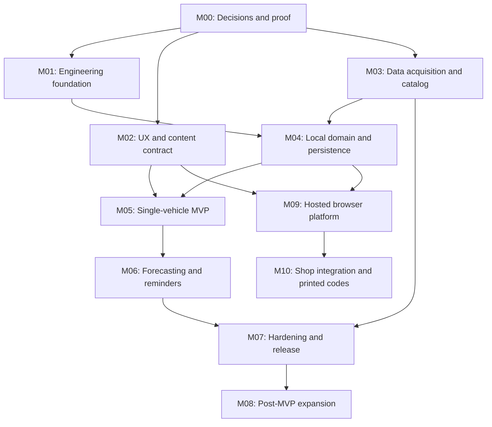

# Digital Oil Sticker — Roadmap

The roadmap is dependency-driven: eleven milestones, each led by an epic issue with child issues. The machine-readable plan lives in [`planning/roadmap.yml`](../../planning/roadmap.yml). After the GitHub sync, GitHub Issues and the GitHub Project are the live tracker; this document is orientation, not status.

Issue totals: 11 epics plus 82 children = 93 issues. Per-milestone child counts: M00 = 6, M01 = 6, M02 = 8, M03 = 10, M04 = 10, M05 = 7, M06 = 7, M07 = 7, M08 = 7, M09 = 10, M10 = 4.

## Milestones

### M00 — Decisions & Proof (DOS-M00-000, 6 children)

Convert the product idea into tested constraints and written decisions, then prove the binding runtime architecture: a Mob `0.7.20` application generated with `mix mob.new digital_oil_sticker --liveview`, with BEAM/Phoenix running entirely on the device, a native WebView loading LiveView over IPv4 loopback, two on-device Ecto/SQLite repositories, and `mob_notify` local notifications. Netlify is a separate static publishing surface and is never the application runtime.

### M01 — Engineering Foundation (DOS-M01-000, 6 children)

Implement only the platform skeleton selected by M00: the Mob `0.7.20` on-device LiveView runtime, strict loopback hardening, two Ecto/SQLite repositories, a tiny bundled fixture catalog, `mob_notify` adapter boundary, a separate static Netlify support site, and automated quality gates. The foundation must make privacy, offline, and runtime-boundary constraints hard to violate accidentally.

### M02 — UX & Content Contract (DOS-M02-000, 8 children)

Produce implementation-ready flows, component/state specifications, content rules, accessibility expectations, and testable native-mobile prototypes for local onboarding, one active MVP vehicle, oil-change records, forecasts, and reminders. Preserve a clearly separated post-MVP design direction for multi-vehicle tabs/search without adding it to MVP implementation acceptance. Designs must show offline, missing-data, denied-permission, native-runtime failure, and destructive states—not only the happy path.

### M03 — Data Acquisition & Offline Catalog (DOS-M03-000, 10 children)

Produce a reproducible, legally distributable, versioned, read-only offline catalog artifact for a rolling 30-model-year scope. The artifact supports deterministic vehicle lookup and, only where licensed evidence exists, oil-service schedules, vehicle lubricant requirements, API-licensed oil products, and oil-filter fitment.

### M04 — Local Domain & Persistence (DOS-M04-000, 10 children)

Implement separate read-only catalog and mutable user-data persistence boundaries that work offline, survive upgrades/crashes, support multiple vehicles from day one, and require no online account or server-side personal-data store.

### M05 — Single-Vehicle, Local-Only, Offline MVP (DOS-M05-000, 7 children)

A first-time user can install the native Digital Oil Sticker app, select one exact vehicle from the bundled catalog without a network connection, save one local vehicle profile, record an oil change and odometer readings, and understand the vehicle's current time/mileage service position. No sign-in, cloud database, remote profile, or network dependency is allowed in the core journey.

### M06 — Usage Forecasting and On-Device Local Notifications (DOS-M06-000, 7 children)

Digital Oil Sticker converts the selected interval, service history, manually sampled odometer history, and an optional declared typical-driving baseline into a deterministic, explainable estimate. It identifies the earlier of the time and projected-mileage thresholds and schedules private, on-device reminders through `mob_notify`; it never requires a user account, remote job, APNs/FCM push service, or a running/backgrounded BEAM process.

### M07 — Hardening, Closed Beta, and Store Release (DOS-M07-000, 7 children)

The single-vehicle app is accessible, private, secure, supportable, performant, migration-safe, and demonstrably reliable on the declared iOS/Android matrix. Signed release builds and truthful store/Netlify materials can move through closed beta to staged production without introducing accounts or behavioral telemetry.

### M08 — Post-MVP Multi-Vehicle Garage and Signed Catalog Operations (DOS-M08-000, 7 children)

A user can maintain many fully isolated vehicles, switch among them through an accessible tabbed garage, and receive correctly budgeted reminders for each. The data team can build, sign, publish, audit, roll back, and retire public catalog packs on Netlify; clients can verify and atomically activate them without risking private vehicle/history data or losing offline operation.

### M09 — Hosted Browser Platform and Anonymous Client Storage (DOS-M09-000, 10 children)

Deliver the 2026-08-01 browser-first pivot: the Phoenix LiveView application runs on Fly.io behind a custom domain and TLS, and a visitor's vehicles and service history live only in their own browser through an anonymous, versioned IndexedDB store hydrated into LiveView socket assigns by an explicit protocol. The server keeps a read-only, impersonal catalog query layer, is hardened for the open internet, and holds no account, identifier, or personal record. Includes the pre-hydration, storage-denied, quota, and eviction states, the browser support and storage-behavior conformance matrix, a dated PWA/Web Push go/no-go, and the data-source authorization gate for hosted network serving.

### M10 — Shop Integration and Printed Sticker Codes (DOS-M10-000, 4 children)

A shop captures the vehicle and service values it already holds and prints a QR code on the customer's receipt; scanning it populates the digital sticker in the customer's own browser. The mechanism is split so personal values never cross our wire: an impersonal resolution surface — the refusing intake resolver and an MCP server projecting the read-only catalog — accepts year/make/model/engine selectors and nothing else, while a distributed codec composes the personal half inside the shop's own system. The integration surface and print contract are specified rather than improvised, and scannability is measured on real printers and scanners and ratified in SCAN_MATRIX.md before any claim is made. The milestone is gated on a ratified constitution revision, ADR-0006, and a third source-rights re-review for machine-to-machine redistribution; closing unstarted with that disposition recorded is a legitimate outcome.

## Epic-level dependency DAG

## Parallelism

M01, M02, and permitted free-source investigation in M03 may run in parallel after their exact M00 blockers close. Do not mark a downstream issue Ready merely because work could be prototyped; its native blockers and source rights remain authoritative.
